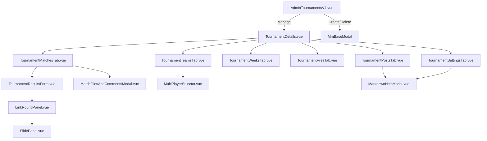

# Design System & Specification Request: Admin Tournaments Platform (V4 Neutral Depth)

## 1. Executive Summary & Overview

The **Admin Tournaments Platform** is the core management interface for competitive Battlefield 1942, Forgotten Hope 2, and Battlefield Vietnam tournaments on `bfstats.io`. It manages the entire competition lifecycle: tournament creation, match scheduling, ticket score entry, live server telemetry round-linking, team & roster registration, weekly date range boundaries, map packs / demos file uploads, announcement publishing, referee comment threads, and branding customisation.

This document specifies the complete **V4 Design System Architecture** for all admin tournament components, replacing all legacy V3 dark-slate/portal code (`portal-admin.css`, `portal-layout.css`) with standardized `--mm-*` CSS design tokens, crisp typography, high-density data tables, slide-over drawer panels, and modern modal interfaces.

---

## 2. Core Design Tokens (`--mm-*`)

The Admin Tournaments design system builds directly on top of the V4 Neutral Depth token architecture (`modern-minimal.css` & `mm-admin.css`).

### 2.1 Color Palette & Surface Tokens
| Token Category | Token Name | Hex / Value | Purpose / Usage |
| :--- | :--- | :--- | :--- |
| **Surfaces** | `--mm-bg` | `#131313` | Primary page background |
| | `--mm-bg-soft` | `#1c1c1c` | Cards, table headers, modal containers |
| | `--mm-bg-mute` | `#262626` | Input background, hover states |
| **Borders** | `--mm-rule` | `#2d2d2d` | Standard card and table borders |
| | `--mm-rule-strong` | `#3d3d3d` | Active input borders, focus outlines |
| **Typography** | `--mm-ink` | `#ffffff` | Primary text, titles, head text |
| | `--mm-ink-soft` | `#d4d4d4` | Secondary labels, body copy |
| | `--mm-ink-muted` | `#8e8e8e` | Metadata, subtitles, column headers |
| | `--mm-ink-faint` | `#555555` | Disabled text, placeholders |
| **Accent & Focus** | `--mm-highlight` | `#e5e5e5` | Primary CTA buttons, active chips |
| | `--mm-highlight-ink` | `#131313` | Text on primary highlight background |
| | `--mm-accent` | `#3498db` | Links, active tab indicators, accents |
| | `--mm-accent-soft` | `#60a5fa` | Secondary accent, interactive hovers |
| **Status & Alerts** | `--mm-danger` / `--mm-kill` | `#e74c3c` | Destructive actions, error banners |
| | `--mm-load-busy` | `#f39c12` | Warning states, draft status |
| | `--mm-load-ok` | `#2ecc71` | Success states, open/active status |

### 2.2 Status Pill Mapping
- **Draft Status**: Border `--mm-rule-strong`, Text `--mm-ink-muted`, Background `rgba(142, 142, 142, 0.1)`.
- **Registration Status**: Border `#3498db`, Text `#60a5fa`, Background `rgba(52, 152, 219, 0.12)`.
- **Open / Active Status**: Border `#2ecc71`, Text `#2ecc71`, Background `rgba(46, 204, 113, 0.12)`.
- **Closed Status**: Border `#e74c3c`, Text `#e74c3c`, Background `rgba(231, 76, 60, 0.12)`.

### 2.3 Typography & Hierarchy
- **Display Font (`--mm-font-display`)**: `'Inter'`, `-apple-system`, `BlinkMacSystemFont`, sans-serif. Used for headers, titles, and primary labels.
- **Monospace Font (`--mm-font-mono`)**: `'JetBrains Mono'`, `'Fira Code'`, monospace. Used for timestamps, server GUIDs, map order badges, round IDs, ticket scores, and code blocks.
- **Scale**:
  - `Header Title`: 24px, Medium (500), `-0.01em` tracking.
  - `Card Title`: 16px, Medium (500).
  - `Section Subhead`: 13px, Regular (400), `--mm-ink-muted`.
  - `Table Header`: 10px, Monospace, Uppercase, Medium (500), `0.14em` tracking.
  - `Body Copy`: 13px, Line-height 1.5.

---

## 3. UI Controls & Component Architecture

### 3.1 Buttons (`.mm-admin-btn`)
```
+-----------------------------------------------------------------------+
|  Primary CTA:     [ + Create Tournament ]  (bg: --mm-highlight)       |
|  Ghost CTA:       [ ← Tournaments ]        (bg: transparent, border)   |
|  Danger CTA:      [ Delete ]              (bg: transparent, red)      |
|  Small Cell CTA:  [ Manage → ]             (font-size: 11px, compact)  |
+-----------------------------------------------------------------------+
```

### 3.2 Form Controls
- **Text & Number Inputs (`.mm-admin-input`)**: Single-line text, number, and URL inputs with crisp 1px `--mm-rule` border, turning `--mm-ink` on focus.
- **Select Dropdowns (`.mm-admin-select`)**: Custom styled dropdowns with custom SVG chevron arrow.
- **Textarea & Markdown Editors (`.mm-admin-input`)**: Multi-line textarea for rules, post bodies, and referee notes. Includes Markdown syntax toolbar and Live Preview side-by-side mode.
- **Date & Time Selectors**: ISO date pickers (`YYYY-MM-DD`) and datetime local inputs for week ranges and match scheduling.

### 3.3 Data Tables (`.mm-admin-table`)
- **Container**: Wrapped in `.mm-admin-table-wrap` for smooth touch-scrolling.
- **Header**: Fixed uppercase 10px monospace column labels (`.mm-admin-table thead th`).
- **Rows**: Subtle hover fill (`var(--mm-bg-soft)`).
- **Group Headers**: Highlighted section divider rows (`.mm-admin-table__group`) for week groupings or round map titles.

### 3.4 Overlay Surfaces (Modals & Slide-over Panels)
- **Modal Window (`MmBaseModal.vue`)**: Centered overlay dialog with backdrop blur, dark surface (`--mm-bg-soft`), header title, close `×` button, and structured action footer.
- **Slide Panel (`SlidePanel.vue`)**: Right-aligned slide-over drawer panel (560px max-width) for complex side workflows (e.g. Linking Round Data).

---

## 4. Component Inventory & Feature Specifications

Below is the complete component dependency hierarchy for the Admin Tournaments Platform:



---

### Spec 1: Tournament List & Manager (`AdminTournamentsV4.vue`)
- **Route**: `/v4/admin/tournaments` (with redirects from `/tournaments` and `/admin/tournaments`).
- **Purpose**: Global index page for signed-in organizers to view, create, manage, and delete tournaments.
- **Key Features**:
  - **Header Section**: Title "Tournaments", subtitle description, and primary `+ Create Tournament` button.
  - **Tournament Cards Grid**: Responsive grid (`repeat(auto-fill, minmax(360px, 1fr))`).
    - **Header**: Game badge (`BF1942`, `FH2`, `BFV`), Tournament title, Organizer name, Creation date.
    - **Stats Summary**: Match count vs anticipated count (`4/10`), Team count, Linked server name.
    - **Action Bar**: `Manage →` (navigates to detail workspace), `View Public ↗` (opens `/t/:id`), `Delete` (prompts confirmation).
  - **Create Tournament Modal**: Full form containing Name, Organizer, Game type, Status, Anticipated round count, Game mode, Slug, Rules markdown, and Discord/social links.
  - **Delete Confirmation Modal**: Safety prompt before destructive deletion.

---

### Spec 2: Tournament Details Shell (`TournamentDetails.vue`)
- **Route**: `/admin/tournaments/:id/:tab` (tabs: `matches`, `teams`, `weeks`, `files`, `posts`, `settings`).
- **Purpose**: Main administrative workspace for a single tournament.
- **Key Features**:
  - **Header Card**: Hero banner image overlay, game icon, title, organizer, creation date, progress metric (`matches / anticipated`).
  - **Header Actions**: `← Tournaments` back button, `View Public ↗` button.
  - **Admin Tab Navigation (`.mm-admin-tabs`)**: 6 tab buttons with active border indicator.
  - **Tab Viewport**: Dynamic component switcher mounting the corresponding tab workspace.

---

### Spec 3: Matches Management Tab (`TournamentMatchesTab.vue`)
- **Purpose**: Full match schedule creation, score entry, and match details management.
- **Key Features**:
  - **Matches Header Toolbar**: Filter by Week dropdown, Status filter, and `+ Add Match` button.
  - **Matches List / Accordion**: Grouped by week or scheduled date.
    - **Match Bar**: Scheduled Date/Time, Team 1 vs Team 2 badge, Server GUID/Name, Status indicator.
    - **Maps Sub-table**: List of maps for the match (Map Name, Order, Picked-by Team, Team 1 Tickets vs Team 2 Tickets, Winning Team highlight).
    - **Match Action Toolbar**:
      - `Enter/Edit Results` -> opens `TournamentResultsForm.vue`.
      - `Files & Comments` -> opens `MatchFilesAndCommentsModal.vue`.
      - `Edit Match` -> opens match editor modal.
      - `Delete Match` -> destructive confirmation.
  - **Add/Edit Match Modal**:
    - Scheduled Date & Time picker (ISO datetime).
    - Team 1 & Team 2 select dropdowns.
    - Server GUID picker.
    - Week assignment select.
    - Dynamic Map list builder: Map order, map name, picked-by team.

---

### Spec 4: Match Results & Score Editor (`TournamentResultsForm.vue`)
- **Purpose**: Detailed ticket score entry for each map in a match, and round data linking.
- **Key Features**:
  - **Match Overview**: Team 1 vs Team 2, Scheduled Date summary.
  - **Per-Map Ticket Form**:
    - Team 1 Tickets input (number).
    - Team 2 Tickets input (number).
    - Winning Team selector (Auto-calculated from tickets or manual override).
    - Map Image path / thumbnail picker.
    - **`Link Round Data` Button** -> opens `LinkRoundPanel.vue` drawer.
  - **Linked Round Indicator**: Shows linked server round ID, map name, and auto-populated ticket scores.
  - **Save Action**: Recalculates match standings and saves results to database.

---

### Spec 5: Round Data Linker Drawer (`LinkRoundPanel.vue` & `SlidePanel.vue`)
- **Purpose**: Side-over drawer panel allowing organizers to search live server round history and automatically link raw server stats to a tournament map result.
- **Key Features**:
  - **SlidePanel Drawer**: 560px width right-hand drawer overlay.
  - **Server Round Search Filter**: Filter rounds by Server GUID, Date range, or Map name.
  - **Unlinked Server Rounds List**:
    - Round ID badge (monospace).
    - Map Name & Start/End Timestamp.
    - Team 1 vs Team 2 ticket scores from live server telemetry.
    - Total player count & round duration.
  - **Link Action**: Clicking a round automatically copies ticket scores, winning team, and links the round ID to the tournament match result.

---

### Spec 6: Teams & Rosters Tab (`TournamentTeamsTab.vue`)
- **Purpose**: Manage registered tournament teams and player rosters.
- **Key Features**:
  - **Toolbar**: `+ Add Team` button, search team filter.
  - **Team Cards / Accordion**:
    - Team Name, Tag (e.g. `[sK]`), Leader name, Creation date.
    - **Player Roster Table**:
      - Player Name (decoded), Leader badge (`👑`), Joined At date, Rules Acknowledged indicator (`✓`).
      - Roster Actions: Add Player to Team (using `MultiPlayerSelector.vue` or name search), Remove Player, Promote to Leader.
    - **Team Actions**: Edit Team Name/Tag, Delete Team.
  - **Add/Edit Team Modal**:
    - Team Name input.
    - Team Tag input.
    - Team Leader selection.

---

### Spec 7: Weeks & Schedule Tab (`TournamentWeeksTab.vue`)
- **Purpose**: Define tournament schedule weeks and date boundaries for match grouping and weekly leaderboards.
- **Key Features**:
  - **Toolbar**: `+ Add Week` button.
  - **Weeks Table**:
    - Week Name / Number (e.g. `Week 1: Omaha Beach`, `Playoffs`).
    - Start Date picker (`YYYY-MM-DD`).
    - End Date picker (`YYYY-MM-DD`).
    - Scheduled Match count for this week.
    - Actions: Edit dates, Delete week.
  - **Add/Edit Week Modal**: Form inputs for week label, start date, and end date.

---

### Spec 8: Files & Downloads Tab (`TournamentFilesTab.vue`)
- **Purpose**: Upload and categorize tournament resources (map packs, custom mods, rules documents, config files).
- **Key Features**:
  - **Category Grouping**: Map Packs, Rulebooks, Server Configs, Replays, Demos, General.
  - **Toolbar**: `+ Upload File` button.
  - **Files Table**:
    - File Name, Category badge, URL / Download button, Uploaded timestamp.
    - Actions: Copy URL, Edit metadata, Delete file.
  - **Add/Edit File Modal**: File Name, Category select, URL or file dropzone.

---

### Spec 9: Announcements & Posts Tab (`TournamentPostsTab.vue`)
- **Purpose**: Publish news updates, rule changes, and schedule announcements.
- **Key Features**:
  - **Toolbar**: `+ New Announcement` button.
  - **Posts Feed**: Chronological stream of announcements.
    - Title, Author, Posted Date, Updated Date.
    - Rendered Markdown body.
    - Actions: Edit Post, Delete Post.
  - **Post Editor Modal**:
    - Title input.
    - Markdown body textarea.
    - Live Markdown Preview panel.
    - `Markdown Help` button -> opens `MarkdownHelpModal.vue`.

---

### Spec 10: Tournament Configuration Tab (`TournamentSettingsTab.vue`)
- **Purpose**: Comprehensive tournament settings and branding configuration.
- **Key Features**:
  - **General Settings**: Tournament Name, Organizer, Game, Status (`draft`, `registration`, `open`, `closed`), Game mode, Anticipated match count.
  - **Branding & Images**:
    - Hero Image upload / preview with `Remove Hero Image` button.
    - Community Logo upload / preview with `Remove Logo` button.
  - **Theme Customization**:
    - Background Color picker (`#000000`).
    - Text Color picker (`#FFFFFF`).
    - Accent Color picker (`#FFD700`).
    - Color Presets (Dark, Light, Cyberpunk, Ocean).
  - **Rules & Registration Content**: Rules Markdown editor & Registration Rules Markdown editor.
  - **Social Links**: Discord URL, YouTube URL, Twitch URL, Forum URL, Promo Video URL.
  - **Server Linking**: Primary Server GUID selection.

---

### Spec 11: Match Files & Referee Comments Modal (`MatchFilesAndCommentsModal.vue`)
- **Purpose**: Post-match demo uploads and referee comment thread.
- **Key Features**:
  - **Header**: Match metadata (Team 1 vs Team 2).
  - **Tabs**: `Files & Demos` | `Referee Comments`.
  - **Files & Demos Tab**:
    - Upload match recording / screenshot (`.bf1942demo`, `.zip`, `.png`).
    - Uploaded files table with tag chips, timestamp, download button, delete action.
  - **Referee Comments Tab**:
    - Chronological comment stream with uploader email, timestamp, and comment content.
    - Add Comment input box.
    - Edit / Delete comment actions for authorized users.

---

### Spec 12: Structural Utilities (`SlidePanel.vue` & `MarkdownHelpModal.vue`)
- **`SlidePanel.vue`**: Side drawer panel component with smooth slide-in transition, semi-transparent backdrop, header title, and keyboard `Escape` dismissal.
- **`MarkdownHelpModal.vue`**: Reference modal displaying Markdown formatting guidelines (headings, bold/italic, lists, tables, links, quotes).

---

## 5. Responsive Breakpoints & Mobile Guidance

- **Desktop (>= 1024px)**: Full multi-column admin layouts, side-by-side forms, sticky right drawers, expanded data tables.
- **Tablet (768px - 1023px)**: 2-column card grid, scrollable horizontal table wrappers (`.mm-admin-table-wrap`), full-width modals.
- **Mobile (< 768px)**: Single column stack, stacked form fields, hidden secondary table columns (showing core columns: Name, Status, Actions), full-screen drawers (`SlidePanel` takes 100% viewport width).

---

## 6. Verification & Implementation Plan

1. **Phase 1: Router & Navigation Integration** (Completed)
   - Route `/v4/admin/tournaments` wired inside `ModernShell`.
   - Legacy `/tournaments` and `/admin/tournaments` redirects established.
2. **Phase 2: Reinstate Admin Tournaments Workspace** (Completed)
   - `AdminTournamentsV4.vue` implemented with V4 `--mm-*` tokens.
   - Clean tournament cards, search/filters, create modal, and delete actions.
3. **Phase 3: Refactor Sub-components to V4 Design System** (Next Steps)
   - Migrate `TournamentDetails.vue`, `TournamentMatchesTab.vue`, `TournamentTeamsTab.vue`, `TournamentWeeksTab.vue`, `TournamentFilesTab.vue`, `TournamentPostsTab.vue`, and `TournamentSettingsTab.vue` from `portal-admin.css` to `mm-admin.css`.
   - Standardize all inputs, buttons, status badges, and tables under the `--mm-*` design tokens.
