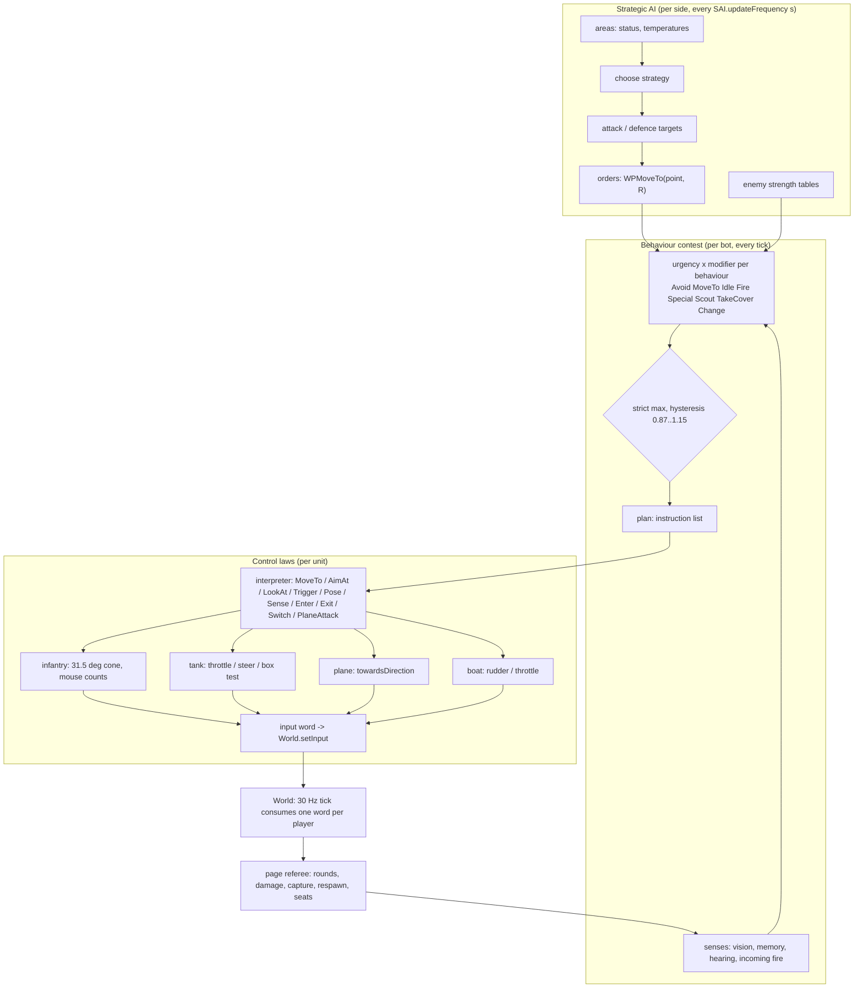

# The bot AI, specified

The algorithm the viewer's bots run (`tools/bf1942-models/viewer`, main at
2026-09-23, `a2498487`), written as the algorithm rather than as the research
trail. Every rule cites the code that implements it (`file function`); engine
addresses and `.con` sources live in [KNOBS.md](KNOBS.md), next to every
constant. The research the code was built from is
[`features/bf1942-ai-research-2026-09-21/`](../bf1942-ai-research-2026-09-21/README.md)
and ledger rows AI-1..AI-66 in
[`features/bf1942-engine-reference/ledger.md`](../bf1942-engine-reference/ledger.md).

| file | covers |
|---|---|
| [strategic.md](strategic.md) | the side's strategic AI: areas, strategies, orders, the enemy tables, spawning |
| [sensing.md](sensing.md) | vision, memory, hearing, incoming fire |
| [behaviours.md](behaviours.md) | the contest, and each behaviour: inputs, urgency, curve, plan, end |
| [movement.md](movement.md) | the navigation maps, the searches, the path follower |
| [controls.md](controls.md) | the input word, the infantry, tank, plane and boat laws, the shot |
| [vehicles.md](vehicles.md) | the strength tables, Change, seats, the seat swap |
| [KNOBS.md](KNOBS.md) | every constant, its value, source, code location and kind |

Labels, used everywhere in these files:

- **ENGINE**: read from `bf1942_lnxded.static` (address in KNOBS);
  **CON**: read from shipped data (`AIbehaviours.con`, a level's `AI.con` /
  `AIpathFinding.con`, an `Ai/Objects.con`).
- **INVENTION**: a viewer stand-in, labelled so in the code.
- **UNSOURCED**: a constant in the code with no label and no source in the
  research. Treat as INVENTION until read.
- **PAGE**: the bots' referee (fire, damage, capture, respawn, vehicle
  seating): `bot-referee.js`, one copy the page and the headless runner
  (`tools/bf1942-models/sim`) both import, with the page's vehicles behind
  `bot-units.js`. Once `map.html`'s own code; the name stays.

Where two research documents disagree, the later correction is used and the
disagreement is stated where it matters ("Research disagreement").

## The three layers

1. **The strategic AI** (one per side, `strategic.js StrategicAI`): every
   `SAI.updateFrequency` seconds it scores the level's strategic areas,
   picks a strategy, splits the side's free bots into attackers and
   defenders and hands each an order: a `WPMoveTo` point and radius inside
   an area.
2. **The behaviour contest** (one per bot, `bot.js BotController`): every
   tick each registered behaviour produces an urgency, the strict maximum
   wins (with hysteresis), and the winner's plan generator emits a short
   list of instructions from a closed set (`PLAN_ACTION`).
3. **The control laws** (per unit kind): the instructions become one input
   word, the same word a human's keyboard and mouse produce, written through
   `World.setInput`. A bot is an ordinary player below this line (AI-1).



## The tick

**The engine** (ledger AI-4..AI-6, README §1.3..1.4 of the research): the AI
runs first in the 30 Hz `GameServer::simulateFrame`, before any player input
is consumed, so a bot's word is in the buffer the same tick. The AI is a time
budget, not a loop over bots: plan execution gets 40 % of it, decision
making, pathfinding, hearing and sensing share the rest per the level's
`AIBotManager.setSystemQuotient`, and each phase has per-bot LOD tick
counters. Sensing, deciding and pathing are therefore stale by design.

**The viewer** runs every phase for every bot on every call, and calls the
bots once per display frame, after the world step (`map.html frame()`):

```mermaid
sequenceDiagram
  participant F as frame(dt)
  participant W as World.step(dt)
  participant T as tickBots(dt)
  participant B as BotController.tick
  participant R as page referee
  F->>W: 0..n whole 30 Hz ticks: per player consume one word, soldier or vehicle step, combat area, supply, guns, bodies, damage
  F->>T: botClock += dt
  T->>T: StrategicAI.update (a pass every SAI.updateFrequency)
  T->>T: enemy strength tables (same cadence)
  T->>R: botVehicleTick: seat / unseat / switch requests, hull destroyed
  loop every bot
    T->>R: botRespawnTick (dead: count down 8 s, respawn)
    T->>B: waypoints = the side's order; tick(dt, botClock)
    B->>B: sync pose, sense + memory, readout, decision, run plan, deviation, write input word
    T->>R: no-progress redeploy
  end
  T->>R: botFireTick: rate, magazine, rounds, hits, damage, deaths
  F->>R: botCaptureTick
```

Consequences:

- A bot's word is consumed by the next world tick: one tick of latency the
  engine does not have (AI-4). INVENTION of ordering, not labelled in code.
- **Tick-counted constants depend on the display rate.** The stall counters
  (150 / 401 ticks, `bot.js OBSTRUCTED_TICKS`, `PATH_FAIL_TICKS`) and
  `CONTACT_TICKS` count `BotController.tick` calls, which the page makes per
  display frame: 150 ticks is 5 s at 30 fps and 2.5 s at 60 fps. `bot.js`'s
  comment assumes 30 Hz. The headless runner (`tools/bf1942-models/sim`)
  ticks bots at 30 Hz.
- Everything seconds-based uses `dt` and `botClock` and is rate-independent.

## `BotController.tick(dt, now)`, in order

1. **Sync** the pose: on foot from the world's soldier (position, yaw, pitch,
   stance); mounted from the drivetrain's state (a rider from the player
   record's position) (`tick`).
2. **Age** potential obstacles and drop the far ones (`_ageObstacles`);
   **zero** this tick's input fields (`_resetInput`).
3. **Sense**: one vision pass, the memory update, the quadrant inertia
   (`_sensePass`, [sensing.md](sensing.md)); expire the fire-plan vetoes
   (20 s).
4. **Readout** for the page: objective, goal, `goalReached`, and the
   no-progress redeploy flag (`_updateObjectiveReadout`, INVENTION).
5. **Decide** (`_decisionMaking`, [behaviours.md](behaviours.md)).
6. **Execute** the plan (`_runPlan`).
7. **Deviation**: step the held weapon's channels, rebuild on a weapon
   change, set the AI term (`deviation.setAIDeviation`, [controls.md](controls.md)).
8. **Write** the word (`_writeInput`).

## Divergences from the research found while writing this

Each is detailed where it applies; none is fixed here.

| where | what |
|---|---|
| `strategic.js _order` (since `ee729113`) | **fixed in `5f363557`** (`inside` is `isInside`, pinned in the strategic harness). Was: **regression**: the order object lost `inside(x, z)`. `bot.js _insideOrderedArea` falls back to true (the 0.75 outside-area factors never apply) and `_urgencySpecial` throws `wp.inside is not a function` whenever a medic holding an order weighs a wounded friend. In the page the throw ends that `frame()` (the later bots, the bots' rounds, the capture and the draw are skipped; the loop's catch shows the render-loop error card after three frames), every frame the condition holds. |
| `strategic.js SAI.updateFrequency` | **fixed**: 2.0 s, `AISettings::reset` 0x0848461a read by `SAI::update` through vt+0x44 (ledger AI-74). Was: 5 s (INVENTION). Research README §6.1 read `AISettings::reset` writing 2.0 to the SAI update frequency (+0x28); bot-behaviours §7 later calls the default unread. |
| `bot.js dismount` / `_urgencyChange` | **fixed**: keyed by the hull (AI-74). Was: `_leftVehicle.id` is the seat candidate's id (`<vehicle>:<seat>`), compared with `c.vehicleId`: the 15 s left-unit ramp (AI-43) never applies. With the saturating Change urgency this cycles a bot in and out of a seat every 0.37 s (found with the headless runner). |
| `bot-fire.js scoreTargets` | **read** (AI-74): the engine does count its factor twice (`fStack_1a4` in each strength term and in the score), but that factor is 0.5 in range and the area factor only beyond range; now built so. Was: the outside-area factor multiplies the score twice (once directly, once inside `strengthSum`): 0.5625 where the research has 0.75. The target-strength term reads the soldier table at the target's class, where the research has "the target's strength against the bot's class" (equal for infantry against infantry). |
| `strategic.js _updateAreas` | the attack temperature counts both sides' bots in the area (`friendly + enemy + radius`); the research has the unit strength in the area plus the base. |
| `strategic.js ownerOf` | **fixed**: held by presence within the takeable flags (`AIStrategicArea::update` 0x0863d6d0, AI-74). Was: an area with no control point keeps its authored side; the research makes it Owned by a side present alone in it. Passes never become Owned, so an area whose only neighbour is a pass is never attacked. |
| `strategic.js _evaluatePrerequisite` | **fixed**: `StrategyPrerequisite::evaluate` 0x0863aa50 adds a passing Required condition's value (AI-74). Was: a passing Required condition adds nothing to the score: on a level whose conditions are all Required every strategy scores 0 and each side keeps its first one (El Alamein: `broad` for the whole match). |
| `strategic.js _distribute` | takes exactly the top `NumberOfAttacks` targets: the "up to 2N within 0.8x of the Nth" rule, `releaseSurplus` (110 %) are not built (the 20 s / 35 s re-order of an arrived bot is, AI-70) (`SAI.attackKeep`, `defenceKeep`, `surplusKeep` are declared and unused). |
| `deviation.js` / `bot.js tick` | the AI term is recomputed and held every tick (engine: a one-shot term added at the trigger pull, AI-19), and the anti-aircraft / vehicle term `C` is never passed (always 0). |
| `bot.js` header | still says `Change` and `Special` are not registered; both are (`REGISTERED`). |
| `bot-vehicle.js CHANGE.driverFactor` | its comment says bots take the driver's seat only; every door is a candidate (AI-46). |
