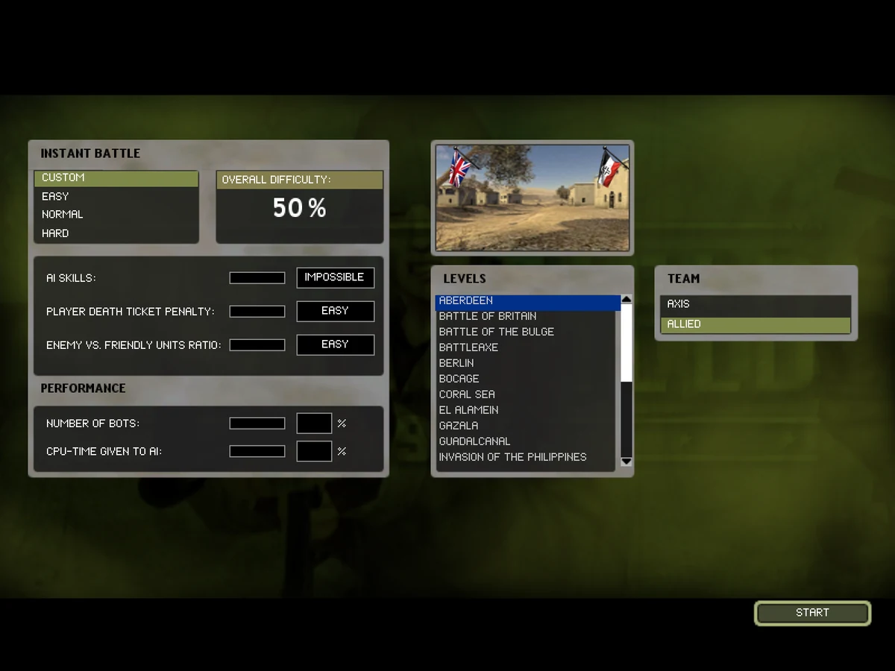
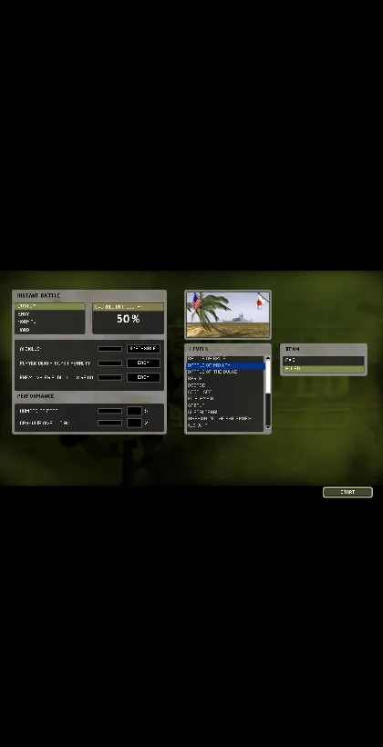
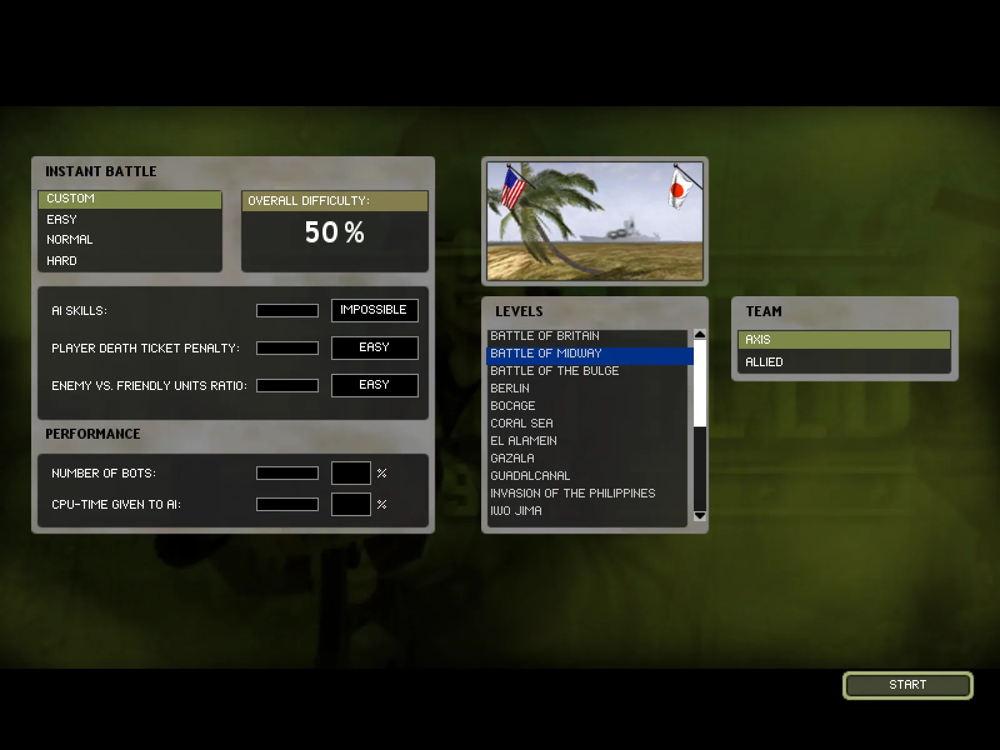
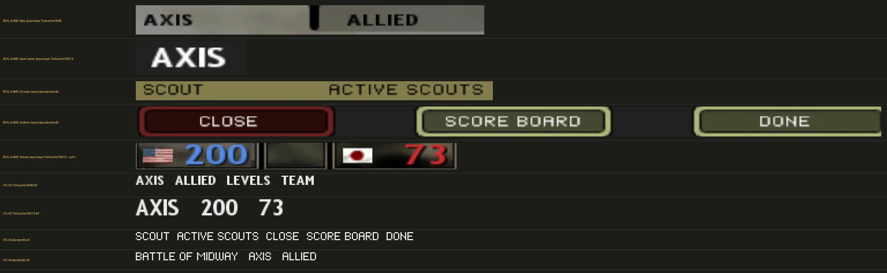

# BF1942 in the browser

A site for playing the extracted levels, separate from the mesh model browser.
Requested 2026-09-19. Tracked in
[`../bf1942-parity-round-2026-09-19/README.md`](../bf1942-parity-round-2026-09-19/README.md),
streams A and B.

## What was asked

1. **Separate the maps from the mesh site.** `mesh.bfstats.io` stays the model,
   pose and kit browser. The playable map page moves to a site of its own, which
   will later grow a multiplayer battle.
2. **The way in is the game's own menu.** For now that is Singleplayer >
   Instant Battle: pick a level, pick a team, start. Drawn from the game's
   assets, the way the spawn screen already is.
3. **Hide the debug options** on the map page (wireframe, spawn on foot, fly the
   plane and the rest). They are for debugging. Typing `show.dev = 1` into the
   console brings them back.
4. **The console**, on the tilde key, reconstructed from the binary. It does not
   exist in the viewer yet.

Items 1 and 2 are built (stream A, below). Items 3 and 4 are stream B's.

## The Instant Battle screen, from the user's capture

The agents cannot see the capture, so this is what it shows.

- A dark olive, faintly camouflaged background.
- Three panels, each a light grey bevelled plate with rounded corners:
  - **Top left, the preview.** A screenshot of the selected level inside the
    plate, with the two sides' flags in its top corners: the Allied nation's on
    the left (the US flag), the Axis nation's on the right (the Japanese rising
    sun), each about 90 px wide on a 600 px wide plate.
  - **Bottom left, `LEVELS`.** The heading in black, wide-spaced capitals on the
    plate. Below it a near-black list box holding the level titles in pale grey
    capitals in the same wide face, left-aligned with an indent: BATTLE OF
    BRITAIN, BATTLE OF MIDWAY, BATTLE OF THE BULGE, BERLIN, BOCAGE, EL ALAMEIN,
    GAZALA, GUADALCANAL, IWO JIMA, KHARKOV, KURSK, and on below the fold. Eleven
    rows show. A scroll bar on the right: up and down arrow buttons, and a white
    thumb about half the track tall.
  - **Right, `TEAM`.** Same heading style. A two-row list box: `AXIS` and
    `ALLIED`. The hovered or selected row is filled olive green across its full
    width.
- The game's arrow cursor.

The titles are alphabetical by display name, and "Battle of Midway" shows the
list uses lexicon titles, not directory names (`midway`).

## Where it lives in the game

Found by `strings` on `Mods/bf1942/Archives/menu.rfa`:

| What | Entry |
|---|---|
| The screen's layout | `menu/SkirmishMenu` and `menu/SkirmishNavigation` (binary `MemeFile 2.0`; reader `bf42/meme.py`) |
| How you get there | `menu/MainNavigationSingleplayer`, `menu/SingleplayerNavigation` |
| Plates | `menu/Texture/Menu/menu_singlepl_levellist_256x256.dds`, `menu_campaign_team_256x128.dds`, `singleplayer/menu_skirmish_tab_256x32.dds`; buttons and scroll controls under `Menu/buttons/` and `Menu/knapp*` (names are Swedish: *knapp* button, *pil* arrow, *upp/ner* up/down) |
| Strings | `lexiconAll.dat` (UTF-16LE; `extract_spawn_layout.py` already resolves keys) |
| Fonts | `Font.rfa`, the `.dif` + `.tga` pairs; `bf42/font.py` |
| Level previews | each level's own menu art; `extract_loading_assets.py` and the `bf1942-map-images` skill already cover thumbnails |
| Which flag a side flies | the level's `Init.con` team nations, already in `scene.json` |

Two of those rows were wrong, and the corrections are below: the backdrop is a
third page (`menu/Background`), and the team nations are **not** in
`scene.json`.

`extract_spawn_layout.py`'s `Flattener` is the thing to extend, not rewrite. The
front-end list-box class (`BfNewListBoxNode`) is one of the classes ledger row
MEME-11 says `meme.py` still reads 57 bytes short, so expect to fix the reader
before the layout comes out clean.

In the real game Instant Battle loads a level's `SinglePlayer` layout with
bots. The viewer extracts Conquest only, so the first version launches Conquest.

---

# What was built (stream A, 2026-09-19)

## The pieces

| Piece | Where |
|---|---|
| The reader fix the screen needed | `tools/bf1942-models/bf42/meme.py` |
| The extractor | `tools/bf1942-models/extract_menu_layout.py` |
| The page | `tools/bf1942-models/viewer/play/index.html` |
| Its renderer, testable under node | `tools/bf1942-models/viewer/play/menu-screen.js` |
| The launch hook in the map page | `viewer/map.html`, `launchTeam` + `preferredDeployTeam` |
| Tests | `tests/test_menu_layout.py`, `tests/test_menu_screen.mjs`, `tests/test_meme.py` |
| Deployment, **not applied** | `play/Dockerfile`, `play/nginx.conf`, `deploy/app/play-deployment.yaml`, the ingress ACL and the tunnel entry |

### The command that produces the pack

```
cd tools/bf1942-models
python3 extract_menu_layout.py --out viewer/maps/_shared/hud/menu
```

It writes `menu-layout.json`, `menu-levels.json`, `textures/` (19 plates),
`thumbnails/` (one per level) and `fonts/` (4 faces) — 82 elements over 3
pages, under 400 KB in total. The page loads it from
`../maps/_shared/hud/menu` by default, beside the spawn screen's own pack, and
`?pack=<url>` points a checkout at a scratch build instead.

**The shared tree is the lead's to populate.** Nothing in this stream wrote to
it; every run during development used a scratch `--out`.

## The reader fix

MEME-11 named `BfNewListBoxNode` as short by a constant 57 bytes, and that
class is the level list on this screen. Its own `read` (client `0x007cfeb0`)
carries fourteen fields after `Border or not`:

| Field | Width |
|---|---|
| `Background color red/green/blue/alpha` | 4 x 4 |
| `Scrollbar width` | 4 |
| `Frame color red/green/blue/alpha` | 4 x 4 |
| `Select color red/green/blue/alpha` | 4 x 4 |
| `Show tooltip` | 1 |
| `Scrollbar offset from border` | 4 |

16 + 4 + 16 + 16 + 1 + 4 = **57**, exactly the shortfall the ledger measured.
The two faces the class then loads (`Outlands_2.dif`, `Outlands_2_inv.dif`) are
hard-coded, not on the wire.

An independent check that the field list is right, not merely the right total
length: seven of those fields come back holding `BfNewListBoxNode`'s own
constructor defaults (`0x007d1200`) — frame colour 1/1/1/0 at `+0x8c..+0x98`
and select colour 0/0.1875/0.5390 at `+0x9c..+0xa4`. A schema one field out
would not reproduce those.

The same route settled four more classes the Singleplayer pages use and
`meme.py` had no schema for at all. `menu/SkirmishMenu` went from 25 warnings
to none, and pages reading to zero leftover bytes across the 16 installed
`menu.rfa` archives went from **80 of 230 to 110 of 230**.

## The screen, element by element

Captured at 1600x1200 by driving the page with Playwright on port 5311
(`?pack=pack-dev`). Rects below are the file's own 800x600 virtual units.

The capture is the canvas 1:1 — the element screenshot is 1600x1200 and so is
the backing store, with no page chrome to stretch it — so pixels sampled out
of it are the colours the layout asked for, not a resampling of them. Sampled
with `getImageData` at load, on the ALLIED default:

| Where | Sampled | Expected | From |
|---|---|---|---|
| Middle of the ALLIED row | `rgb(126,136,74)` | `0.4922, 0.5352, 0.2891` x 255 = `125.5, 136.5, 73.7` | `ColorEffect` in `menu/SkirmishMenu` |
| Middle of the AXIS row | `rgb(42,42,36)` | the bare plate | its `CullNode` is false |
| Top of the scroll track | `rgb(255,255,255)` | the thumb | drawn, not in the file |
| Track below the thumb | `rgb(27,27,27)` | black at alpha 0.8 over the plate | `ColorEffect(0,0,0,0.8)` |



| The description says | This site draws | Source | Match |
|---|---|---|---|
| Dark olive, faintly camouflaged background | `Menu/Background.tga` at `(0,85) 800x450` over a black `(0,0) 800x600` fill | `menu/Background`, tops 3 and 5 | yes |
| Three light grey bevelled plates with rounded corners | `menu_creategame_karta_256x128`, `menu_singlepl_levellist_256x256`, `menu_campaign_team_256x128` | `menu/SkirmishMenu` | yes — the bevels and corners are the shipped art |
| Preview top left | `(385,125) 256x128`, with the level's own `Menu/thumbnail.dds` at `(390,130) 172x128` | `VariablePictureNode` on `Skirmish/SkirmishMap` | yes |
| LEVELS bottom left | `(385,237) 256x256`, same x as the preview, below it | — | yes |
| TEAM to the right | `(585,237) 256x128` | — | yes |
| Allied flag left, Axis flag right, in the preview's top corners, ~90/600 of the plate | `icon_flag_<nation>` at `(390,130)` and `(523.6,130)`, 38.4 units = 90/600 x 256 | **not in any layout file** — see below | art and nations from the game; the rectangle is ours and is marked `fromCapture` |
| The Allied nation is the US flag, the Axis the Japanese rising sun (on the pictured level) | Midway: `game.setTeamSkin 1 JapaneseSoldier`, `2 USMarineSoldier` → `jp` right, `us` left | each level's `Init.con` | yes — see `instant-battle-midway.webp` |
| LEVELS heading, black, wide-spaced capitals | `CREATE_GAME_LEVELS` = "LEVELS", `Trebuchet MS8.dif`, `ColorEffect(0,0,0,1)`, at `(397,245)` | lexicon + `Style/HeadingStyle` | yes |
| Near-black list box | `Background color` is `(0,0,0,0)` — the box paints nothing; the near-black is the plate's own recessed well | `BfNewListBoxNode`, the 57-byte trailer | yes, by a different mechanism than the description assumes |
| Titles in pale grey capitals, same wide face, left-aligned with an indent | `standard6.dif`, indented by the box's `Scrollbar offset from border` = 4 | `BfNewListBoxNode.Font` | yes |
| **Eleven rows show** | 11 | derived: the plate's well is `264..422`, over the file's `Row height` 14 | yes |
| Scroll bar: up and down arrows | `menu_scrollpilupp_16x8` at `(555,263)`, `menu_scrollpilner_16x8` at `(555,409)`, each with its `_MC_` mouse-over plate | `BfButtonNode` | yes |
| A white thumb about half the track tall | rows on screen / rows in the list = 11/23 = 0.478 of the `(555,272) 10x145` track | track from the file; the thumb is drawn, see below | yes |
| TEAM heading, same style | `SINGLEPLAYER_TEAM` = "TEAM", same face and colour | lexicon | yes |
| Two rows, `AXIS` and `ALLIED` | `SINGLEPLAYER_TEAM_AXIS` = "AXIS" at `(597,268)`, `SINGLEPLAYER_TEAM_ALLIES` = "ALLIED" at `(597,286)` | lexicon | yes |
| The selected row filled olive across its full width | `ColorEffect(0.4922, 0.5352, 0.2891, 1)` over an empty `PictureNode`, `169` units wide, gated on `EqualData(Campaign/Team, 1\|2)` | `menu/SkirmishMenu` | yes, and the gate is the game's own |
| The game's arrow cursor | the browser's `default` / `pointer` cursor | — | **no.** The game's cursor art was not extracted |
| Titles alphabetical by display name | sorted by the title shown | — | yes |
| "BATTLE OF MIDWAY" | "BATTLE OF MIDWAY" | the level's own `lexiconAll.dat` record, English column | yes, after the review below |
| (not mentioned) | A fourth panel: the difficulty and performance settings at `(25,125) 512x512`, headed "INSTANT BATTLE" | `menu/SkirmishMenu` top 2, child 0 | drawn, because the file places it |
| (not mentioned) | A green `knapp3` START button at `(670,535) 109x25`, labelled `MENU_START` | `menu/SkirmishNavigation` | drawn, because the file places it |

### The three things this screen does not take from the data

Each is marked in the JSON so the next reader is not misled.

1. **The two nation flags.** No menu page places a flag picture — searching
   every `MemeFile` in `menu.rfa` for a picture whose name contains "flag"
   finds only `menu/InGame`'s four control-point markers — and `icon_flag` is
   not in `BF1942.exe`'s string table either. Some code draws them and it was
   not traced. The art (`icon_flag_<nation>`) and the nations
   (`game.setTeamSkin`) are the game's; only the rectangle is ours, sized
   90/600 of the plate from the description, and it carries
   `"fromCapture": true`.
2. **Where the list's rows start.** `BfNewListBoxNode` has no rect of its own;
   it fills the 178x185 transform it shares with the scroll arrows, and rows
   drawn from the top of that transform land over the LEVELS heading and
   overrun the plate. The plate art has a recessed well for them, so
   `list_rows` reads the well off the shipped texture rather than hard-coding
   an inset: `264..422`, which is 11 rows of the file's own 14-unit pitch —
   the count the description gives. Carried as `listRows.fromPlateArt`. The
   engine's own row origin is **UNVERIFIED**.
3. **The scroll thumb.** The track is in the file; the thumb is not. It is
   drawn white at `rows visible / rows total`, which the description's "about
   half" (11 of 23) agrees with.

### Where this site and the description disagree

- **The selected level row is blue, not olive.** That is the file's own
  `Select color`: `(0, 0.1875, 0.5390, 1)`, three of the values being the
  class's constructor defaults. The TEAM rows are olive because the TEAM rows
  are `ColorEffect` fills, which is a different mechanism. Drawing the level
  list olive to match would be exactly the invention this screen is supposed
  to avoid, so the file's colour stands. If the real game shows olive there,
  it is drawn by code, and that is the thing to go and find.
- **The arrow cursor** is the browser's. The game's cursor art was not
  extracted.
- **Phone width.** Below 4:3 the screen scales uniformly and letterboxes — the
  same rule `map.html` uses for the spawn screen — so at 420x820 the whole
  screen is legible but small. The game has no portrait layout to copy.
  

---

# The review (2026-09-19)

Three things were put to a second pass: the level titles, the typeface, and
which levels the list holds. Two were defects and are fixed. The capture
above is the screen as it now draws.



## The titles: the lexicon does have "BATTLE OF MIDWAY"

The first pass looked for the string and did not find it, and concluded it
was not in the install. It is. `lexiconAll.dat` carries one record per level
**keyed on the level's own directory name**, and the first translation
column is English:

```
python3 -c "…"   # the reader is extract_spawn_layout.load_lexicon
Midway         -> col0 'BATTLE OF MIDWAY'  col1..4 'MIDWAY'   (byte 1637528)
Market_Garden  -> col0 'OPERATION MARKET GARDEN'  col1 'MARKET-GARDEN'
ABERDEEN       -> col0 'OPERATION ABERDEEN'
Wake           -> col0 'WAKE ISLAND'
```

The reader was never at fault and picks no "later column" — `load_lexicon`
has always returned `values[0]`, and `extract_spawn_layout.py` reads the
same column, so the two agree. The extractor simply never asked it: level
titles came from `extract_loading_assets.format_map_title`, which
prettifies the directory name. Four of the 23 came out wrong: MIDWAY,
MARKET GARDEN, ABERDEEN and BATTLEAXE.

Fixed in `extract_menu_layout.level_title`. Every title re-checked against
the English column:

| Directory | Title (lexicon) | Loading screen's table |
|---|---|---|
| `Midway` | BATTLE OF MIDWAY | MIDWAY |
| `Market_Garden` | OPERATION MARKET GARDEN | MARKET GARDEN |
| `aberdeen` | OPERATION ABERDEEN | ABERDEEN |
| `Battleaxe` | OPERATION BATTLEAXE | BATTLEAXE |
| the other 17 with a record | identical to the table | identical |
| `Kasserine_Pass`, `Truk` | no record — falls back | KASSERINE PASS, TRUK |

Two traps found on the way:

1. **The key's casing is not the directory's.** `ABERDEEN`,
   `BATTLE_OF_BRITAIN`, `INVASION_OF_THE_PHILIPPINES` and
   `LIBERATION_OF_CAEN` are upper-case keys while the rest are mixed. The
   index is lower-cased.
2. **`lexiconAll.dat` is not a map.** 31 of its 1,693 keys occur twice and
   seven of those pairs hold different strings. `Omaha_Beach` is one:
   record 976 is "OMAHA BEACH" and sits inside the contiguous level-title
   block (records 958..979, `Battle of the Bulge` through `Wake`); record
   1332 is "Omaha Beach" and sits inside a block of control-point labels
   (`Arnhem_Bridge`, `Airfield`, `German_Garrison`). `load_lexicon` took
   the last of a repeated key, which would have put a mixed-case
   control-point label in the level list. It now takes a `keep` argument
   and the titles ask for the first. **The default did not move**: none of
   the seven differing pairs is a key `menu/InGame` names, and the spawn
   pack is byte-identical before and after (`diff -r`, 9 files).

So one level no longer has one name across the site: the menu says
BATTLE OF MIDWAY and the loading screen says MIDWAY. That is deliberate —
these are two different tables in the game and this screen is the one the
lexicon speaks for. `menu-levels.json` carries both, as `title` and
`loadingTitle`, with `titleSource` naming the record each came from.

## The typeface: the layout is right, and so is the render

The description of the real screen says every string is in a wide, squared,
geometric all-caps face. On this screen that is true of the level rows,
AXIS, ALLIED, START and the whole difficulty panel, and it is **not** true
of the four headings (INSTANT BATTLE, PERFORMANCE, LEVELS, TEAM), which the
layout file puts in `Trebuchet MS8.dif` in black. No change was made. The
evidence, in order:



1. **There is only one candidate atlas.** The menu `.dif` + `.tga` pairs in
   the installed `Font.rfa` are **byte-identical** to the untouched 2004
   `Archives/Font-Original.zip` — same sha256 for `standard6`,
   `standard6 - Latin`, `Trebuchet MS8/11/14/18`. The 2012 replacement the
   extraction skill warns about changed exactly two files, `Font/BF1942.font`
   and `Font/BF1942.tga` (128x128 grown to 256x256), and that is the HUD
   font, which this screen does not use.
2. **`Outlands_2.dif` does not exist.** It and `Outlands_2_inv.dif` are in
   `BF1942.exe`'s string table (offsets found by `strings -n 5`) and in no
   archive in the installation — not in `Font.rfa`, not in any mod's. The
   list box's hard-coded faces cannot load, so its `Font` field is what is
   left, and that field says `standard6.dif`.
3. **`standard6` *is* the wide squared face.** Rendered from its own atlas
   it is unmistakable beside the Trebuchets (bottom two rows of the sheet).
4. **The game really draws Trebuchet where the data says Trebuchet.** The
   decisive proof is the owner's own in-game spawn-screen capture
   (`spawn-interface-ingame.webp` in the repo root), which is the same
   engine, the same font system and a layout we have already decoded. Its
   AXIS/ALLIED tabs are `Trebuchet MS8`, the big team name is
   `Trebuchet MS14`, the ticket digits are `Trebuchet MS14 - Latin`, and the
   kit rows and the CLOSE / SCORE BOARD / DONE buttons are `standard6` —
   and in the capture each of those renders as exactly the face its `.dif`
   names. The top five rows of the sheet are those crops; the bottom rows
   are the atlases they should match.
5. **Nothing distorts the glyphs on the way out.** `drawBitmapText` blits
   each glyph from the atlas at its own pixel size with
   `imageSmoothingEnabled = false`, and advances the pen by the `.dif`'s own
   `left + width + right`, so the spacing is the file's.

If the owner's Instant Battle capture really shows the headings in the wide
face, then it is not this install drawing it, because every one of the five
points above would have to be wrong at once.

## Which levels the list holds

The rule is confirmed, across all 23 level archives in this install: the
game's Instant Battle list holds the levels with bot support, and bot
support is a **`SinglePlayer` mode directory** inside the level archive
(`bf1942/levels/<Level>/SinglePlayer/...`). 19 of 23 ship one. The four
that do not are exactly the four the reference capture is missing:

| Not listed | Modes it ships |
|---|---|
| `aberdeen` | Conquest only |
| `Coral_sea` | Conquest only |
| `Invasion_of_the_Philippines` | Conquest only |
| `Liberation_of_Caen` | Conquest only |

Two more the reference does not show are explained by the install rather
than the rule: `Kasserine_Pass.rfa` and `Truk.rfa` are dated **2026-09-07**
and are not retail 1.61 levels, which is also why the lexicon has never
heard of them. Take those two out and the seventeen levels the game would
list, alphabetical by English title, begin: BATTLE OF BRITAIN, BATTLE OF
MIDWAY, BATTLE OF THE BULGE, BERLIN, BOCAGE, EL ALAMEIN, GAZALA,
GUADALCANAL, IWO JIMA, KHARKOV, KURSK — eleven rows, which is what the
reference shows and where it stops.

**This site lists all of them anyway, on purpose.** It has no bots and it
launches Conquest, so a level without bot support plays here exactly as
well as one with it, and hiding four playable levels would only lose them.
The rule is recorded rather than applied: every record carries
`singlePlayer`, and `menu-levels.json` carries an `inGameList` block
stating the rule, the count and this departure. A consumer that wants the
game's own list filters on `singlePlayer`.

## Other defects found

- **Picking AXIS on Wake deployed you as the Allies.** The launch hook let
  the flag tally overrule `?team=` whenever the chosen side owned no control
  point and the other did. All five of Wake's control points are Allied at
  the start, so the most-played level in the game silently dropped the
  choice made on the screen before it. The guard was never needed:
  `deployFlagIndices` already offers every flag to a side that owns none,
  and driving Wake's Axis tab shows five flags offered and `spawn()`
  succeeding as team 1. `?team=` now wins outright; without the parameter
  nothing changed (`map.html?map=Wake` still deploys 2 by the tally, and an
  unparseable `?team=` still falls through to it).
- **The page preferred the loading screen's title over the menu's.**
  `buildLevels` read `entry.loading?.title || level.title`, so a fixed
  `menu-levels.json` would still have drawn MIDWAY. It now takes the menu
  title.
- **`viewer/play/pack-dev` was ignored by Docker but not by git.** A scratch
  pack is a megabyte of PNGs one `git add -A` away from the history. Added
  to `tools/bf1942-models/.gitignore`.

## What was re-derived and held

- `BfNewListBoxNode`'s 57 bytes and the four new schemas: the survey
  reproduces **80 of 236 pages clean before, 110 after**, over the 16
  installed `menu.rfa` archives. No page that was clean became dirty and no
  page gained a warning. (The first pass said 230 pages; the denominator
  depends on where the MemeFile filter is drawn — the 80 and the 110 match
  exactly.)
- The spawn-screen pack is **byte-identical** across the `meme.py`,
  `extract_spawn_layout.py` and `load_lexicon` changes: `spawn-layout.json`
  and all eight font files, same sha256.
- `python3 -m unittest discover -s tests`: **1,169 green**, from 1,161.
- Driven with Playwright at 1600x1200 and at 420x820: the list scrolls by
  wheel and by the down arrow, rows select by click, the TEAM rows switch
  the side, and START opens `map.html?map=Midway&team=1` which deploys on
  team 1. No page errors at either size.

---

## The bot settings are switched off (2026-09-20)

The screen's left column - the CUSTOM / EASY / NORMAL / HARD list, OVERALL
DIFFICULTY, the three AI sliders and the PERFORMANCE block - configures bots,
and this site has none, so it was a panel of controls that changed nothing.
`SHOW_BOT_SETTINGS` in `viewer/play/menu-screen.js` is `false`: the column
neither paints nor takes a click, and the level list, preview and TEAM panel
stay exactly where the game puts them. Nothing was deleted - the layout pack
still carries every element, and the flag brings the game's screen back.

It returns with the bots, and the bots are blocked on research: how the
engine's AI works, and what `Skirmish/SkirmishAiSkill`, `SkirmishBotRatio`,
`SkirmishNrOfLives`, `SkirmishOverallDifficulty` and the two
`Options/General/SkirmishPercentageOf*` variables become when a battle starts,
is not in `features/bf1942-engine-reference` yet.

## Launching

START goes to `../map.html?map=<level>&team=<1|2>`. The map page is reached by
a relative path: it is the same source file the mesh site serves, not a fork.

The way back is the engine's own: `game.disconnect` in the console (`~`)
returns to this screen. And a bare `map.html` hands over to it (2026-09-20):
once `show.dev 1` hid the debug panel, the level list inside it went too, so a
bare page opened the manifest's first level with nothing to change it with.
`?map=`, `?replay=`, `?shots` and `?dev=1` stay on the map page; the mesh
site's Maps tab now opens the menu. Pinned by `tests/test_map_entry.py`.

`map.html` gained only the launch parameters. `?map=` it already honoured.
`?team=` resolves to 1 (Axis) or 2 (Allied) — `Campaign/Team`'s own numbering,
which `menu/SkirmishMenu`'s TEAM rows write — and `preferredDeployTeam()`
returns it, so the deploy screen opens on that side. Names (`axis`, `allied`)
are accepted too.

The named side wins outright. The flag tally is only a guess at which side
has somewhere to stand, and `deployFlagIndices` already offers every flag to
a side that owns none — which is what makes Midway work at all (its control
points all start neutral) and what makes Wake playable from the Japanese
side (all five of its flags are Allied at the start). An earlier guard that
consulted the tally is the reason `map.html?map=Wake&team=1` used to deploy
you on the Allies; see the review above.

Verified by driving ten launches with Playwright against the worktree on
5321:

| URL | Deploy team | First flag |
|---|---|---|
| `map.html?map=Wake` (no `team`) | 2 | Landing_Beach |
| `map.html?map=Wake&team=1` | 1 | Landing_Beach |
| `map.html?map=Wake&team=2` | 2 | Landing_Beach |
| `map.html?map=Wake&team=axis` | 1 | Landing_Beach |
| `map.html?map=Wake&team=bogus` | 2 | Landing_Beach |
| `map.html?map=Midway&team=1` | 1 | Airfield (neutral) |
| `map.html?map=Midway&team=2` | 2 | Airfield (neutral) |
| `map.html?map=Berlin&team=axis` | 1 | German_Mitte_HQ |
| `map.html?map=Berlin&team=2` | 2 | Soviet_HQ |
| `map.html?map=Tobruk&team=1` | 1 | German_Base |

## Tests

`python3 -m unittest discover -s tests` from `tools/bf1942-models`: **1,169
green**, from 1,116 at the start of the round.

- `tests/test_meme.py` — the five classes' field lists, the 57-byte
  arithmetic, the real `menu/SkirmishMenu` reading clean, and the survey floor
  raised from 70 to 100 clean pages.
- `tests/test_menu_layout.py` — the extractor against the installed game: the
  three panels' rects, the headings, the list box's decoded fields, the team
  rows, the START button, every level's two nations, and the synthetic halves
  (`TranslateNode`'s sibling scope, the settled-value resolution, the
  `Flattener.extend` hook's unchanged base behaviour); and, from the review,
  the titles against the lexicon, the duplicate-key tie-break in both
  directions, the fallback for a level with no record, and `singlePlayer`
  for two levels that have bots and two that do not.
- `tests/test_menu_screen.mjs` — the renderer under node against a stub 2D
  context: the rows in the well, the eleven-row count, the thumb fraction, hit
  testing on rows and team rows and arrows, the game's conditions, the stage
  scaling, and that a leaf the file switches off never paints. Run by
  `test_menu_layout.py` so `discover` reaches it.

## Deployment

**Confirmed 2026-09-19: the hostname is `play.bfstats.io`.** It is the host
in the HAProxy ACL, the tunnel entry and this doc; `play/nginx.conf` keeps
`server_name _`, because in the two-container shape it is the only server
block in its own pod and HAProxy has already routed on Host by the time the
request arrives. The DNS record is the owner's to create. Nothing here was
applied.

`play/Dockerfile` is the mesh image's shape: static nginx, the viewer tree,
`models` and `maps` from `bf42-stats-pvc-v2` at the same two subPaths,
read-only, so no asset is copied. It leaves out `index.html`, `poses.html` and
`kits.html`; nginx 301s those three paths to `mesh.bfstats.io`, because
`map.html`'s nav bar links them and that file is shared with the mesh site.
Built and run locally: 65.6 MB image, 3.1 MB of served files, `/` 302s to
`/play/`, `/map.html` and `/vendor/` serve, the three browser paths redirect.

`deploy/app/ingress/deployment.yaml` gains the host ACL and a `play_frontend`
backend; `cloudflared-tunnel.yml` gains the hostname. The backend server line
carries `init-addr last,libc,none` deliberately: the play Service does not
exist yet, and HAProxy 3.2 treats an unresolvable server address as a **fatal**
startup error, so applying the ConfigMap without it would take `bfstats.io`
down. Checked against `haproxy:3.2-alpine -c`, which downgrades exactly that
one line to `NOTICE ... disabling server` while every other backend still
alerts. Re-run in the review, same result.

**The order matters, in both directions.** There is no `resolvers` section
in this HAProxy config, so a name is resolved once at startup: a server
disabled at boot stays disabled. Applying the ingress ConfigMap before the
play Deployment is safe, but once the Service exists HAProxy has to be
restarted or `play.bfstats.io` keeps answering 503. No Jenkins stage applies
the ingress ConfigMap — it is a manual step, as it already was for
`mesh.bfstats.io`.

The Jenkins stage exists but is gated on `PLAY_ENABLED`, which is `'false'`.

### The node does not have room for this yet

Measured across `deploy/app/` on 2026-09-19:

| | Mi |
|---|---|
| Sum of declared memory limits | 7296 |
| Node | 7741 |
| Headroom | 445 |
| `CLAUDE.md` asks for | ~1536 |

The node is already about 1.06 Gi past the headroom rule **before** this site
is counted; a second 64Mi nginx takes it to 381Mi. So the manifest is written
and the pipeline stage is switched off, and the budget has to be recovered
before either is used.

The cheapest recovery is not to add a container. This image and the mesh image
are the same nginx over the same two PVC subPaths, differing only in which
pages they carry and one `server` block. HAProxy already routes on the Host
header, so one container can answer both hostnames: give the mesh image a
second `server` block for `play.bfstats.io` with this site's `location` rules,
point `play_frontend` at `bfstats-mesh-service`, and the whole site costs 0Mi.
What that gives up is the separation the request asked for — one rollout, one
blast radius, and the play site's pages riding the mesh site's deploy cadence.
That is a call for the owner, which is why both shapes are written down and
neither is applied.

**The review's recommendation is the shared container.** The arithmetic
above re-derived (a sweep of every `limits:` block under `deploy/app/`:
7296Mi without this site, 7360Mi with it) makes it the only shape that does
not push an already-violated invariant further. The separation argument is
thinner than it looks: the two sites serve the **same `map.html` from the
same asset volume**, so a bad viewer commit breaks both however many nginx
processes are in front of them — a second container separates the web
server and nothing else. It also removes the `init-addr` workaround
entirely, because `use_backend mesh_frontend if host_play_bfstats` points
at a name that already resolves, and it removes the second image, the
second build stage and the second rollout.

Two things to write if that is the shape chosen, neither of which exists
yet: the second `server` block in `mesh/nginx.conf` needs a real
`server_name mesh.bfstats.io` on the existing block (today it is `_`) and
`listen 80 default_server` on it, or the new block will never be reached;
and the mesh image already contains `play/`, so nothing needs copying.
The alternative is prose in this file, not a file anyone can review.

## The console, from the user's capture

Taken at 2000x1124 with the console open over the spawn view on Wake.

- It covers the full width and the top 39% of the screen (442 of 1124 px) as a
  flat translucent white wash. The scene, and the HUD elements inside that band,
  show through it desaturated. There is no border and no title.
- Text sits at the bottom left of the band, growing upward, in a small black
  sans face quite unlike the HUD font (about 16 px cap-to-baseline line pitch 22
  px at this resolution).
- The lines, verbatim:

  ```
  Adding <skandia> (0) to buddylist
  > game.showHud
  Error  (2): game.showHud
  Error : Unknown object or method!
  >
  ```

  So a typed line is echoed with a `> ` prefix; an unknown command produces two
  lines, the first with a number in parentheses and two spaces after `Error`;
  the prompt is a bare `>`; and the game writes its own messages there too.

Everything else (the key, the drop animation, history, completion, how a line is
parsed, what the `(2)` counts) is for stream B to read out of the client.

## Notes for the other streams

- **Stream B** owns the debug panel's visibility and the console. This stream
  added nothing to `map.html` but `launchTeam` and one line inside
  `preferredDeployTeam`, so the `#side` panel is untouched. `play/index.html`
  exposes `window.__menu` the way `map.html` exposes `window.__deploy`.
- **Stream D** may want `menu-levels.json`: it carries each level's two
  nations, which `scene.json` does not. The design doc's claim that the team
  nations are "already in `scene.json`" is wrong — `scene.json` has no
  `teams`/`nations` key, and `game.setTeamSkin` is read straight out of each
  level's `Init.con` here. It also now carries `singlePlayer` per level,
  which is the only place in the tree that records which levels the game
  itself would offer.
- **Everyone**: `extract_spawn_layout.load_lexicon` takes a `keep` argument
  now. The default is the old behaviour. If you look a level or a control
  point up by name, know that 31 keys are repeated and seven of them
  disagree with themselves.
- **The lead**: the pack has to be extracted into
  `viewer/maps/_shared/hud/menu/` and published before the site works in
  production. The command is above. It must be re-run after this review —
  `menu-levels.json` changed, `menu-layout.json` did not.

## Open questions

- Whether the mesh site keeps a Maps tab that links out, or drops it.
- Whether the map page should start in the deploy screen on the chosen team
  (it does today, on the launched team) or drop straight in.
- Whether to spend the 64Mi or share the mesh container (above). The review
  recommends sharing.
- Whether the level list's selected row is blue in the real game, as the file
  says, or olive.
- Mod coverage: the pack is vanilla-only, like the spawn screen's. 16 installed
  mods ship their own `menu.rfa` and lexicon.
- Which occurrence of a repeated lexicon key the engine itself keeps. The
  level titles take the first, on the evidence that the second
  `Omaha_Beach` record sits in a block of control-point labels; the engine's
  own rule was **not** traced. It matters for one string.
- Whether the engine's list really is gated on the `SinglePlayer` directory
  or on something that correlates with it. The rule predicts the reference
  capture's contents exactly, for all 23 archives, but the function that
  fills `Skirmish/SkirmishLevelsList` was not read.

## Closed by the review

- Where "BATTLE OF MIDWAY" comes from: `lexiconAll.dat`, keyed `Midway`.
- Whether the narrow face on the headings is a bug: it is not.
- Why ABERDEEN and CORAL SEA are not in the reference list: no bots.

## Mod picker and menu music (2026-09-20)

Closes the "mod coverage" open question above, for the four mods this viewer
already has maps for (bf1942, eod, xpack1, xpack2 - `viewer/models/mods.json`).
`play/index.html` picked a level for vanilla only; it now also picks *which*
mod's levels, with the game's own CUSTOM GAME dialog as the reference, not a
generic dropdown - the request was explicit that this should look and feel
like the real screen, not a styled `<select>`.

**The dialog is real data, not a mockup of one.** `menu.rfa` has a
`menu/CustomGameMenu` page nobody had decoded yet: the icon frame, the NAME /
VERSION / INFO column headers (real `lexiconAll.dat` strings), and the list
box's own frame/select colours and row height. `extract_custom_game_layout.py`
decodes it exactly the way `extract_menu_layout.py` decodes the Skirmish
screen, and reuses that script's `decode_page`/`extract_textures` outright.
`menu/CustomGameNavigation` (the real ACTIVATE / VISIT WEB PAGE buttons) was
deliberately *not* decoded: ACTIVATE is CD-key activation, meaningless here,
and both buttons already share `knapp3_n`/`knapp3_mo`, the same plate
`SkirmishNavigation`'s START button uses and had already been extracted -
`play/mod-picker.js` draws its own VISIT WEB PAGE button on that plate rather
than pull a second page for a texture already on disk.

**It is not a modal.** The request, mid-build, was to drop the popup-dialog
UX and instead render the same dialog permanently inside the column
`SHOW_BOT_SETTINGS = false` (`play/menu-screen.js`) already leaves blank -
`mod-picker.js`'s `placeInColumn` translates the file's leaves from their
shipped, centered-for-a-modal position into that column. Clicking a row
applies immediately (`remember()` + reload, the same mechanism the
shell-mods `<select>` on every other viewer page already uses) - there is no
confirm step, because a mod here is a filter over the level list beside it,
not a game to launch. The active mod's row carries the list box's own select
colour at full strength; hovering another row tints it at 40%.

**Per-mod facts are real, not invented**, the same way `menu-levels.json`'s
level titles are: `game.setCustomGameVersion` / `...Url` / `...Info` in each
mod's own `init.con` (`build_mods_manifest.py`'s `MOD_INFO` table, read once
by hand out of the installed mods - EoD really is version 2.50, and its own
description is a real line from EoD's own `init.con`, not filler). Vanilla
never sets `setCustomGameInfo` at all — DICE's own dialog falls back to
literal placeholder text ("dslfskf skdföl sdföl...") for it in the retail
game — so a real line was written for vanilla instead of reproducing that.

**A mod other than vanilla has no `menu-levels.json` of its own** (that file
is vanilla's `SkirmishLevelsList`, from `Mods/bf1942/Archives` specifically),
so `buildLevels` skips the join for a non-vanilla mod and lists its own
`maps.json` directly - no bot-support flag, no menu thumbnail (falls back to
the level's own loading-screen background image).

**Menu music.** Separately requested: the main menu's own loop, not the
loading screen's `vehicle4.mp3` (`progress.js`, on `map.html`) and not the
well-known battle theme - whatever a mod's own `Game.setMenuMusicFilename`
names. Every mod here happens to point that at `music/slaughter4.bik`, but
`extract_menu_music.py` reads the directive out of each mod's `init.con`
rather than assuming the filename, falling back to vanilla's directive for a
mod that does not set one (XPack2). Output is `_shared/music/menu.mp3` per
mod - named for the role, not the source file, since a mod's own recording
under that name is not guaranteed to be `slaughter4.bik` in general even
though today's four all are. Confirmed genuinely per-mod, not just
per-directive: EoD's `menu.mp3` is a different recording (own md5) from
vanilla/RtR/SWoWWII's, which are byte-identical to each other. Playback
reuses `audio.js`'s `LoadingAudioController` outright (autoplay-gesture
handling, fade, the unmute badge) rather than a second audio implementation;
switching mods is a full page reload, so the new mod's own `menu.mp3` loads
the same way a fresh page load always has.

Not done: the real dialog's small per-row icon is very likely a native
Win32 ListView icon (the retail font in a capture looks nothing like this
screen's own bitmap face, and the scrollbar looks like a native one) rather
than anything in `menu.rfa` - `viewer/icons/mods/*.png` stands in for it,
already prepared for far more mods (16) than the four this viewer can
currently serve maps for.

## The Escape menu (2026-09-20)

Asked for: *"a way to go back to the 'instant battle' menu. In the real game
you use escape for that — by pressing Esc it takes you to the menu, and lets
you disconnect, or just choose a new map and it disconnects and loads the new
map."*

**It is the same screen, because in the game it is the same screen.** Escape
in a running level does not open a small in-game panel; it puts the front end
back up over the battle, with one button in the top right corner the front
end does not otherwise show. So the Instant Battle screen stopped being a page
and became a controller — `viewer/play/skirmish.js` — that either page can
mount on a canvas:

| Mount | What it is |
|---|---|
| `play/index.html` | the way in. No game behind it, the menu loop playing, START a link away |
| `map.html`, `#menu-canvas` | the Escape menu. The level keeps running behind it, no music, and the exit button live |

`play/index.html` lost its whole script to the move and gained nothing but the
options that make it the way-in mount; `menu-screen.js` and `mod-picker.js`
are untouched by it — they were already the painting and the arithmetic.

### The fourth page

`menu/ExitMenu` is the pair of buttons in the top right of every front-end
page: QUIT at (669,33) and, beneath it, the one that leaves the game you are
in at (669,85). `extract_menu_layout.py` now decodes the second
(`EXIT_RECTS`), which costs the pack nothing but three leaves — the plate is
`knapp3_n`, the same one START already uses.

The button carries **both** of the game's labels and picks between them on
`Join/Disconnect/ShowDisconnect`: `== 1` is a server and reads `DISCONNECT`,
`== 2` is a singleplayer game and reads `END CURRENT GAME`. Instant Battle is
the second, so that is what the Escape menu shows, and it is the file's own
choice rather than ours — both labels are in the pack, culled on the variable
`menuVars` writes from `state.disconnect`.

Whether the page is up at all is the viewer's call, the way it already is for
the other three (the engine's `SetPathAction`s choose pages; nothing in a page
says "I am showing"). The `CullNode` over the button *is* in the file — a bare
`IntData` on the same variable — but `condition()` models equality and boolean
culls, not the engine's non-zero-is-true reading of an int, so `livePages()`
holds the page back until there is a game rather than pretending to read that.
The reading itself is not in doubt: the same page's Bink player wraps that
variable in a `NotData`, which means nothing unless an int is a truth value.
Confirming it against the client is unfinished business, and it changes
nothing on this screen either way.

### What Escape does, in order

The chain in `map.html`'s keydown, outermost first — every step of it was
already there but the last:

1. the console has the keyboard → Escape closes the console
2. **the Escape menu is up → Escape is back to the game**
3. the deploy screen is up → Escape cancels the deploy
4. the full map is up → Escape closes it
5. `?kblock` fullscreen with the pointer already free → Escape leaves it
6. otherwise → **release the pointer and put the menu up**

One press does step 6's two things together: the browser has already taken
the pointer lock off the page by the time the handler runs, and a menu you
cannot click is no menu. Closing does not take the lock back — Chrome will not
hand it over on the same Escape that dropped it — so the gate shows and a
click resumes, which is the page's existing way back into play.

Under the menu the keyboard is the menu's, exactly as it is the console's:
`keys.clear()` on the way up, nothing reaches the game while it is there, and
the arrow keys, Home/End, Page Up/Down and Enter drive the level list. The
canvas is opaque and sits above everything the level draws (z-index 12; the
console moved to 13, since in the game the console comes down over the front
end too). Nothing dims or blurs the frame behind it: the engine's own menu is
opaque here as well — it paints its black field and its camouflaged plate over
the game, and stops the front end's Bink movie the moment there is a game to
go back to. Which is also why the Escape menu plays no menu music.

### The three ways out

- **Escape** — back to the game, which is still exactly where it was.
- **END CURRENT GAME** — `location.assign(MENU_URL)`, the same place the
  `game.disconnect` console word already went.
- **START** — the new level, `?mod=`, `?team=` and `?mode=` and all. "It
  disconnects and loads the new map" is a page navigation here, so it is one
  step rather than two.

The menu opens on the level being played (`selectMap`), and the mod list beside
it switches **in place** rather than reloading: a reload is what the way-in
screen does, and doing it here would throw away the level you are standing in.
The pack and the level list are re-fetched, the choice is remembered as it
always was, and the mod travels on the next START.

Its pack is fetched once the level's own warm-up has settled
(`warmups.level.finally`), so the first Escape is a paint and not a fetch; an
Escape before that lands builds it on the spot.

**One fix came out of this**, in code the way-in screen has been running all
along: the font atlases were awaited with `img.decode()`, and a background tab
does not decode — the promise never settles and the screen never finishes
loading. It waits for the image's `load` now, which is what the first paint
actually needs; `drawImage` decodes on its own.

Not done: **touch**. There is no Escape key on a phone, and no on-screen
control was added for it — the shell nav's MAPS link is still the way out
there, as it was before.
