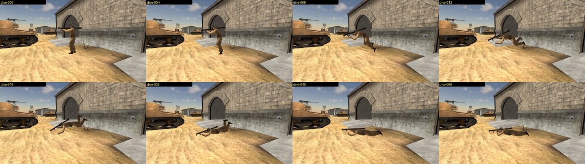
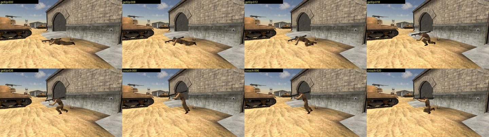
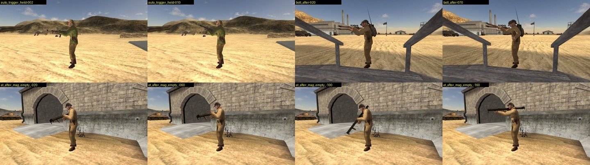
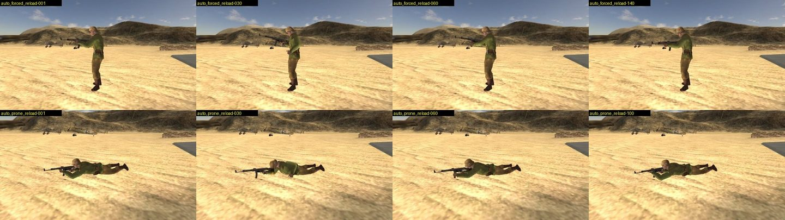
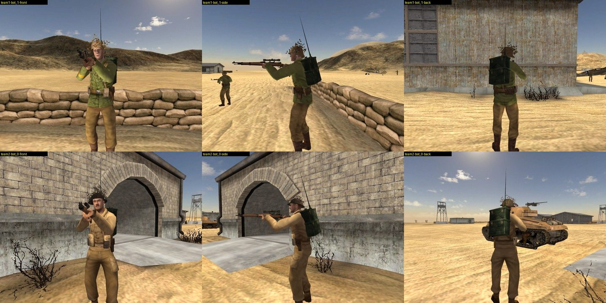
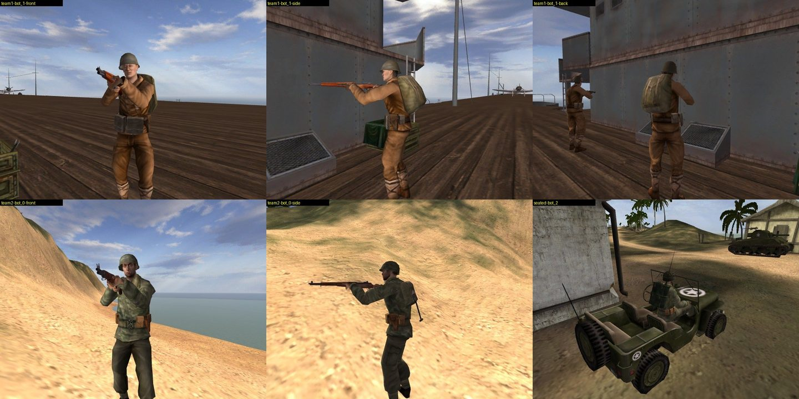
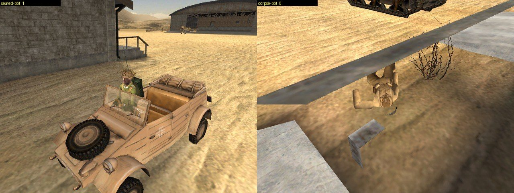
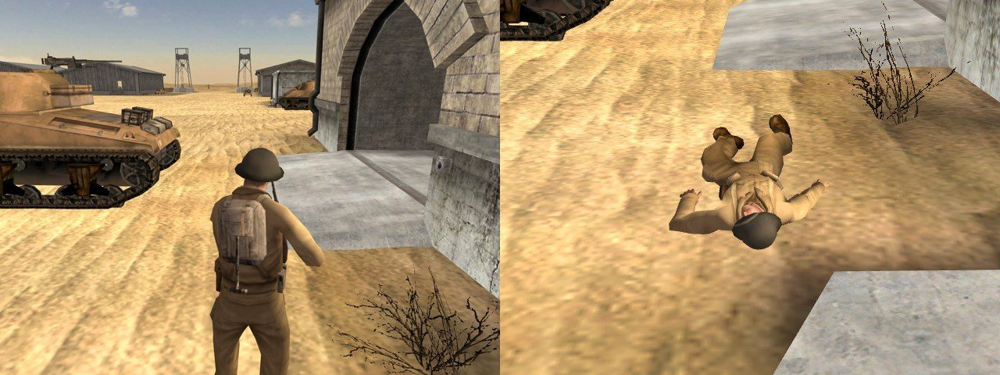

# Bot bodies: stance changes, fire, reload and the kit

Three owner reports, 2026-09-24:

> "Bots are instantly proning when under attack. And it looks janky. They don't have an aimation from
> standing to prone so they snap to prone. Is proning how the game does it? It looks a bit weird when all
> the bots are lying down, I think some could stay standing up some could couch instead of every=one
> proning."
>
> "bot solddiers are missing the entire kit outfit, they have the gun, but they don't have the back
> pack, or helmet matching their unit"
>
> "The bazooka sounds glitchy ... in the real game you have to reload, so the bots should show the
> reload animation."

The reload logic is the bot-fire work's (`bot-referee.js`). This folder covers the body that shows it.
The engine facts are ledger rows BODY-1 to BODY-9 in
[`bf1942-engine-reference/ledger.md`](../bf1942-engine-reference/ledger.md).

## Is proning how the game does it?

Yes. A firing bot picks its pose with `getFiringPose` (lnxded `0x085a26f0`). It tries prone, then
crouch, then stand, and takes the first whose eye has a clear line to the target (AI-36, BODY-5). On
flat open ground the prone eye sees, so a firing bot lies down. From standing the engine gets there with
the dive, `Lb_RunStandToLie`, whether the soldier was running or standing still. The dive is a 0.71 s
one-shot at the machine's rate of 1.4. Only a soldier moving backward lies down the long way, through
the crouch (PHY-8, BODY-1). The prone was right. The snap was the bug.

The variety the owner remembers has two sources, and neither is random tie-breaking:

- **Terrain and cover.** The engine's prone eye is 0.30 m over the feet. A rise, a sandbag or a wall edge
  blocks that line, and the bot kneels or stands. The viewer's prone eye is 0.40 m, which sees over more.
  Its line also runs to the target's feet + 1.0 m, where the engine's runs to the point the bot sensed on
  the target (BODY-5).
- **Bots that are not firing.** Scout and TakeCover pick their pose with a variable component (BODY-6).
  A bot stands where his side holds the ground and crouches where it does not. He lies down only once the
  fire at him passes his own random threshold, and the pose is re-decided every 5 s. The viewer's Scout
  lies down under fire and otherwise stands.

Both are sim changes in `bot-fire.js` and `bot-plans.js`, outside this work's files. They are listed
under Open.

## What was wrong

- `bot-visuals.js` switched whole-body clips at full weight from their first frame (`playFamily`). The
  gait sidecars held seven loops and no transitions, so a stance change was a one-frame cut: the pelvis
  dropped 0.84 m between two frames.
- The torso never fired or reloaded. A bot's rounds and magazine changes drew nothing.
- Every bot wore `GermanSoldier` or `USMarineSoldier`, whatever the level. A `BFSoldier` template is a
  body, a head and two hands. The helmet, pack and pouches belong to the kit and hang off bones `A`,
  `backpack` and `HipPack`. Only the human's seated body was dressed.
- A Thompson bot kept his gun when he died. `getObjectByName('Thompson')` found the skeleton's bone of
  that name before the loader's `Thompson_1` weapon node.

## What changed

**Extraction** (`extract_pose.py`, `bf42/gltf.py`, `bf42/animstates.py`)

- `gaits/lower.gait.glb` gains the seven lower transitions under the engine's names, at the machine's
  finished rates: `Lb_StandToCrouch` 12, `Lb_CrouchToStand` -10, `Lb_StandToLie` 6, `Lb_CrouchToLie` 1.6,
  `Lb_LieToCrouch` -2, `Lb_LieToStand` -3, `Lb_RunStandToLie` 1.4.
- Each `gaits/<Grip>.gait.glb` gains its grip's torso halves of those, plus `Ub_Fire`, `Ub_LieFire`,
  `Ub_StandReload` and `Ub_LieReload`. `Ub_FireEnd` and `Ub_LieFireEnd` are baked but never played
  (BODY-8).
- Every bundle's `extras.states` gives each clip's rate, loop, morph and follow-on state. A lower state
  also gets the pose its flags hold (BODY-4). `gaits.json` `stateMachine` lists:
  - the three torso transitions with no clip (BODY-9);
  - the four weapons whose rate differs from their grip's bake (Panzershreck `Ub_LieReload` 0.4,
    WalterP38 `Ub_Fire` 2.0, K98Sniper and No4Sniper `Ub_RunStandToLie` 1.5);
  - the states each grip declares with no clip.
- A backward one-shot is now reversed end to end (BODY-3). That corrects `swim.gait.glb`'s
  `Lb_EndSwim` / `Ub_EndSwim`, the only existing clips whose content changed.
- The new clips are written compact: shared time accessors, constant channels as two keys, accessors
  deduplicated by content. A grip bundle grows from about 384 KB to about 540 KB, not about 860 KB.
  Every other existing clip keeps its content, and all 288 pose glbs are byte-identical.
  `--gaits-only` rewrites only the sidecars.

**The body** (`soldier-actions.js`, `bot-visuals.js`)

- `SoldierActions` gives each half a current state. A stance change enters the engine's chain on both
  halves, starting from the pose the legs are in. One-shots run for 1/|rate| at the weapon's own rate and
  follow their `addTransitionWhenDone`. `_POSE_` returns the half to its gait family's loop.
- `MorphBlend` is ANIM-4's morph. On entry it captures the bones. Each frame after the mixer, every bone
  slerps from where it stood toward the new clip by `w`, which starts at 0 and gains `dt x morph` a frame.
  A morph above 1000 is a cut.
- `bot-visuals.js` builds that rig when the bundles carry the stance halves and keeps the old one
  otherwise. It reads each stance change at the world tick that made it, with the dive-or-backward test
  from the body's `stateSpeed`.
- Each round plays `Ub_Fire` or `Ub_LieFire` (map.html `onShot` calls `botBodies.botFired`). An
  automatic loops while the trigger is held. A bolt rifle's shot hands on to the bolt.
- A reload plays `Ub_StandReload` or `Ub_LieReload` when the referee's magazine clock starts. The reload
  keeps the torso through a stance change (BODY-2).
- A death plays with the die morph from wherever the bones stood.
- A round from a weapon other than the one in his drawn hands plays nothing. A grenade would otherwise
  swing the rifle.

**The outfit** (`soldier-dress.js`, `kit-graft.js`, `bot-visuals.js`, `seat-body.js`, `seat-pose.js`,
`foot-body.js`)

- A bot wears the level's soldier for his side (`soldierTemplateFor`: `game.setTeamSkin` through
  `_shared/loadouts.json`, falling back by nation) and holds his kit's primary. If the tree has no pose
  for that pair, the old template holds the primary, then each template holds the pistol
  (`outfitCandidates`).
- One dresser and one cache of kit parts (`createSoldierDress`) hang each worn part on its bone with the
  pinned slot rotation, shaded like the level. It reads `kits.json` from the mod's tree, then vanilla's.
  A figure disposed while a part is in flight is not dressed.
- `undress` takes the borrowed parts off before a figure's buffers are freed, because the parts share
  the cache's geometry.
- Dressed now: bots on foot, seated and dead, and the human's third-person body, alive and as the corpse
  the death cam frames. The human's seat now uses the same dresser.
- The weapon a death stows is the subtree named after the weapon that carries the most meshes
  (`weaponNodeOf`).

## Published

26 files went to `mesh.bfstats.io/models/poses/gaits/` with
`scripts/publish-mesh-delta.py models --root <staging> --hash --hash-remote`. Nothing was deleted, and
the other 8,692 files on the volume were left alone. Each file was fetched back over HTTPS with a cache
buster and matched its local size and sha256. Before the publish the gaits tree was backed up and
checksummed.

| file | live before | live after |
|---|---|---|
| `gaits.json` | 3,068 | 4,905 |
| `lower.gait.glb` | 108,540 | 141,972 |
| `Thompson.gait.glb` | 384,116 | 555,384 |
| the other 22 grip bundles | | 455,552 to 585,268 |
| `swim.gait.glb` | 426,700 | 426,700 (the exit reversed) |

Older viewer code still works on the new bundles. The live site's viewer bound all 16 families with no
errors, and so did the main checkout's (8 bots, clocks running).

## Verified

All runs are headless Chromium on the worktree's viewer at 60 frames a second. The runs were repeated
after the rebase onto main `15e677b0`, and the numbers are identical.

**Stance changes** (El Alamein, `bot_0` holding a Bazooka; `Bip01` height over the feet)

| change | `Bip01` (m) | largest step a frame (m) | states entered (frame) |
|---|---|---|---|
| dive | 0.997 to 0.157 | 0.050 | 1 `Lb_RunStandToLie` + `Ub_RunStandToLie`, 43 lie |
| get up | 0.157 to 0.998 | 0.053 | 1 `Lb_LieToStand` + `Ub_LieToStand`, 20 `Lb_CrouchToStand`, 26 stand |
| crouch | 0.998 to 0.493 | 0.052 | 1 `Lb_StandToCrouch`, 5 crouch |
| stand from a crouch | 0.493 to 0.997 | 0.049 | 1 `Lb_CrouchToStand`, 6 stand |
| crouch to prone | 0.492 to 0.157 | 0.018 | 1 `Lb_CrouchToLie` + `Ub_CrouchToLie`, 38 lie |
| prone to crouch | 0.157 to 0.494 | 0.024 | 1 `Lb_LieToCrouch` + `Ub_LieToCrouch`, 30 crouch |
| lie down moving backward | 0.997 to 0.200 | 0.051 | 1 `Lb_StandToLie` (torso `Ub_CrouchToLie`), 10 `Lb_CrouchToLie`, 48 crawl |
| get up from a crawl | 0.202 to 0.998 | 0.053 | 1 `Lb_LieToStand`, 20 `Lb_CrouchToStand`, 26 walk, 31 stand |

Every state lasts 1/|rate| to within a frame. For example, the dive's 42 frames are 0.70 s against
1/1.4 = 0.714 s. Before the change, each of these was a single frame.

**Fire and reload** (El Alamein; the torso's state by frame)

| weapon | event | torso |
|---|---|---|
| Sg44 | trigger held, then released | `Ub_Fire` loops; the aim returns after 9 rounds |
| Sg44 | magazine change standing | `Ub_StandReload`, 113 frames (1/0.53 = 1.89 s), then the aim while the 3.8 s reload finishes |
| Sg44 | magazine change prone | `Ub_LieReload`, 109 frames (1/0.55 = 1.82 s) |
| Sg44 | round fired prone | `Ub_LieFire` |
| No4 | one round | `Ub_Fire` for 1.0 s, then the bolt (`Ub_StandReload`) for 1.92 s, then the aim |
| Bazooka | the round | `Ub_Fire` for one frame, then `Ub_StandReload` for 2.86 s (1/0.35). The referee starts the reload on the round's own tick (Open) |

**The kit**, counted off the scene graph:

- **Soldier template.** On El Alamein the Allies wear `BritishSoldier` and the Axis
  `GermanDesertSoldier`. On Wake the Allies wear `USMarineSoldier` and the Axis `JapaneseSoldier`.
- **Parts per kit.** Head, back and hip: `GB_Scout`, `GB_Assault`, `GB_Engineer`,
  `German_Scout_Desert`, `German_Engineer_Desert`, `USMarine_Scout`, `UsMarine_Assault`,
  `USMarine_Engineer` and `Jap_Engineer`. Head and back: `GB_Medic`. Head and hip: `GB_AT`,
  `German_Assault_Desert`, `German_AT_Desert`, `German_Medic_Desert`, `Jap_Assault` and `Jap_Medic`.
- **Seated bots.** A Kubelwagen passenger on El Alamein and a Willys passenger on Wake wear their kit's
  parts.
- **Corpses.** On 4 of 4 corpses the same parts are on before the blow, at it and after it. The weapon
  is hidden. Before the `weaponNodeOf` fix, `ThompsonFlerp` stayed visible.
- **The human.** He is `BritishSoldier` holding `GB_Assault`'s Bar1918, with head, back and hip parts
  alive, dead under main's new corpse cam, and in a Willys seat.

**The stance flicker.** In the 25 s, 8-bot squad fights, the bots that fought prone flipped their plan
from Fire to Change to Fire for one world tick every 2.5 to 5 s: 18 to 20 stance-input flips each. The sim's input
goes prone, standing for one tick, then prone again. The body now keys on the legs' pose (BODY-4), so
each flicker plays one tick of `Lb_LieToStand`, which is still lying, and settles back into the lie
loop. No dive is replayed. A real Change of 2.8 s standing played the whole chain: `Lb_LieToStand`,
`Lb_CrouchToStand`, then `Lb_RunStandToLie` back down.

**Tests**

- `tests/test_gait_actions.py` (14): the bake, the compact writer and the one-shot reversal.
- `tests/test_soldier_actions.py` (19): the state machine and the morph under node.
- `tests/test_soldier_outfit.py` (9): the template, the kit, the parts, undressing and the mod fallback.
- `tests/test_swim_assets.py` (+1): the swim exit's reversal.

The full suite after the rebase is 3,227 tests, all OK.

## Open

1. **The stance flicker is still in the sim.** `bot-decision.js` lets Change win a single tick of a
   fight, and the Change plan (`bot-mount.js` `planChange`) starts with `SoldierPose` 'stand'. The body
   hides it, but the sim still flips.
2. **Firing pose.** `bot-fire.js` `firingPose` uses eyes of 0.4 / 1.1 / 1.6 m, where the engine's are
   0.30 / 1.12 / 1.65 m. It aims at the target's feet + 1.0 m, not the sensed point, and nothing passes
   the LOD force (BODY-5).
3. **Scout and TakeCover.** The variable pose (BODY-6) is not built.
4. **The Bazooka's shot is cut after one frame.** The referee starts the reload on the round's tick. The
   engine waits for the fire cycle (BODY-7). This is the bot-fire work's.
5. **The local player's stance timings.** `soldier.js` `STANCE_TRANSITION` and
   `soldier-locomotion.js` `DIVE_DURATION` use a 26 fps frame count that ANIM-2 refutes, and the files'
   untweaked rates. The machine plays the dive for 1/1.4 = 0.714 s, not 0.282 s. It plays crouch to lie
   for 0.625 s, not 0.216 s, and lie to stand for 0.333 s plus 0.1 s, not 0.115 s.
6. **The fire-timer half of BODY-2 is not modelled.** A stance change while firing swaps the torso to
   the transition.
7. **Mods.** XPack1, XPack2 and EoD have no gait trees, so their bots keep the old still rig. The kit
   dresser reads the mod's own `kits.json` first.
8. **Remote players.** `netcode-render.js` bodies are neither dressed nor driven by `SoldierActions`.
9. **The human's own body** is dressed but plays no stance transitions (`soldier-body.js`).
10. **Grenades.** A bot is drawn holding his primary, so a thrown grenade plays no torso action.
11. **A sinking corpse.** One corpse on a slope appeared to sink into it (`corpse-el_alamein`, `bot_3`).
    Not investigated.
