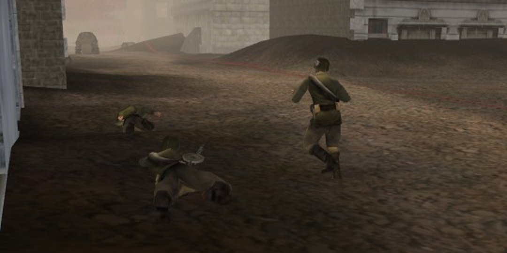
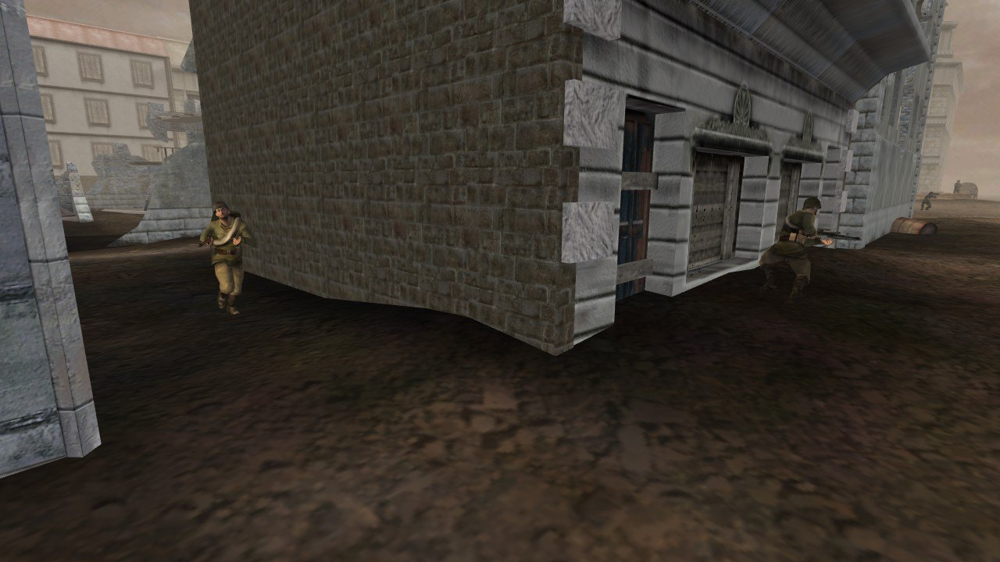
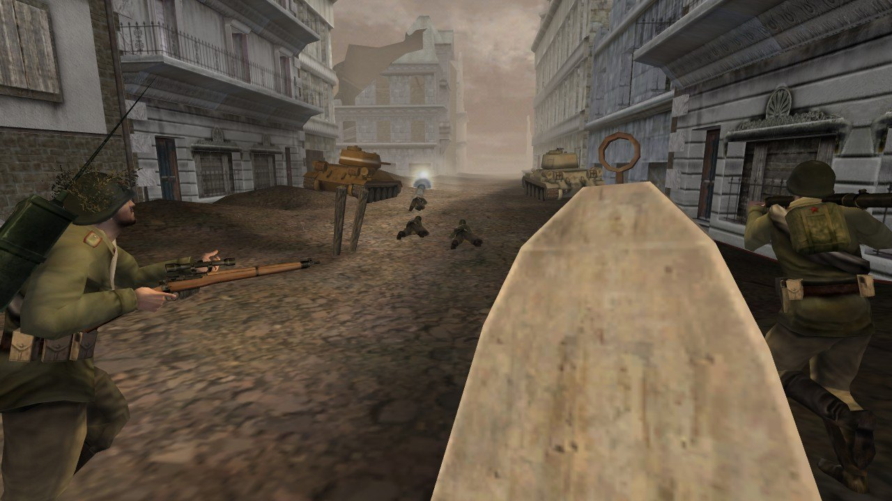

# Bot stances: which pose a bot takes, and when it can change it

The owner, 2026-09-24:

> "Bots are instantly proning when under attack... Is proning how the game does it? It looks a bit
> weird when all the bots are lying down, I think some could stay standing up some could crouch
> instead of everyone proning."

The stance snap was fixed in [`bot-body-animation`](../bot-body-animation/README.md). This round brings
the pose decisions themselves to the engine's rules. The engine facts are ledger rows BODY-5, BODY-6
and BODY-10 to BODY-14 in [`bf1942-engine-reference/ledger.md`](../bf1942-engine-reference/ledger.md),
read from `bf1942_lnxded.static`.

## What the engine does

- **A firing bot lies down whenever the prone eye can see its target.** `getFiringPose` tries prone,
  crouch, then stand. Each pose's eye is the soldier's pose camera: 1.65, 1.12 and 0.30 m over the feet.
  The line runs to the point on the target that the bot's sense ray reached. So a bot fires prone on
  open ground. It kneels or stands only where something blocks the low line (BODY-5).
- **The firing pose applies only while the bot can shoot.** A soldier's fire plan switches every tick
  between closing in and firing. It fires while the target is within 0.9 of the weapon's range and can be
  aimed at, and in sight when the firing state asks for that. Otherwise it closes in, and the move's own
  pose decides (BODY-12).
- **A bot that is not firing mostly stands.** Every move, the Scout plan and TakeCover's walk to cover
  carry a variable pose (`BAPAComponentSoldierPose`). It stands. It lies down when the fire at the bot
  passes a random threshold of its own, re-deciding every 5 or 10 s. Its "crouch" branch never fires in
  the retail game, because both inputs that could select it stay at 0 or above (BODY-6, BODY-11,
  BODY-12). The component crouches only in shallow water.
- **The fire the component weighs** is the bot's attacker strength: its attackers' newest rounds, decayed
  by age. Hits count, and so does any enemy round fired within 50 m of the bot or flown within 10 m of
  it. Each round weighs the shooter's battle strength against the bot's class, 4 for a healthy soldier
  (BODY-11).
- **At a cover object, TakeCover picks once:** stand if the danger is in view from a standing eye, else
  crouch if a crouching eye sees it, else prone. Without cover the bot lies down, crawls to low ground and
  lies down again (BODY-13).
- **A pose change goes through a 10 s gate.** Going prone happens at once. Any other change waits until
  10 s after the last change. No request is taken while a change is under way, and no reset touches the
  pose. A bot that drops prone therefore stays down at least 10 s, even if it walks off. A request the
  gate holds back stays stored and is carried out when the gate opens, whatever plan runs then (BODY-10).

## What was wrong in the viewer

- The firing pose used eyes of 1.6, 1.1 and 0.4 m, aimed at the target's feet + 1.0 m, and fell back to
  standing when no pose saw the target. The engine keeps the pose the bot already has. The fire plan
  asked for the firing pose before its approach, so a bot closing in on its target crawled there.
- Scout lay down for 1.5 s after any hit and otherwise stood. TakeCover walked to cover standing and
  re-picked its ladder every tick. Moves had no pose of their own.
- Every pose request was applied at once. The stance was also reset to standing at the start of every
  tick and on every plan switch. When another behaviour won a single tick of a fight (Fire's urge curve
  hands the contest over every few seconds), a prone bot stood up for that tick. MoveTo's move and
  Change's opening "stand" statement caused most of it. The engine's Change plan has no pose statement.
- Hits fed incoming fire at strength 1. The ledger's FF-8 had read the fire object's decay rate as its
  strength. Near misses fed nothing.

## What changed

- `viewer/bot-pose.js` (new): the component with the engine's arguments per builder, the water depth,
  and `PoseRequests`, which is `requestSoldierPose` plus `pollRequestedSoldierPose` with its 10 s gate.
- `bot-fire.js`: `FIRING_POSES` takes its eyes from `soldier-pose.js`. `firingPose` tests the line to the
  sensed point. The fire plan's pose statement waits for the approach or back-off move, and is left out
  when no pose sees the target.
- `bot-sense.js`: a soldier's sense point is kept in his body frame and turned with him (`sensedPoint`).
  The eyes are the pose cameras. `attackerStrength` and the shared near-miss entry are new.
- `bot-perception.js`: `nearShot` adds the 50 m and 10 m fire objects. `fireObjectStrength` gives hits
  and near misses the shooter's strength.
- `bot-plans.js`: Scout's variable pose, TakeCover's two plans, the ladder decided once with the pose
  cameras, and no pose statement for the medic. `execInfantryResetControls` no longer resets the stance.
- `bot-route.js`: each move asks for its own pose from its second tick on.
- `bot-mount.js`: Change loses its "stand" statement. The pose state resets when a bot mounts or
  dismounts.
- `bot-aim.js` and `bot.js`: the input holds the polled pose, and the poll runs after the plan.

## Verified

Everything below was measured on main `ea2e0b8f`, before and after this branch. Runner numbers taken
before the damage-parity merge are not comparable with these. The branch now sits on `1340e452`, whose
two commits wash the seated player's HUD and change nothing a bot does.

**Tests.** `tests/test_bot_stance.py` (22) covers the component's threshold spread, its strict
comparison, the 5 s re-decision, the control branch and the water rule, and every builder's threshold
and duration. It covers the gate (prone at once; stand at 10.0 s, not 9.99 s; a request dropped in
flight), the eyes and the sensed point, the attacker sum, its expiry and the near misses, and the plans.
It also runs a bot firing prone on open ground while Change is forced to win one tick every 3 s: the
soldier stays prone on all 600 ticks. On `1340e452` the whole suite runs 3,295 tests, all OK; main
alone runs 3,273.

**Stance shares, the runner.** `sim/run.mjs` with the same modules, 3 seeds of 600 s each, every bot alive
and on foot sampled once a second. Shares are stand / crouch / prone. The middle column is this branch
with the fire objects' strengths and the near misses taken out: hits weigh 1 and near misses nothing, as
before. It shows what the pose rules do on their own.

| level | behaviour | before | pose rules only | after |
|---|---|---|---|---|
| Berlin | Fire | 33 / 7 / 60 (n=2078) | 28 / 10 / 62 (n=1689) | 26 / 5 / 69 (n=2275) |
| | Scout | 99 / 0 / 1 (n=1023) | 98 / 0 / 2 (n=570) | 86 / 0 / 14 (n=551) |
| | TakeCover | 74 / 0 / 26 (n=47) | 28 / 0 / 72 (n=88) | 41 / 0 / 59 (n=181) |
| | MoveTo | 100 / 0 / 0 (n=4064) | 92 / 1 / 7 (n=4384) | 91 / 0 / 9 (n=3766) |
| | Change | 100 / 0 / 0 (n=2097) | 87 / 1 / 11 (n=2283) | 88 / 2 / 11 (n=2085) |
| El Alamein, on foot (`--no-vehicles`) | Fire | 34 / 14 / 52 (n=1883) | 70 / 14 / 16 (n=1700) | 51 / 19 / 29 (n=1903) |
| | Scout | 100 / 0 / 0 (n=3853) | 99 / 0 / 1 (n=4381) | 98 / 0 / 2 (n=3154) |
| | TakeCover | 32 / 2 / 66 (n=59) | 57 / 2 / 41 (n=100) | 25 / 1 / 74 (n=272) |
| | MoveTo | 100 / 0 / 0 (n=20004) | 99 / 0 / 1 (n=20036) | 99 / 0 / 1 (n=20787) |

- **Firing.** A bot closing in on its target now runs there on the move's pose. Before, it crawled
  there on its firing pose. On Berlin the approach is 17% of Fire's samples (33% before), and 82% of
  them stand, where 76% had been prone. At the trigger with the target in sight, 88% of firing bots lie
  down, up from 68%.
- **El Alamein's firing bots stand more** (34% to 51%). Two things add up. The approach runs standing, as
  above. And the line from the low eyes now runs to the sensed point, which for a soldier beyond 20 m is
  always 0.3 m over his feet. That height is the viewer's own, not the engine's (open item 1).
- **Moves, Scout and Change** lie down 9 to 14% of the time on Berlin, where they never had. Past its
  threshold the variable pose lies a bot down, and the gate keeps a bot that just fired prone down for up
  to 10 s.
- **The fire objects' strengths** (the last two columns) raise the fire every bot weighs. So moves, Scout
  and TakeCover lie down more, and TakeCover wins more often. On Berlin its share of bot time goes from
  4.6% to 7.0%.

**Stance shares, the page.** Headless Chromium on the worktree's viewer, 16 bots, `botSkill 0.75`,
150 s of Berlin each, sampled the same way. "Before" is main's viewer served to the same page. The page
is not seeded, so each run is a different match.

| behaviour | before | after |
|---|---|---|
| Fire | 27 / 9 / 64 (n=344) | 14 / 4 / 81 (n=522) |
| Scout | 100 / 0 / 0 (n=33) | 100 / 0 / 0 (n=24) |
| TakeCover | 100 / 0 / 0 (n=6) | 88 / 0 / 12 (n=83) |
| MoveTo | 100 / 0 / 0 (n=487) | 91 / 0 / 9 (n=347) |
| Change | 100 / 0 / 0 (n=429) | 96 / 0 / 4 (n=536) |

El Alamein's first 150 s on the page are a march: with every bot on foot, 6 Fire samples before and 6
after. The runner is the measurement there. No page error either way.

**The flicker.** The runner traced every tick on Berlin, seed 1, for 240 s. Before, it counted 89
one-tick stance flickers: 60 after a TakeCover tick, 14 MoveTo, 13 Change, 2 MoveTo from a crouch. It
counted 0 after, and no stance run of three ticks or less (148 before). The one-tick behaviour flips out
of Fire remain, as in the engine: 79 before, 93 after. On the page, a stance that lasted 0.1 s or less
between two runs of the same stance counted 38 before and 5 after. The bot's held input did so 65 times
before and 5 after:

- Four are requests carried out the moment the gate opened, three stands and a crouch. Each time prone
  was asked for again at once, and prone is never held back. A bot that takes turns between firing prone
  and a move that asks for stand does this every 10 s. In the engine the stored request is written only
  by `requestSoldierPose`, the constructors and the poll's reset, so the engine should do the same
  (BODY-10).
- One is a TakeCover tick that asked for stand with the gate already open. The engine's TakeCover looks
  at the danger first (open item 7).

**Match metrics** (the runner, the same 3 seeds; before / pose rules only / after). On Berlin, captures
went 5 / 8 / 3, kills 234 / 218 / 169, deaths 254 / 232 / 182. On El Alamein on foot, captures went 21 /
21 / 21, kills 65 / 50 / 58, deaths 68 / 51 / 62. Three seeds of a match that diverges from its first
seconds are a small sample. Most of Berlin's drop in kills comes with the fire objects' strengths, not
with the pose rules. Route failures went 364 / 385 / 1,387 on Berlin. In every column most of them are
one or two bots a run stuck walking to a vehicle they cannot reach (Change, standing). On El Alamein
they went 0 / 0 / 58, mostly TakeCover's walks to cover.

## Not built, and open

1. **The point a soldier is sensed at.** The engine keeps a random skeleton bone
   (`pickSoldierRandomSensePosition` `0x085e3d20`, ledger AI-123, read, not ported). The viewer aims its
   sense rays at invented heights: its one ray beyond 20 m always at 0.3 m over the target's feet.
   Since the firing pose now tests the line to that point, the low eyes lose it at range more than they
   would to a random bone. That likely explains El Alamein's firing bots standing 51% of the time (70%
   with the pose rules alone). Porting the bone pick needs the soldier's bone positions in each pose,
   which the runner does not have.
2. **The fire plan's switch** between closing in and firing (BODY-12) is not ported. The viewer closes in
   once, then asks for the firing pose and pulls the trigger even when the target has left its sight.
3. **The LOD shortcut.** A target that is a bot with `getLodLevel` above 0 (far from every human
   player, `AILODManager::updateBot` `0x08475fe0`) makes the firing pose prone with no line test, and
   skips the plan's other line tests. The viewer runs every bot at full detail, so it has nothing to pass.
   In the real game most bot-against-bot fights away from the player lie down for this reason alone.
4. **The impact point of a near miss.** The engine measures the 10 m to the segment from the shooter to
   where the round landed. The viewer's hearing hook carries no impact point, so it uses the shooter's
   facing, onward past the bot (INFERRED).
5. **The ammunition half of a round's strength** is taken as full. `IPIUnit::getAmmo` was not traced.
6. **A new move asks for no pose on its first tick** (INFERRED from the budgeted path search that gives
   a finding move its point). This is what keeps a one-tick MoveTo or Change from standing a prone bot
   up.
7. **TakeCover's opening look** at the danger (`While(Not(LookDeviation))`) is not ported, so its pose
   statement can run on the plan's first tick.
8. **Which area the SAI holds a bot in** is not tracked. The control input is passed as 0. Every value
   the engine can pass (0, 1, or a share in [0, 1]) takes the same branch.
9. **Near misses also feed Scout's and TakeCover's urgencies**, because they sit in the incoming-fire
   list, as the engine's fire objects do. Neither generator was re-read for this.
