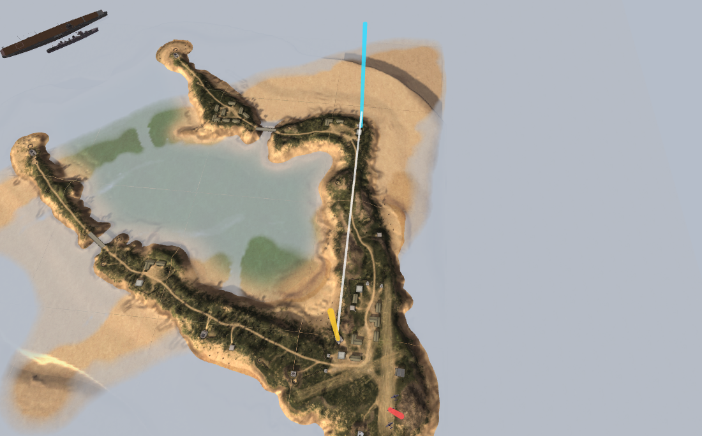

# Flight-model measurement protocol

Four in-game measurements that pin down the constants the shipped `.con` data
cannot fix. Keep this open on a second screen while recording.

Background: [flight-model.md](flight-model.md) §8 lists the free constants
(inertia, `K_LIFT`, `AOA_CLAMP`, the thrust calibration). Everything below is
chosen so each one is directly recoverable from a stopwatch.

---

## Before you start

- [ ] **Vanilla BF1942, single player, Wake Island.** Not a mod, not a server.
      Our extract is of vanilla Wake, so anything else invalidates the comparison.
- [ ] **Fly the Corsair.** It spawns on the airstrip. The SBD is a different
      airframe with different numbers.
- [ ] **60 fps, constant frame rate.** OBS with CBR. *Variable frame rate
      destroys frame counting, which is the entire measurement.*
- [ ] **Note your video-distance slider setting** once, on camera or out loud.
- [ ] **One manoeuvre per clip.** Don't touch other axes mid-measurement.
- [ ] **Say what you're holding, and when.** "Full throttle now", "stick hard
      right", "releasing". A voice track beats trying to infer it later.

Ten to twenty seconds per clip is plenty. Re-takes are cheap; ambiguity is not.

---

## The speed baseline

BF1942 has no airspeed readout, so a video gives time but not speed. The fix:
two landmarks whose exact world positions we already know.

| Marker | World position | Notes |
|---|---|---|
| **Defgun D** | x = 1346.3, z = −764.9 | The coastal gun nearest the airstrip, ~140 m from the Corsair spawn |
| **Defgun B** | x = 1346.0, z = −1217.7 | The next one along the same arm |

**452.8 m apart, and they sit on a dead straight line** — the x coordinates
differ by 30 cm. Both are large concrete coastal gun emplacements, unmistakable
from the air.



Rendered from our own extract of Wake, so the positions are exact.
**Red** is the Corsair spawn on the airstrip, **yellow** is Defgun D,
**cyan** is Defgun B, and the white ribbon is the 452.8 m run. Both guns are on
the eastern arm of the atoll, and the spawn is a short hop south of D.

Take off, turn onto the arm, and run its length. Either direction works — just
be consistent within a clip.

Fly directly over one, then the other, straight and level. The frame count
between them is an exact ground speed:

```
speed (m/s) = 452.8 / (frames / 60)
```

At the ~55 m/s we currently predict, that's about 8.2 s, or ~494 frames. Plenty
of resolution.

---

## Clip 1 — Deck run (top speed, thrust, spool)

1. Start **stationary on the airstrip**, engine idle.
2. Full throttle. Call it.
3. Take off, level out low, line up on the Defgun D → B run.
4. Hold full throttle, straight and level, all the way across both markers.
5. Keep flying straight for a few seconds past the second marker.

**Gives:** throttle spool time, the acceleration curve, and top speed.
**Watch for:** don't climb. Altitude changes contaminate the speed reading.

## Clip 2 — Roll rate

1. Get to **established top speed**, straight and level.
2. Full aileron, one direction, and **hold for at least three complete
   rotations**.
3. Release and recover.

**Gives:** roll rate, from frames per 360°.
**The valuable part:** whether the rate is *constant* or still *accelerating*
across those three rotations. Constant means rate-limited; accelerating means
torque-limited. That distinction is worth as much as the number, because it
tells us which term in the model is actually binding.

## Clip 3 — Loop

1. Get to **established top speed**, straight and level.
2. Full back stick, hold through **one complete loop** until you're level again.
3. Call the top of the loop as you pass through it.

**Gives:** pitch authority, and how much speed the manoeuvre bleeds.
**Watch for:** keep the wings level going in — a barrel roll instead of a loop
measures something else entirely.

## Clip 4 — Stall

1. Climb at a steep angle with **throttle well back**.
2. Hold the nose up until the aircraft stops flying.
3. **Keep holding** and let it sink, for several seconds, before recovering.

**Gives:** the speed at which the lift regulators saturate. In BF1942 this *is*
the stall model — there is no stall parameter anywhere in the data, only the
regulators' ±2° of travel running out.
**Watch for:** the sink is the measurement, not the nose drop. Don't recover early.

---

## Roughly what to expect

From the surveyed data, so you can sanity-check on the spot. If something is
wildly off, the clip is more interesting, not less — say so on the voice track.

| Quantity | Expected |
|---|---|
| Level top speed | ~55 m/s |
| Stall | 20–25 m/s |
| Terminal dive | ~150 m/s |
| Full-stick roll at cruise | 180–220 deg/s (1.6–2.0 s per turn) |
| Sustained loop | ~40 deg/s (~9 s per loop) |
| Throttle idle to full | ~10 s |

That last one surprises people. `setMaxSpeed 500` over the engine's 5000-degree
accumulator is a tenth of the range per second, so the spool really is that
slow — worth knowing before you start clip 1 and wonder why nothing's happening.

---

## Afterwards

Send the files over and I'll pull frames with ffmpeg and read the timings off
directly. Raw files are better than anything re-encoded for sharing — a second
encode can resample the frame rate and quietly break the count.

### What this will and won't settle

These four numbers will make the aircraft *feel* right, and they fix every free
constant in §8.

They will **not** validate the per-surface aerodynamic model itself — for that
you want continuous state rather than inferred timings, which is the demo-file
or capture-hook path. Worth remembering when we get to replaying real rounds:
a replay that re-simulates from captured *inputs* depends on the model being
right, while one that interpolates captured *state* does not. That argues for
capturing both.
