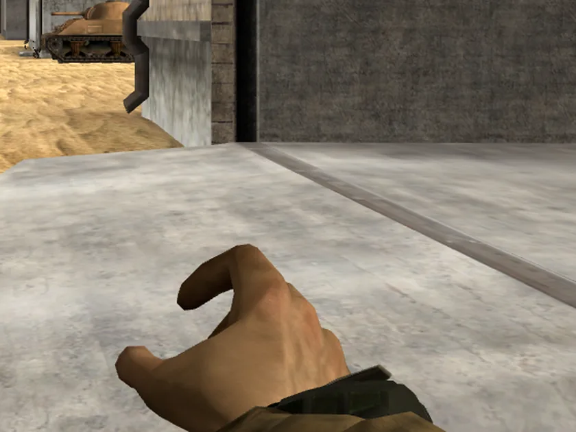
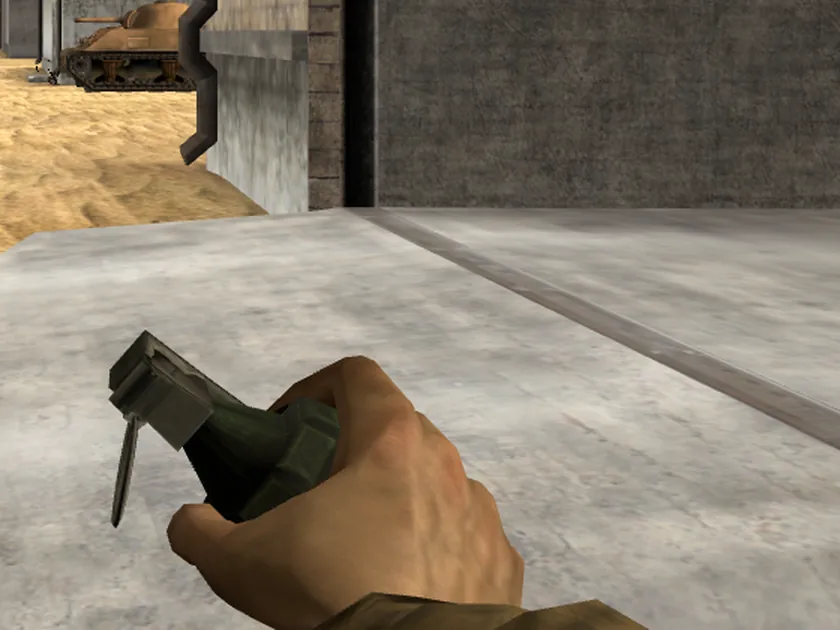
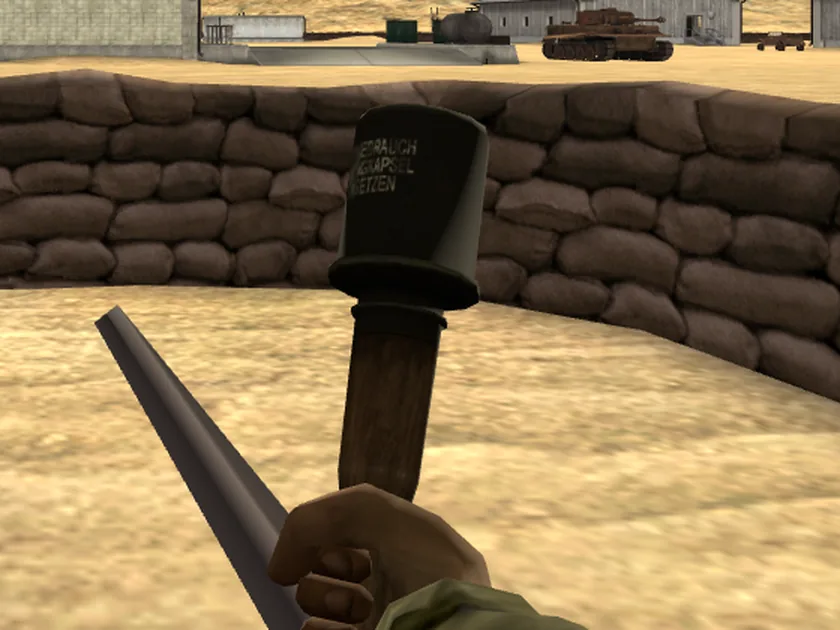
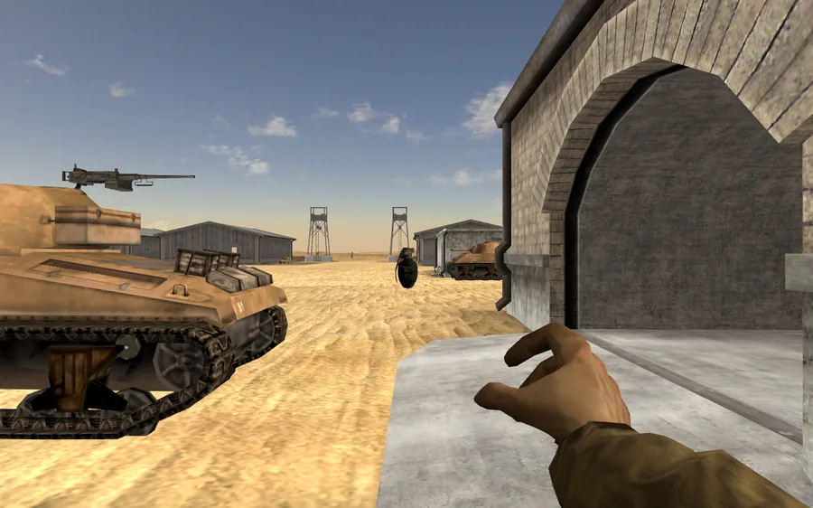
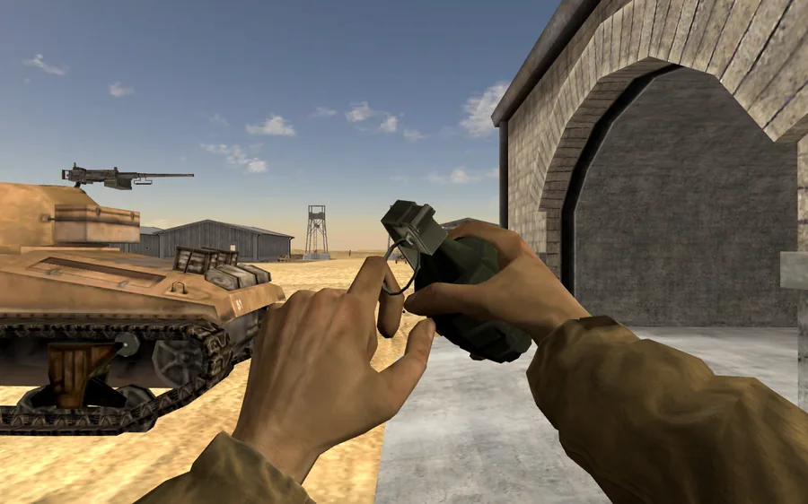
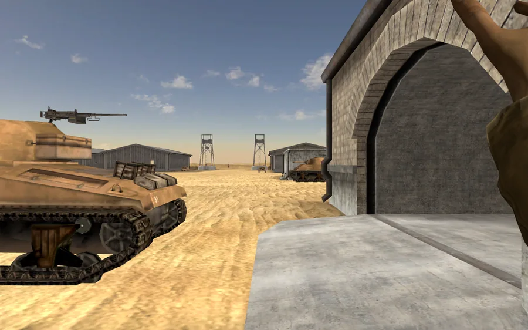
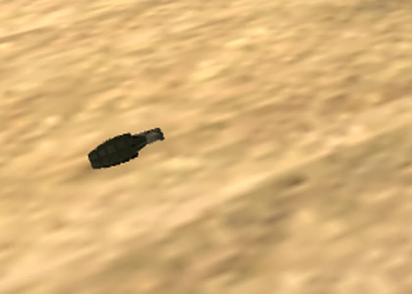
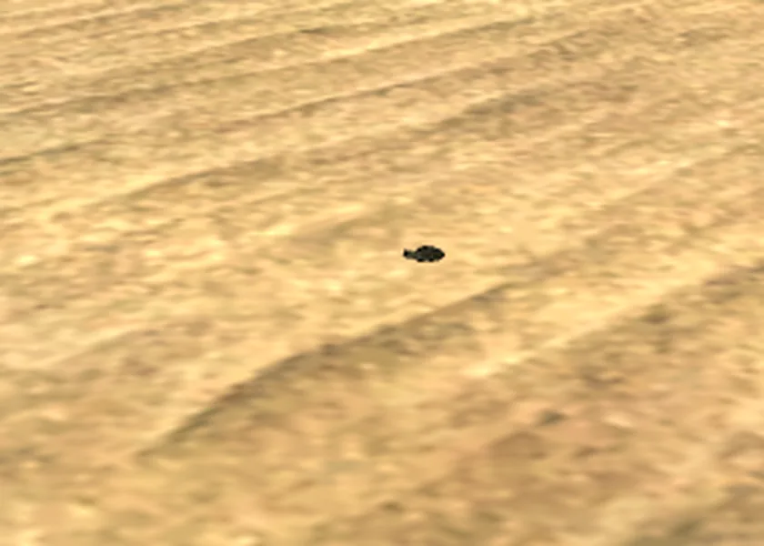
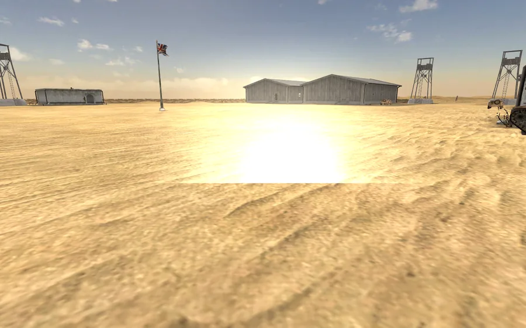

# The grenade: the one in the hand, and the one you throw

Two bugs, reported together and unrelated underneath:

1. *"The grenade kit has the throw animation, but the grenade doesn't move with
   the hand, and by default is not positioned correctly anyway, it is on its
   side and floating on their arm."*
2. *"When a grenade is thrown it does explode where you threw it, but in game
   you can see the grenade thrown and roll."*

The first is an archive reader that handed back compressed bytes without
inflating them. The second is a `layers` mask. Neither is about grenades, and
both were hiding more than the grenade.

---

## Bug 1 — the pose: a break-even LZO segment read as raw

### What was wrong

`viewer/models/viewmodels/USSoldier__GrenadeAllies.fp.report.json` said

```json
"weaponSkeleton": "unreadable, attached at hand root",
"boundParts": []
```

and every other weapon with a skeleton said nothing there and listed real bound
parts. With no readable `.ske`, `extract_viewmodel.export_viewmodel` falls back
to `attach = (CLIP_WORLD_YAW, (0, 0, 0))` — the grenade welded at the `Bip01 R
Hand` origin with no authored grip transform at all, which is exactly "on its
side and floating on their arm". The weapon-channel clips that pose the
grenade, its pin (`pigg`) and its spoon (`sprint`) never applied either,
because there was no skeleton to pose them against.

### Root cause

`animations/GrenadeAllies.ske` is 247 bytes and its archive segment is 247
bytes. The RFA reader treated `seg_c == seg_uc` as "the compressor could not
shrink it, stored verbatim" — the plausible reading of a format with no
per-segment flag, and wrong.

**LZO output is not bounded below by its input.** `animations/GrenadeAxis.ske`
deflates 130 bytes *up* to 136 and inflates back correctly; a stream that comes
out exactly the length of its payload is an ordinary compressed one that
happened to break even. Measured across the whole install — vanilla and all
nine installed mods — **448 segments have `seg_c == seg_uc` and all 448 inflate
cleanly to exactly `seg_uc` bytes. Not one is raw.**

Read raw, the grenade skeleton's first four bytes decode as version 278, the
parser rejects it, `extract_pose.read_skeleton` swallows the `SkeletonError`
and returns `None`, and the fallback above does the rest. `tests/test_ske.py`
even carried a comment enshrining the bug ("GrenadeAllies.ske in this install
reports version 278 and is unreadable"); that comment is now the story of why
the reader had to change.

### Fix

`bf42/rfa.py` subclasses the skill's `RfaArchive` and overrides `read` with the
corrected segment rule: LZO first, and verbatim only as a fallback for a
*break-even* segment LZO rejects. Where the two sizes differ, verbatim is
arithmetically impossible — the segment cannot both be `seg_c` bytes long and
expand to a different `seg_uc` — so a failed inflate there is real archive
damage and keeps raising, which is what `ArchivePool.try_read` exists to log
and skip (EoD's `objects.rfa` has three such entries out of 4806).

Everything in the pipeline imports `RfaArchive` from `bf42.rfa`, so every
extractor gets the fix. Other files that were arriving as garbage:

- `animations/Weapons/MedPack/MedPackFire.baf` (vanilla)
- every mod's `Molotov.ske`, `APLandmine.ske` and the four smoke-grenade
  skeletons
- mod level heightmaps and terrain tiles (`Tx05x03.dds`, `heightmap.raw`, …)

The skill's own copy at
`~/.claude/skills/bf1942-map-images/scripts/extract_map_images.py` is outside
this repo and still has the old rule. **Unresolved:** it should get the same
fix, but it is not ours to commit here.

### The second half: the weapon that moves in the hand

With the skeleton readable, one more thing was still being thrown away.
`GrenadeAlliesFire.baf` animates three bones — `Base `, `pigg`, `sprint` — and
`Base ` is the weapon's own **main** bone, the one `useSkeletonPartAsMain`
names. `weapon_part_locals` deliberately re-expresses every bound part *against*
the main bone, so any motion of the main bone itself is divided back out. That
motion is the throw: the clip holds the grenade at rest for its first 24 frames
and then flies it 0.54 m out of the palm along the swing.

Eight vanilla weapons do this and none of it reached the glb: both grenades,
the Detonator, the Landmine, the MedPack, the JohnsonLMG's reload, the M1Garand
and the Type5.

`extract_viewmodel.weapon_main_local` computes the main bone's pose in the
skeleton root's space per frame, in the raw file convention, yawed by
`CLIP_WORLD_YAW` — the same quantity `pose.weapon_attachment(clip_posed=True)`
computes statically, which is the identity that pins it. The export writes it
as a track on the `<weapon> grip` wrapper node. A rig whose clips never move
their main bone gets no wrapper track at all and is byte-identical to before;
one that does gets a track in *every* family, including the still ones, so a
crossfade out of the throw never mixes an animated wrapper against an
unanimated one. `gripAnimated` in the report says which is which.

### The sweep for the same failure class

Every `viewer/models/viewmodels/*.fp.report.json` was checked.

- `weaponSkeleton: unreadable` appeared on exactly four rigs, all
  `*__GrenadeAllies`. Fixed by the reader.
- The `clip unreadable:` entries are **not** a second parser gap. Every one of
  those files is genuinely absent from the archives — `1PReloadGrenadeAllies.baf`
  and 15 siblings under `WeaponHandling/1p/` that the state machine registers
  and the game never shipped. A grenade has no reload animation because
  reloading one is raising the next. The report now says `clip absent from the
  archives` or `clip present but unparseable` instead of lumping both under
  "unreadable", which is how a real reader bug sat in these reports for months
  looking like missing content.
- `ExpPack`, `Landmine`, `KnifeAllies`, `KnifeAxis`, `MedPack`, `RepairPack`
  and `Binoculars` report no bound parts because they genuinely declare no
  `bindToSkeletonPart`: each skeleton is a root plus one main bone and the
  weapon is one mesh. Confirmed against their `Objects.con` trees, not assumed.

### Pictures

| | |
|---|---|
|  |  |
| **Before.** Nothing in the fist; the grenade lies on its side across the wrist. | **After.** Upright in the palm, fingers round the body, spoon along the side and the pin hanging off the top. |



The Axis stick grenade, gripped by the handle. `GrenadeAxis.ske` always read
(its stream does not break even), so its *pose* was never broken — what it
gained here is the throw animation, the same as the Allied one.

---

## Bug 2 — the throw: a round drawn by nobody

### Root cause

`map.html`'s `loadHandWeapon` puts the whole first-person rig on
`VIEWMODEL_LAYER` so `frame()`'s near pass can draw it over cleared depth:

```js
rig.traverse(obj => { obj.layers.set(VIEWMODEL_LAYER); ... });
```

and only then calls `guns.collect(rig, …)`. So the `projectileMesh` that
`collect` finds is a node *inside* that rig, on layer 1 — and
`Object3D.clone()` copies `layers`. `#spawnProjectile` cloned it, added it to
the **world** scene, and it was drawn by nobody: the world camera's mask does
not include layer 1, and the near camera only renders `vmScene`. The grenade
flew, bounced, rolled, came to rest and exploded, all of it invisible.

The same silence would have hidden a Bazooka's rocket body fired from an fp
rig; its smoke trail is separate sprites spawned by the same module, which is
why nobody noticed.

### Fix

`GunFire.#adopt(mesh)` resets the whole subtree to layer 0 and parents it into
the world scene, and every spawn path goes through it — projectiles, tracers,
trail puffs, impact markers. Pooled meshes are re-adopted rather than trusted,
because a pool outlives the weapon it came from.

### The rest of the throw

Three engine properties that only the four hand weapons which let go of what
they hold declare — both grenades, the explosives pack and the landmine — were
not being parsed at all. They are now, on `HandFireArmsTemplate` and in both
the `weaponStats` block and the FireArms node's own extras, under `throw`:

| property | GrenadeAllies | what it is |
|---|---|---|
| `fireDelay` | 1.0 s | the lockout **after** a shot, not a wind-up before it |
| `hideDuringFireTime` | 0.4 s | seconds the weapon's own mesh is hidden, from the shot |
| `rotationalSpeed` | `8/0/0` | the round's tumble |

`fireDelay` had to be read out of the engine rather than guessed, because the
name suggests the opposite of what it does. `FireArms::Fire` (lnxded
`0x0828a090`) returns early when the countdown is still running — arming a
pending shot that `handleUpdate` (`0x08288890`) releases at expiry — and
otherwise fires **immediately**, only then setting the countdown from the
template. So the projectile leaves on the click and this is the earliest the
next one can. **The throw is not delayed**, and nothing here invents a delay.

`hideDuringFireTime` is the hand-off, and it is one statement rather than two
events to line up: the same `Fire` that creates the projectile blanks the
weapon's own visual and starts this countdown, and `handleUpdate` restores it
at expiry. `map.html` does exactly that — `guns.onShot` (called from
`fireShot`, the same call that spawns the round) hides the `<weapon> grip`
node and starts `hw.hideFire`; the per-frame tick restores it. So the grenade
in the palm goes away on the frame the thrown one appears, and comes back for
the pin-pull.

The engine restores the mesh unconditionally and only then considers switching
weapons (`changeWeaponWhenNoAmmo 1`, which this page does not do yet), so a
soldier out of grenades keeps holding one he cannot throw. That is the
engine's own frame-by-frame behaviour, not a shortcut.

`returnTo` is the last piece. A rifle's fire state returns to `Ub_StandReload<W>`
(ANIM-7) and `viewmodel-anim.js` already handled that; a grenade's returns to
`Ub_StandResetRaiseWeapon<W>`, and it has no reload family at all. The new
`fireReturnsToDeploy` rule hands the arms to `deploy` when the throw clamps, so
the next grenade is raised instead of the arms dropping to idle empty-handed.

**`rotationalSpeed` is the one unverified reading here.**
`PointPhysicsNode::updatePhysics` (lnxded `0x082562c0`) integrates one scalar
rate into one accumulated angle, so taking the first component is the engine's;
the *unit* is not settled. Read as radians per second, `8` is 1.3 turns a
second, which is what a thrown grenade does; read as degrees it is 2.2 degrees
a second, which is nothing. The viewer uses radians and this paragraph is the
record that it was a choice.

### Pictures



The frame the round appears: the hand is empty — `hideDuringFireTime` blanked
the in-hand grenade in the same call that spawned the thrown one — and the
grenade is already in the air.



0.4 s later the hide expires and the next grenade is back in the hand, pin
pulled and ring clear of the body.



0.73 s: the throwing arm is up and the hand is empty again — this time because
the weapon clip's own `Base ` track has flown the grenade out of the palm. The
grip wrapper's local y through the clip, read off the live page:

```
t(s)   clip   grip drawn   grip y (m)
0.00   fire   hidden       0.046     <- the static weld: at rest in the palm
0.33   fire   drawn        0.046
0.60   fire   drawn        0.046
0.63   fire   drawn       -0.042     <- the release: the main bone leaves the hand
0.67   fire   drawn       -0.140
0.70   fire   drawn       -0.241
0.73   fire   drawn       -0.279
0.77   fire   drawn       -0.292
```

Before this change that column was 0.046 for every frame of the clip.

| | |
|---|---|
|  |  |
| Rolling after the bounce, world camera, no viewmodel in the way. | Slowing to a stop 17 m out. |



The 3.0 s fuse, at the resting place.

`throw-trace.txt` beside this file is the round's full per-frame state from the
same run — position, velocity, contact count, rest flag and the layer mask.
The shape of it:

```
frame    t(s)  contacts  resting          position (x,y,z)             velocity (x,y,z)  layer
    0   0.000         0    False  (  1725.79,  61.67,  -773.41)  (    0.00,   -1.55,  -24.98)      1
   11   0.183         0    False  (  1725.79,  60.66,  -780.08)  (    0.00,   -5.48,  -24.98)      1
   18   0.300         1    False  (  1725.79,  60.06,  -783.24)  (   -0.05,    0.09,  -23.37)      1   <- contact
   30   0.500         1    False  (  1725.78,  60.01,  -787.36)  (   -0.05,   -0.10,  -13.74)      1   <- rolling
   50   0.833         1    False  (  1725.77,  60.00,  -790.10)  (   -0.01,   -0.01,   -2.59)      1
   60   1.000         1     True  (  1725.77,  60.00,  -790.14)  (    0.00,    0.00,    0.00)      1   <- at rest
  159   2.650  -- round gone: the 3.0 s fuse ran out and it exploded where it lay --
```

`layer 1` is the mask `1 << 0`, i.e. layer **0** — the world's. Before the fix
it was `2`.

---

## Verification

```
uv run --with pytest --with pillow pytest tools/bf1942-models/tests -q
2073 passed, 132 subtests passed in 22.81s
```

New, each pinning one of the two root causes:

- `tests/test_rfa.py::SegmentInflateTests` — the real 247-byte LZO stream of
  `animations/GrenadeAllies.ske` (`tests/fixtures/grenadeallies.ske.lzo`)
  through a synthetic one-entry archive and out the other side as a four-bone
  skeleton whose main bone is `Base `. Plus: a non-LZO break-even segment falls
  back to verbatim, and a size-mismatched broken one still raises.
- `tests/test_gunfire_layers.py` + `gunfire_layers_harness.mjs` — a rig built
  the way the extractor builds one, moved to `VIEWMODEL_LAYER` exactly where
  map.html moves it, fired, and asked whether a layer-0 camera can see what
  came out. Run against the pre-fix `gunfire.js` it answers
  `worldCameraSees: []` and `nearCameraSees: [the grenade]`; after, the
  reverse.
- `tests/test_viewmodel.py::WeaponMainLocalTests` — a rest frame reproduces the
  static weld; a moved frame carries the weapon half a metre out of the hand.
- `tests/test_viewmodel_anim.py` — the throw's `returnTo` raises the next
  grenade, a rifle's `returnTo StandReload` is untouched, and a rig with no
  deploy family falls back to loco instead of asking for a clip that is not
  there.
- `tests/test_con.py` — the `throw` block is parsed, and a weapon that throws
  nothing does not grow one.

Headless, in the real page: `map.html?map=el_alamein&shots&weapon=Grenade*`
with `renderer.setAnimationLoop(null)` so one `__renderOnce` is exactly one
1/60 s frame, and the canvas read back in the same task as the render
(Playwright's own screenshot waits for a page that a swiftshader rAF loop never
lets go still). The world-camera sequence drops the arms rig mid-flight with
`__setOnFoot(false)` — "rounds already in the air keep their reference to the
group and finish their flight" — and parks the free camera abeam the throw.

## Assets replaced

38 rigs under `viewer/models/viewmodels/`, `.fp.glb` and `.fp.report.json`
each. Neither tracked fixture (`USSoldier__Thompson`, `GermanSoldier__MP40`) is
among them: both report `gripAnimated: false` and neither weapon throws.

- **`*__GrenadeAllies`** (British, Russian, USMarine, US) — skeleton now
  readable: real grip weld, `pigg`/`sprint` bound parts, animated grip, throw
  block.
- **`*__GrenadeAxis`** (GermanDesert, German, Japanese) — animated grip, throw
  block.
- **`*__Landmine`**, **`*__ExpPack`** (all seven soldiers) — throw block;
  Landmine also gains the animated grip.
- **`*__Detonator`**, **`*__MedPack`** (all seven) — animated grip.
- **`*__M1Garand`** (US, USMarine), **`*__Type5`** (Japanese) — animated grip
  (their fire and reload clips move the whole rifle in the hands).

## Still open

- The skill's `extract_map_images.py` keeps the old segment rule, so anything
  run straight out of `~/.claude/skills/bf1942-map-images/` still reads those
  448 segments as raw bytes.
- `rotationalSpeed`'s unit (above).
- Third person. `extract_pose.py` has the same main-bone blind spot; only the
  first-person path is fixed here.
- `changeWeaponWhenNoAmmo` — the engine switches weapons when the last grenade
  is gone and this page does not, so the soldier is left holding one he cannot
  throw.
