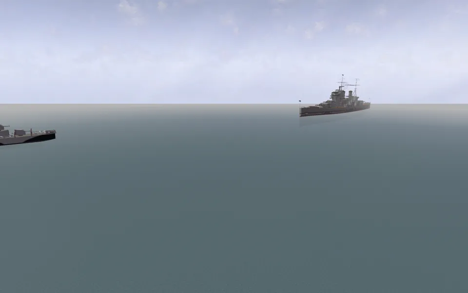
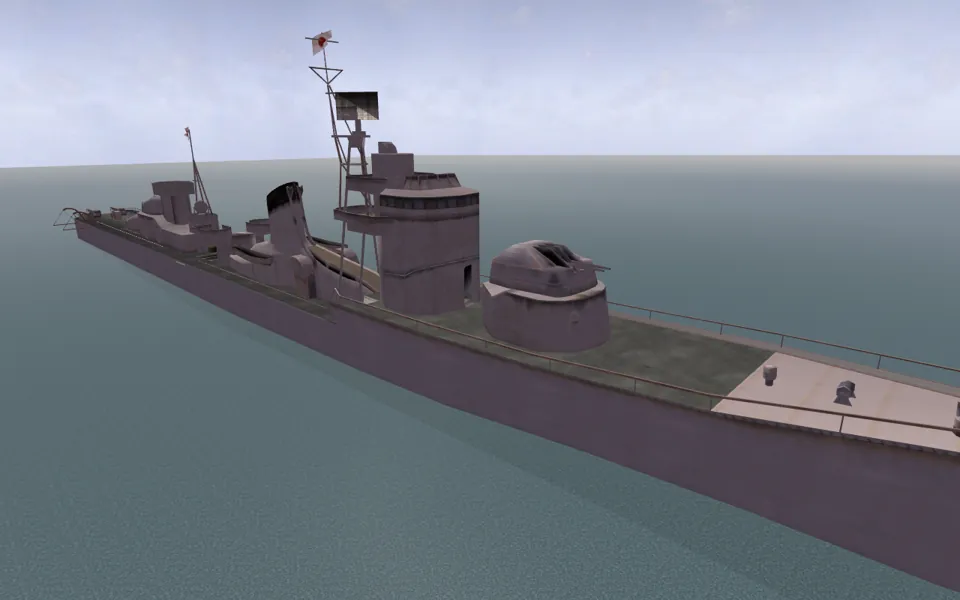
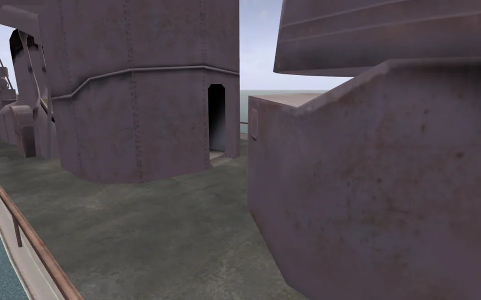
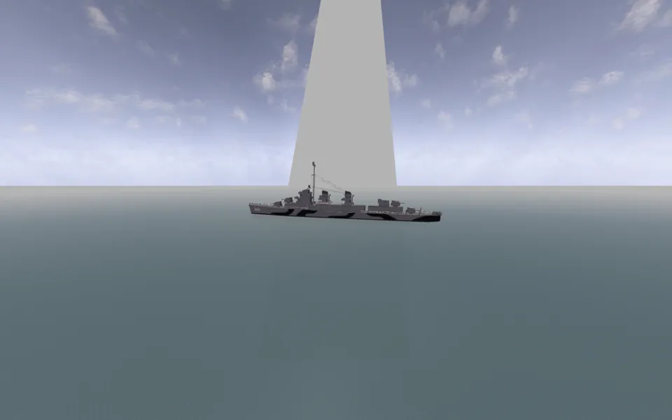
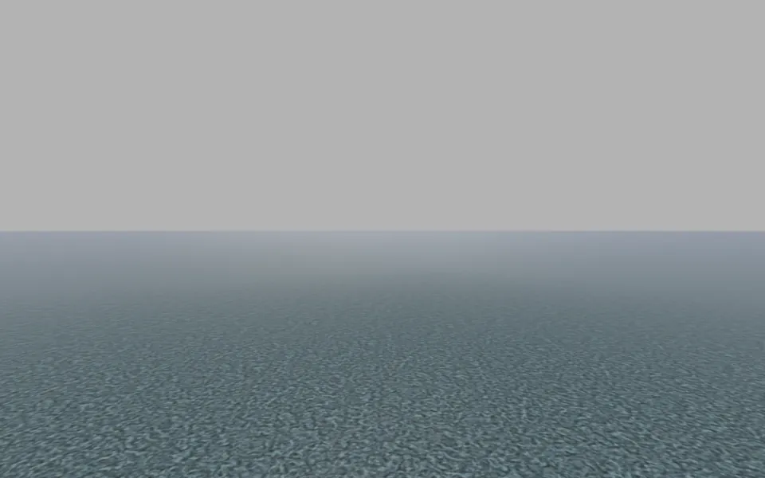
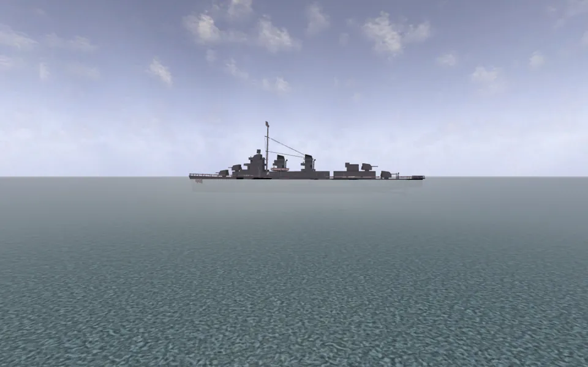

# Ships in the viewer

Stream **W7-A** of the parity round. The owner asked for full parity on ships:
spawn on them, drive them, fire their main guns, cycle the positions with the
number pad. This is what was built, what it was measured against, and what is
still open.

The spec is [`features/bf1942-ships-research-2026-09-22/README.md`](../bf1942-ships-research-2026-09-22/README.md)
as corrected by that folder's [`VERDICT.md`](../bf1942-ships-research-2026-09-22/VERDICT.md);
the verdict's wording is the binding one wherever the two differ, and where this
stream found the code contradicting either, it says so below.

Two things were already fixed before this stream began and are not claimed here:
`teamOnVehicle` read as a team index (`49c5235f`, merged `0934813`), and the
extractor's double-mirrored deck-spawn offset (`d30dbbaa`).

---

## 1. What is now true

| | |
|---|---|
| **Every floating hull sits at its own draft.** | Placed from the closed form, not from the level's pad. Ten hulls on Midway, all exact against the research's predicted values. [§2](#2-buoyancy) |
| **Ships are driveable.** | `c_ETShip` is a `'ship'` seat kind with a real drive model: the aircraft thrust law, the bit-3 water rule, two rudders, and buoyancy under way. A Fletcher makes 12.2 m/s and turns 53 degrees in ten seconds of full rudder. [§4](#4-propulsion) |
| **Deck spawns land on decks.** | All 30 of Midway's, and all 43 across Wake, Coral Sea, Iwo Jima and Guadalcanal. Six of Midway's eight ship flags used to put the soldier on the sea at y = 20. [§3](#3-deck-spawns) |
| **Main guns and seat cycling already worked**, and this stream changed nothing about them — measured before touching anything. [§5](#5-guns-and-seat-cycling-what-was-already-there) |
| **A critically damaged ship goes down by the bow**, and stops being a spawn point while she does. [§6](#6-sinking) |

### Files

| file | what |
|---|---|
| `viewer/body-float.js` (new) | `PhysicsFloatingBundle::updatePhysics` `0x0824d640`, its closed-form equilibrium, `FloatingBundle::handleMessage`'s sink rate, and `FloatingHull` — a `RigidBody` with the law posted at each node |
| `viewer/ship.js` (new) | `Ship extends Aircraft`: the spec read off the hull's own nodes, the bit-3 water gate, buoyancy as a body force, and `PhysicsNode`'s box drag |
| `viewer/flight.js` | three hooks (`waterGate`, `bodyForces`, `applyDrag`), `engineType` carried into the engine table, `throttleMin`, `mountQuaternion` |
| `viewer/seats.js` | `c_ETShip` -> `'ship'`; `DRIVE_KINDS`; `ensureDrive` builds a `Ship` |
| `viewer/soldier.js` | `settle()`'s upward escape |
| `viewer/map.html` | `floatPlacedVehicles`, `rebaseDeckSpawns`, `stepSinkingHulls`, `armSinkingHull`, `shipFlagInactive`, the `Ship` wiring in `setPilot`, and the `__ships` / `__deckSpawns` / `__seatTable` readouts |
| `tests/` | `test_body_float.py` + harness (24), `test_ship.py` + harness (13), 4 new cases in `test_soldier.py`, 1 in `test_seats.py` |

---

## 2. Buoyancy

### 2.1 The law

`viewer/body-float.js`, ported as the research reads it and the verdict
corrects it. The three corrections are each a test:

- **`t` is computed from the unclamped `f`.** `0x0824d718` is `fst`, not
  `fstp`; the `max(f, -1)` store is at `0x0824d778`. This is what makes a
  submarine's trim angle a **dive-depth setpoint in metres** rather than a
  one-way sink — the boat settles at `depth = angle_Y + 0.5`, where `t = 0.5`,
  `lift = 1.2275` and `8 x 1.5 x 1.2275 = 14.73 = |g|` exactly.
- **`g / -9.82` is exactly 1.5**, which is what makes that arithmetic land on
  the nose and shows the lift pair was centred on `|g| / (N x 1.5)` on purpose.
- **`1 + 24f` really does reverse sign** in `f ∈ (-1/24, 0)`. Ported as
  written; the sliver is never an equilibrium.

### 2.2 Placement is closed-form, not a settle

`equilibriumRootY` solves `Σ (-f_i) · lift_i = 9.82` by bisection rather than
by the uniform closed form, so it also covers a `Gato` (whose `t` is not
saturated and whose angle may be a dive setpoint) and the `Elco80`/`Type38`
hulls that mix floater templates. `map.html:floatPlacedVehicles` calls it for
every `VCSea` root before `buildCollisionIndex`, so the index bakes each hull
where it rests.

The verdict's case against iterating reproduces exactly. Simulating the law at
1/30 s from Midway's own pads, with the destroyer hull's measured footprint
(18.73 x 133.86 m):

| ship | pad y | equilibrium | y after 300 ticks | out by |
|---|---|---|---|---|
| Fletcher | 20.4371 | 20.2250 | 20.3716 | **0.147 m** |
| Hatsuzuki | 20.4371 | 14.3625 | 14.5425 | **0.180 m** |

`SETTLE_TICKS` is 300. Raising it to the ~2,510 a Fletcher needs would cost
ten times the load-time settle budget for a number the closed form gives free
and exact.

### 2.3 The eight equilibrium values, measured

`map.html?mod=bf1942&map=midway&shots`, served on :5281 from this worktree,
read through `window.__ships()`. `target` is `equilibriumRootY` evaluated live;
`predicted` is the research's §1.5 table. Water level 20.

| hull | authored pad y | **measured y** | predicted | error |
|---|---|---|---|---|
| Fletcher | 20.4371 | **20.2250** | 20.225 | 0.0000 |
| Fletcher2 | 20.4372 | **20.2250** | 20.225 | 0.0000 |
| Hatsuzuki | 20.4730 | **14.3625** | 14.362 | +0.0005 |
| Hatsuzuki2 | 20.4510 | **14.3625** | 14.362 | +0.0005 |
| Enterprise | 19.8651 | **19.2189** | 19.219 | -0.0001 |
| Shokaku | 19.5996 | **20.3175** | 20.317 | +0.0005 |
| PrinceOW | 12.7351 | **12.5662** | 12.566 | +0.0002 |
| Yamato | 12.6481 | **17.4542** | 17.454 | +0.0002 |
| Gato | 12.7078 | **18.8111** | 18.811 | +0.0001 |
| Sub7C | 12.6481 | **19.0568** | 19.057 | -0.0002 |

Every residual is the research table's own rounding to 3 dp. The engine lifts a
Yamato 4.81 m and drops a Hatsuzuki 6.11 m from their own pads, and surfaces
both submarines by 6.1-6.4 m, exactly as predicted.

Beyond the eight: `Fletcher2` and `Hatsuzuki2` are the same hulls and land on
the same numbers, which is the cheap consistency check.

**Frame.** 

The Prince of Wales and a Gato at anchor, with the sea cutting their hulls at
the waterline.

### 2.4 The submarine reverses, as the verdict says

`equilibriumRootY(gato, 20, { angle: -angle_Y })`, where the node's stored angle
is `-angle_Y`:

| `angle_Y` | solved depth |
|---|---|
| 0 | 2.4889 (the surfaced draft, `9.82·H/(N·maxLift)`) |
| 5 | **5.500** |
| 10 | **10.500** |
| 20 | **20.500** |
| 50 | **50.500** |

`depth = angle_Y + 0.5`, stable, independent of `hullHeight`. The research's
"sinks without limit" does not survive, and the dive law is in the module but
is **not wired to a control input** — see §7.

---

## 3. Deck spawns

### 3.1 What was wrong, and what this stream added

The extractor's double mirror was fixed before this stream (`d30dbbaa`). What
remained is that a baked world position is stale the moment the hull moves —
and §2 moves every hull by up to 6.1 m.

`map.html:rebaseDeckSpawns` carries each baked point through
`hull.matrixWorld · authoredInverse`. That is the ship-local offset the engine
resolves live (`BFSpawnPoint::spawn` `0x08163d70` is
`soldier->setAbsolutePosition(this->getAbsolutePosition())` and nothing else),
recovered from the bake rather than from a re-extract: the inverse of the pose
the point was baked against turns the world point back into the hull-local
offset, and the hull's current matrix puts it back. It is right for pitch and
roll as well as heave, which is what makes §6 work for free.

**This is why no re-extraction is owed for deck spawns.** The research's §8
asks the extractor to emit the ship-local offset alongside the world position;
with the rebase, that is redundant — the offset is recoverable from what is
already in `scene.json`. Emitting it would be tidier and is not necessary.

### 3.2 Measured: every ship flag, both teams

Spawn on each ship flag, read the soldier's `y`, then probe with
`__colliderRef().statics.cast` from `y + 0.5`. Before this stream, the verdict
measured six of eight standing on the sea at y = 20.000 and one five metres
under it.

| flag | soldier y | surface under him | owner | sea |
|---|---|---|---|---|
| Fletcher | 24.600 | 24.600 | 261 | 20 |
| Gato | 21.370 | 21.370 | 262 | 20 |
| Enterprise | 37.843 | 37.843 | 264 | 20 |
| Princeow | 26.567 | 26.567 | 265 | 20 |
| Shokaku | 32.121 | 32.121 | 266 | 20 |
| Sub7c | 21.191 | 21.191 | 267 | 20 |
| Yamato | 28.854 | 28.854 | 268 | 20 |
| Hatsuzuki | 25.630 | 25.630 | 269 | 20 |

Eight of eight on their own hull, on both teams, with the static hit at exactly
the soldier's feet and the owner id the ship's own.

Per spawn point rather than per flag, over all 30 of Midway's: the drop from
the authored point to the deck under it is 0.09-1.85 m, and it is **identical
per template across both pads at two different yaws** — Hatsuzuki 0.73 / 0.17 /
0.17, Shokaku 1.20 / 1.84 / 1.73 — which is the verdict's own decisive check,
now measured on the corrected tree.

The same probe over the other sea levels: **Wake 12, Coral Sea 10, Iwo Jima 7,
Guadalcanal 14 — 43 more, every one on a hull surface.**

**Frames.**



The Hatsuzuki from outside, deck clear of the water, the spawn point on it.



The deck and its rail from the soldier's own position, sea below the rail. He
also walks: 1.14 m forward in one second, `grounded` throughout, y 25.630 ->
25.654. (The local player draws first-person only -- `footView3p.modes` is
`['inside']` -- so his own body is not in the frame.)

### 3.3 `settle()`'s upward escape, and why it fires nowhere

`viewer/soldier.js:settle` probed from `y + 0.5` **downward only**, so a spawn
authored inside a hull had no way up. The escape is now there
(`Soldier.#escapeUp`): when the surface the soldier would stand on leaves him
no room to stand up, climb onto whatever is pressing on his head, at most four
decks, and only across a slab thin enough to be a deck.

**The gate that makes it safe is that the floor has to be a hull's, not the
world's**, and that is not a detail. The engine's push-out goes along the
contact normal — the shortest way out — and for a man on open ground under a
low beam the shortest way out is downward: the engine does not lift him onto
the beam, it refuses to let him stand up. `tests/test_soldier.py` has both
cases, and the existing head-clearance test is the one that would have caught
this.

**On vanilla it fires nowhere.** Across all 73 ship deck spawns on the five sea
levels, the minimum headroom is **3.01 m** (the Shokaku's and Hiryu's boat-bay
spawns, under the flight deck). The verdict's "3 of Midway's 26 are authored
genuinely inside the hull" was measured against the *pre-fix* tree; with the
double mirror fixed and the hull at its draft, none of them is. The predicted
fourth case — the Fletcher's own `relY 5` spawn — is on the deck: see §7 for
the one point that is worth a second look.

---

## 4. Propulsion

### 4.1 There is no ship propulsion code in the engine

`c_ETShip = 9` — proved from `operator<<(std::ostream&, EngineType)`
`0x0823ef60`, whose table is 1 `c_ETPlane`, 2 `c_ETCar`, 6 `c_ETTank`, **9
`c_ETShip`**, 0x11 `c_ETRocket`, 0x19 `c_ETTorpedo` — has bit 0 set, so
`PhysicsEngine::updatePhysics` `0x0824cbb0` runs the same `rho` /
signed-square-`K` / `getCurrentRatio()` thrust body a Corsair's propeller does.
A car and a tank have bit 0 clear and return at the `& 1` gate, which is why
they need `ground.js` and a ship does not.

So `viewer/ship.js` is `Aircraft` with a spec read off the hull's nodes, one
extra force, and the opposite water gate. `flight.js` grew three hooks
(`waterGate`, `bodyForces`, `applyDrag`), each defaulting to exactly what an
aircraft already did, rather than a copy of `step()`.

### 4.2 The bit-3 water rule, and the bug it exposed

Screw **below** the waterline: thrust runs. Screw **above** it with
`|throttle| > 0.02`: thrust is skipped and the stored throttle is pinned to 1.0
(`0x0824cc89` / `0x0824d047`). A plane gets the mirror — an engine below the
waterline has its throttle **zeroed**.

`Aircraft`'s engine table did not carry `engineType`, so a ship's screw — which
is authored *under* water (`Fletcher_Engine` at `0/-4/40`, absolute y 16.2
against a water level of 20) — took the aircraft rule and had its throttle
zeroed every step. The first driving test produced a destroyer with the
throttle at full and a speed of exactly 0.000 for 1,860 ticks. One field.

### 4.3 Steering is two ordinary `Wing`s

`Fletcher_rudder` and `Fletcher_HullWing`, `setWingLift 0 / setFlapLift 2` on
`c_PIYaw`, 55 m fore and aft, with opposite `setAcceleration` signs so they
deflect against each other. They make lift at all only because
`PhysicsWing::updatePhysics` gives a surface below the water surface a flat
medium of **10** instead of the `1 - y/1000` air density — which is why
`Ship` must be told where the sea is. No new code: `flight.js`'s existing
surface path, with the mount taken from the node's own glb quaternion
(`mountQuaternion`).

### 4.4 Measured on the page

`__enterOwner(owner)`, then `__plane().setInput` and `__stepSim(n, 1/30)`.
Phases are cumulative; heading is read off the hull node's own world matrix.

| ship | rootKind | drive | full ahead | 10 s full rudder | full astern |
|---|---|---|---|---|---|
| Fletcher | `ship` | `Ship` | **12.19 m/s**, y 20.226 | **53.5 deg** | decelerates, reverses |
| Yamato | `ship` | `Ship` | **15.04 m/s**, y 17.457 | **39.9 deg** | " |
| Enterprise | `ship` | `Ship` | **13.95 m/s**, y 19.220 | **30.3 deg** | " |

All three hold their draft to within a centimetre while under way. Under the
node harness, the same Fletcher turns the same number of degrees each way round
and turns through nothing at all with the rudder centred.

**Frame.** 

Hull 445 at sea, at her waterline, 150 m from her pad under her own power. (The
pale wedge is a capture artefact: the frame is rendered straight through
`renderer.render` with the camera moved by hand, so the page's own per-frame
sky and flare update does not run.)

### 4.5 A ship's drag is NOT `flight.js`'s

`Ship.applyDrag` runs `PhysicsNode`'s box law (physics.md §3) with the
submerged multiplier `1 + 24·min(depth/DY, 1)`. The linear `-drag·v` the
aircraft model carries is a fitted stand-in, and for a hull it is not even the
right order of magnitude — with `scale` entering twice, a submerged body feels
625 times its dry drag, and that factor is the entire difference between a
destroyer that settles near 12 m/s and one that settles near 200.

---

## 5. Guns and seat cycling: what was already there

**Measured before anything was changed**, on the tree as it stood at
`a60b2608`, with `__enterOwner` + `__switchSeat` + `__gunGroups`:

| ship | entering | seat 0 (helm) | seats 1+ |
|---|---|---|---|
| Fletcher | occupancy built; `drove` false | 4 gun groups | 2 |
| Yamato | " | 3 | 2, then 5 |
| Hatsuzuki | " | 3 | 2 |
| Enterprise | " | 0 | 1 |
| Shokaku | " | 0 | 1 |

So: **boarding a ship already worked, the main guns already collected, and the
number row already moved between positions and rebuilt the gun set.**
`TurretAxis` and `VehicleOccupancy` never cared that the root had no drive
model — `switchSeat` is gated on `optPilot.checked && occupancy`, and
`occupancy` is built for every `PlayerControlObject` root whatever
`classifySeat` calls it. Nothing was broken and nothing was changed.

The one thing that was missing is the one the owner named: `__enterOwner`
returned `false` because there was no `car` and no `aircraft`. It returns true
now, and `__seatTable()` reports the whole row:

```
Fletcher    rootKind ship  drive Ship  seats [(0,'ship','c_ETShip'), (1,'gun'), (2,'gun')]
Yamato      rootKind ship  drive Ship  seats [(0,'ship','c_ETShip'), (1,'gun'), (2,'gun'), (3,'gun')]
Enterprise  rootKind ship  drive Ship  seats [(0,'ship','c_ETShip'), (1,'gun'), (2,'gun'), (3,'gun'), (4,'gun')]
```

A carrier's helm has no gun of its own, which is why its seat 0 reported 0
groups and always did.

---

## 6. Sinking

`FloatingBundle::handleMessage` `0x082402b0` arms the per-node sink rate on
TemplateMessage **`0x14`** — `criticalDamage`, not death. For a Fletcher that
is 50 of 300 hit points. `0x15` (destroyed) sets the wreck byte and leaves the
rate alone.

The body world does not carry ships (§8), so a hull that starts sinking gets
its own `FloatingHull`: a `RigidBody` — which *is* the engine's `PhysicsNode` —
with the float law posted at each node. `map.html:stepSinkingHulls` runs it,
and `rebaseDeckSpawns` carries the deck points down with her.

`sinkRate` per node is `(q + 0.1) · 0.05 · sinkingSpeedMod` with
`q = clamp((2R + Δz + Δx)/(4R), 0, 1)`. On the harness Fletcher (R = 70, nodes
at `Δz = ±50`, `Δx = ±5`) the eight rates run 0.0207 to 0.0393 — a spread of
**1.90:1**, which is the verdict's ~2:1 and not the research's 11:1 — and they
are monotone along the hull, so she trims by the bow.

Sixty seconds from `0x14`, node harness:

| t | root y | forward axis y (trim) |
|---|---|---|
| 10 s | 17.672 | -0.023 |
| 20 s | 9.865 | -0.088 |
| 30 s | 1.004 | -0.143 |
| 60 s | -25.711 | -0.300 |

Monotone down, monotone bow-down, and awake throughout — the accumulator wakes
her every tick, which is why a sinking ship never sleeps.

Two other things fell out of it and are tested:

- **`sinkingSpeedMod 0` is "never".** Both vanilla rafts set it on all four
  floaters, so a shot-up raft does not go down and does not roll; the hull that
  actually rolls as she goes is the LCVP (three `Lcvp_Floater` at mod 1, one
  `Lcvp_Floater2` at mod 7).
- **A sleeping hull makes no lift.** `updatePhysics` copies the root's
  sleepiness and returns before it touches the water, and that early return is
  load-bearing rather than an optimisation: a `RigidBody` wakes with an empty
  accumulator and takes its first tick as pure buoyancy — half a metre a second
  upward — so posting lift into a sleeping hull walks it up out of the water a
  centimetre per sleep cycle. It measured 20.33 against a draft of 20.225 after
  a minute before the return was honoured, and 20.22500 exactly after.

`BFSpawnPoint::getActive`'s Armor gate (`0x08163dd0` step 2, Armor vtable
`+0xcc`) is `map.html:shipFlagInactive`: a critically damaged ship's flag
reports `inactive` and `spawnAtFlag` refuses it. Same threshold that arms the
sink, so a burning destroyer stops offering her decks at the moment she starts
going down.

### On the page

Midway's Fletcher, `__damageVehicle(261, 83)` — 128 hit points down to 45
against a `criticalDamage` of 50, so **critical but not destroyed**, which is
the case the whole mechanism is about:

| | |
|---|---|
| hull | 20.225 -> 18.811 -> 16.731 over 24 rendered frames, then steadily under |
| deck spawn | rides her down, 25.23 -> 8.54 -> -30.08, from `__deckSpawns()` |
| flag | `inactive: true` from the moment she goes critical |
| `__deploy.spawn()` | returns **false** — you cannot deploy onto a sinking ship |
| rate | constant, not accelerating: equal distance per frame-step at 10 s, 20 s and 40 s of stepping |

**Frames.**





At her draft, and 3.5 m lower with the sea over her main deck line.

---

## 7. Divergences from the engine, and why

| | |
|---|---|
| **`underWater` is not read.** | The box drag law's multiplier is `1 + 24·min(underWater/DY, 1)` with `underWater` at `PhysicsNode+0x8c`, written by `setUnderWater` `0x0824d430` — and **who calls that setter for a ship's root, and with what, is UNVERIFIED**. `ship.js` uses the depth of the hull bounding box's bottom below the sea, clamped to `[0, DY]`, because that is what "submersion depth in metres" has to mean for a box. It is the single biggest lever on a ship's top speed, so the speeds in §4.4 are **not calibrated**, and the research declines to offer one for the same reason. |
| **`getCurrentRatio()` is sampled at max rev.** | It is rev-dependent (`0x0824ca70`), and `flight.js` samples the gear curve at its last entry, 0.94. So a Fletcher gets 7.447 at every rev instead of only at full. Correcting it needs TANK-12's rev filter, which is another stream's. |
| **The geometry box is the drawn glb's.** | Masts and davits included. The engine asks the object for its own geometry box, which for a ship may be the LOD hull without them. It sets both `DX·DZ` in the buoyancy damping and all three faces in the drag. |
| **A parked ship is not in the body world.** | `bodySpecFor` still excludes `VCSea`, so a moored hull is correct *scenery* — solid, walkable, at the right waterline — and cannot be rammed or rocked. The parked path is gravity plus wheel springs against the heightfield; a destroyer woken into that would sink. |
| **A ship's own Wings have no angular drag.** | `Ship.applyDrag` implements the linear half of the box law only. The angular half would be a second unmeasured damper on top of the rudders, which is tuning rather than porting. |
| **The `1 + 24f` anti-damping sliver is ported as written.** | It is the bytes. That it "reads like an intended `lerp(1, 25, |f|)` with a sign slip" is the research author's inference, not a read. |
| **`settle()`'s escape is a ray, not a push-out.** | The engine ejects a soldier by resolving a penetrating capsule against the hull's col1 faces. A downward ray cannot ask that question, so the escape is gated on "the floor is a hull's" (§3.3). The exact version is a capsule push-out. |
| **A ship's mouse profile and HUD line are an aircraft's.** | `Ship extends Aircraft` and lands in the page's `aircraft` slot, so `profileFor('air')` and `HUD_PILOT` follow. Cosmetic; the input mapping is keyed on `player.kind` in `world.js` and is correctly a ground vehicle's signed W/S. |

---

## 8. Still open

1. **Runtime buoyancy for an unoccupied hull.** Ram a moored Fletcher and she
   does not rock: ships stay out of the parked body world. `FloatingHull` is
   the piece that would do it — it already is a `RigidBody` with the law —
   so the work is wiring it in for every floating hull rather than only for a
   sinking one, and giving `body-ground.js`'s parked path a way to leave a
   ship's heave to the float term.
2. **The submarine dive is in the module and not on a control.** The law is
   implemented and tested (`depth = angle_Y + 0.5`, capped at 50.5 m by
   `setMaxRotation 0/50/0`); what is missing is the `RotationalBundle` on the
   float node driven by `c_PIPitch` at `setMaxSpeed 0/2/0` /
   `setAcceleration 0/1/0`, plus `submarineData`'s crush depth and oxygen
   drain (PHY-3). A Gato drives and floats; she does not dive.
3. **Top speed is uncalibrated.** See §7. Settling it needs either a read of
   `setUnderWater`'s callers or a measurement against the game.
4. **The Fletcher's own driver spawn is worth a second look.** On Midway she
   puts the soldier at relY 4.375 with the next surface 4.71 m above him, and
   from directly overhead the first surface at that x/z is relY 9.23 — so he is
   under a deck rather than on the open one. He has standing room and can walk
   out, and the two other `FletcherSoldierSpawn` points at the same authored
   relY land on an open deck with nothing above them, so this is a sheltered
   position rather than a defect. Separating "under the bridge wing" from
   "inside the hull" needs the surface's facing, and `collision.js:851` flips
   every hit normal to oppose the ray, so the ray API cannot answer it.
5. **A wreck's sink is not visually finished.** The hull goes down and keeps
   going; there is no sea-bed stop, no bubble/wash effect, and the wreck fade
   `stepWrecks` owns is unaware of it.
6. **Torpedoes.** `viewer/torpedo-run.js:floaterLift` uses `t = clamp(depth/H)`
   where the engine uses `t = clamp(angle - f·H)` — depth in **metres**, not
   normalised. It is behaviourally moot today because every torpedo floater
   authors `floatMinLift == floatMaxLift`, so the lerp cannot be seen; it is
   wrong if anything ever authors a pair. Also, per the verdict, `c_ETTorpedo`
   carries bit 3, so a torpedo's engine follows the ship water rule —
   `ship.js`'s `WATER_ENGINE_TYPES` includes it, but nothing routes a torpedo
   through `Ship`.

---

## 9. Re-extraction owed

**None for this stream.** The deck-spawn rebase (§3.1) makes the ship-local
offset recoverable from what `scene.json` already carries, and the buoyancy
placement is a load-time computation from data the glbs already hold
(`FloatingBundle` nodes carry `hullHeight` / `floatMaxLift` / `floatMinLift` /
`sinkingSpeedMod`, and `bf42/con.py` has emitted them since before this round).

The vanilla levels were already re-extracted for `teamOnVehicle` and the
deck-spawn sign fix, and this stream read that tree rather than writing to it.
Nothing was extracted, published or uploaded.

Two optional tidies, neither blocking:

- `extract_map.py:_vehicle_soldier_spawn_report` could emit the ship-local
  `offset` alongside `position`, which would let the viewer drop the
  `authoredInverse` recovery. Cosmetic.
- `bf42/con.py:1371` could carry a comment saying `dragModifier` and
  `waterHeight` are **dead in the engine** (no reader anywhere in the image,
  `FloatingBundleTemplate+0x1c0` and `+0x1b0`) so nobody wires them.

---

## 10. How to reproduce

```bash
# tests (from tools/bf1942-models)
python3 -m unittest tests.test_body_float tests.test_ship tests.test_soldier tests.test_seats tests.test_flight

# the page
python3 -m http.server 5281 --directory tools/bf1942-models/viewer
# then, headless:
#   window.__ships()        hull y beside the y the closed form asks for
#   window.__deckSpawns()   each deck point beside the extractor's own bake
#   window.__seatTable()    every seat of an occupied vehicle, not just the active one
#   window.__enterOwner(o) + window.__plane().setInput + window.__stepSim(n, 1/30)
#   window.__damageVehicle(o, 260)   past criticalDamage, and she starts going down
```

Scratch — probes, traces and the frames — is in this session's scratch
directory under `W7-A/` (`ships.mjs`, `decks.mjs`, `drive.mjs`, `frames*.mjs`,
`sink.mjs`, `shots/`). Session-scoped; every number above carries the hook that
regenerates it.

---

# W8-A: the three defects the owner found

Stream **W8-A**. The owner drove what W7-A shipped and reported three things: a
ship is too quick and too manoeuvrable, a ship does not run aground, and a
respawn on a ship that has moved puts you where she started. All three are fixed.
Everything below was measured; where a number moved the wrong way it says so.

Before/after on the page is the **same probe against two builds** — the main
checkout (W7-A as merged, `d265a6fa`) on one port and this worktree on another,
each ship driven from her own authored pad on her own authored heading, heading
read off the velocity direction because that is a hook both builds have
(`scratch/W8-A/compare.mjs`).

## 11. `setUnderWater`'s caller, read at last

W7-A left this as the single biggest lever on a ship's top speed and marked it
UNVERIFIED. It is now read.

**`PhysicsNode::setUnderWater` has no direct callers at all.** It is virtual slot
**`+0xc0`** (`vt.py 'world::PhysicsNode'`), and the same slot on
`PointPhysicsNode` (`0x08256ad0`) and `StaticPhysicsNode` (`0x0825ead0`). A scan
of every `call DWORD PTR [reg+0xc0]` in the lnxded image finds **57 sites**, of
which all but four are AI, console and mesh-loading code. The four are:

| site | function |
|---|---|
| `0x0825ac60`, `0x0825ad41` | `ResponsePhysics::checkVsTerrain(float)` `0x0825a960` |
| `0x08257777`, `0x08257b40` | `PointResponsePhysics::checkVsTerrain(float)` `0x08257720` |

So **the vehicle side has exactly one caller, and it is the terrain check.** What
it passes, traced instruction by instruction:

```
0x0825a991  this->getVertexCollision(0)                  ; ResponsePhysics vtable +0x5c
0x0825aa30  T = 9999.0                                   ; ds:0x86d16d0, a running MINIMUM
0x0825aa48  n = <that collision mesh>->vtable[+0x18]()   ; a count; if (n <= 3) n = 1
0x0825aa72  if (n > 10) goto 0x0825b04f                  ; a different arm entirely
  loop over n:   transform a vertex to world;  T = min(T, vertex.y)
0x0825ac01  R = terrainBase->vtable[+0x5c](pos.x, pos.z) ; PatchTerrain::getWaterLevel
0x0825ac26  if (T < R)  setUnderWater(R - T)     at 0x0825ac60
            else        setUnderWater(0.0)       at 0x0825ad41
```

`dice::ref2::geom::terrainBase` is the global at `0x087435f0` (`vt.py --sym`) and
`PatchTerrain`'s vtable `+0x5c` is `getWaterLevel(float, float)` `0x083d7a80`,
which SHIP-5 already read as discarding both arguments and returning the level's
flat scalar.

> **`underWater` is a DEPTH IN METRES: the water level minus the world y of the
> object's lowest collision vertex, floored at zero.** Not a fraction, not a
> volume, and of one point only — the keel.

And the divisor is confirmed independently while I was there.
`PhysicsNode::updatePhysics` `0x082543d0` reads the geometry bounding box twice
through the same accessor — max at `+0xc/+0x10/+0x14` (`0x0825453d`), min at
`+0x00/+0x04/+0x08` (`0x08254563`) — forms `DY = max.y - min.y` at `0x08254591`,
divides `PhysicsNode+0x8c` by it at `0x0825459d`, clamps the quotient to 1 at
`0x082545aa`, and multiplies by the 25.0 at `ds:0x86ccce0` (`0x082545fb`). So
`scale = 1 + 24*min(underWater/DY, 1)` with `DY` the geometry box's **full
vertical extent**, exactly as physics.md §3 has it.

**Still UNVERIFIED, and it is the one thing left open about this law:** which
hulls reach the writing arm. `n` comes from slot `+0x18` of the col0 collision
mesh, reached as an interface subobject, so the slot is not one of
`SimpleCollisionMesh`'s or `GridCollisionMesh`'s primary vtable and I did not
identify it. `n > 10` goes to `0x0825b04f`, and **that arm calls neither
setter** — the `+0xc0` scan finds only the two sites above in the whole function.
If `n` is a vertex or LOD count that a capital ship exceeds, the engine may never
write `underWater` for one. The law is ported as though it does, because a hull
whose drag never gets the multiplier has no terminal speed worth the name.

## 12. Defect 1: too quick, and too manoeuvrable

Three levers were checked. Two were real and one was not.

### 12.1 The drag box was a world-space AABB (the big one)

`shipSpec` measured `THREE.Box3().setFromObject(root)` — the world axis-aligned
box of **every mesh drawn under the hull**, at the hull's placed yaw. On Midway:

| ship | old box (world AABB) | hull mesh's own box |
|---|---|---|
| Fletcher | **100.56 x 35.95 x 82.80** | 18.87 x 35.26 x 115.49 |
| Fletcher2 (same template, other pad) | **100.32 x 35.95 x 83.14** | 18.87 x 35.26 x 115.49 |
| Gato | **75.02 x 20.64 x 76.80** | 8.53 x 20.64 x 95.03 |
| Enterprise | **253.14 x 69.26 x 207.43** | 44.16 x 69.20 x 284.50 |

A destroyer with a 19 m beam was being given a 100 m one, **and the number
changed with the direction her pad happened to face** — so a ship's drag, her
inertia and her submerged multiplier all depended on her mooring heading. That is
not a calibration, it is a bug.

`hullGeometry` now walks the root's own LOD chain to the node that carries its
geometry and measures that, in the **root's own frame**. The engine asks the
object for its own `IGeometry` (IID `0x492fe0fe`), which is the root's standard
mesh: a Fletcher's turrets, climbing nets, ammo boxes, depth-charge projectiles,
muzzle-flash sprites and water-wash sprites are children with geometry of their
own and are not in it. Masts are, because they are part of the hull mesh.

One wrinkle the level assembler forces: it splits a hull's single StandardMesh
into one sub-mesh **per material** (a placed Fletcher is nineteen
`Fletch_hull_M1*` children of `FletcherComplex`, which itself carries no mesh),
while the standalone glb puts the mesh on the node. `hullGeometry` takes a node's
own mesh **plus** its untagged non-collision mesh children, which covers both.

### 12.2 The pedal is not the throttle the thrust law reads (the other big one)

`PhysicsEngine::updatePhysics` reads `PhysicsEngine+0xa0` for the `throttle` in
`K = 0.1*|throttle| + e*|e|` — `fsubr [edi+0xa0]` at `0x0824cf4b`, and again at
`0x0824cf5d` for the idle term. `+0xa0` is written in exactly one place:
`Engine::handleUpdate` `0x0823e120`, the gearbox (TANK-12).

```
revs += 0.05 * ((T1 - L) - 0.5*revs)          clamped to [-1.0, +1.2]
```

`T1` is the clipped `RotationalBundle` roll angle over `maxRotation.z`, so for
every vanilla ship (`setMinRotation 0/0/-4000`, `setMaxRotation 0/0/5000`) it is
**+1.0 ahead and -0.8 astern**, not +/-1. `L` is the load, and for a **ship** it is
not what tank-driving.md §4 describes — that reading is the ground-vehicle
caller's. A ship's `feedbackLoop` caller is `updatePhysics` itself at
`0x0824cfc1`: the by-value `Vec3` it pushes is `K*fwd` (each component multiplied
by `[ebp-0xa0]` = K at `0x0824cf7e`-`0x0824cfa0`) and the `const Vec3&` is `fwd`
(`lea ebx,[ebp-0x28]`, the transform's own row 2), so the dot is `K` and

```
L0 = K * getCurrentRatio() / getCurrentTorque()          L = 0.99*(L*n + L0)/(n+1)
```

with `getCurrentTorque = torqueCurve[100*min(|revs|,1)] * setTorque` (TANK-4, and
TANK-13's "divisor of the load"). `c_ETShip = 9` has bits 1 and 2 clear, so
neither the `& 2` clamp at `0x0824c8ab` nor the `& 4` frame min/max at
`0x0824c90f` applies — a ship takes the running mean at `0x0824c952`.

That load is a **speed-dependent governor**, and it is the whole of "too quick":
at full pedal from rest a Fletcher's revs settle near **0.48**, not 1.0, and the
thrust law sees 0.48. All of it is in the new `viewer/engine-revs.js`, with the
two authored curves rebuilt from their control points (the published ratio ladder
— Sherman 4.000/6.364/9.333/12.727/14.894, M3A1 first gear 5.512 — comes out of
it, which is the check that the curve is right and not merely self-consistent).

**One correction to the corpus while here.** `getCurrentRatio()` is **not**
rev-dependent; the VERDICT's §2.5 reads `PhysicsEngine+0xbc` as "the current
rev", and TANK-12 and physics.md §5 both read the same field as the **gear**.
`0x0824ca70` is `fild [ebx+0xbc]` over `fild [edx+0x360]` times 100 — the index
is `100*gear/numberOfGears`. `EngineTemplate`'s ctor defaults `numberOfGears` to
1 (`0x0823f018` and `0x0823f288`, `mov DWORD PTR [ebx+0x360],0x1`),
`PhysicsEngine`'s seeds the gear to 1, and **no vanilla ship authors
`setNumberOfGears`** (checked on all eight Midway hulls' glbs). So the index is
100, the divisor is `ratioCurve[100] = 0.94`, and a Fletcher's 7.447 is exact at
every rev. There was nothing to fix here, and TANK-12's rev filter was the
missing piece for a different reason than the one nominated.

### 12.3 The inertia was a quarter of the engine's — and it is not the steady turn

`flight.js`'s `boxInertia` divided by **12**, the textbook solid box.
`getGeometryInertia` (`0x08253930`, collision-response.md §4.2) divides by **3**.
A ship now takes the engine's law (`spec.inertiaLaw = 'geometry'`); an aircraft
still takes the solid box, because `flight.js`'s aircraft model was calibrated
against it and there is no measurement to move it to.

Isolated in the harness — the same hull, the same rudder, the same everything but
the divisor:

| full rudder for | engine's `/3` | solid box's `/12` | ratio |
|---|---|---|---|
| 1 s | 0.000 deg | -0.001 deg | — |
| 2 s | **-0.030** | **-0.117** | **3.9** |
| 3 s | -0.273 | -0.898 | 3.3 |
| 5 s | -2.340 | -4.721 | 2.0 |
| 10 s | -15.84 | -21.79 | 1.4 |
| 30 s | -105.60 | -115.41 | 1.1 |
| **steady rate** | **-4.791 deg/s** | **-4.816 deg/s** | **1.005** |

So the answer to "was the inertia the manoeuvrability problem" is: **it was four
times too little resistance in the first two seconds of a turn and it was nothing
at all at steady state.** The steady rate is set by the two `Wing`s' own balance,
and the box law's angular half — which W7-A left out and which is now
implemented — is 2.2e-9 rad/s^2 at five degrees a second of yaw, thirteen orders
below the rudders. It is ported because it is in the law, not because it does
anything.

### 12.4 The turning circle is the authored geometry, and it did not move

Measured radius, before and after, on the page:

| ship | radius before | radius after |
|---|---|---|
| Fletcher | 118.2 m | **118.1 m** |
| Yamato | 192.4 m | 193.3 m |
| Enterprise | 235.9 m | 236.0 m |

A Fletcher's is `55 / tan(25 deg) = 118.0 m` — the two `Wing`s' own arm over
their own `setMaxRotation`, exactly. It is speed-independent (both the rudder
couple and the wings' damping go as `v^2`, so `omega` goes as `v`) and
inertia-independent, so **no code lever reaches it**: it is `Fletcher_rudder` and
`Fletcher_HullWing` at +/-55 m with a +/-25 degree range, and a real Fletcher's
tactical diameter is about three times that. If the owner still wants her to turn
wider, the number to change is authored data, not this model.

### 12.5 The numbers, before and after

Same probe, both builds, each ship from her own pad. Speed in m/s.

| | Fletcher before | Fletcher after | Yamato before | Yamato after | Enterprise before | Enterprise after |
|---|---|---|---|---|---|---|
| after 2 s | 8.56 | **1.89** | 9.13 | **1.89** | 7.24 | **1.42** |
| after 5 s | 12.09 | **6.13** | 14.66 | **6.26** | 13.19 | **4.75** |
| after 10 s | 12.19 | 11.10 | 15.04 | 11.96 | 13.95 | 9.31 |
| top speed | 12.36 | **15.20** | 15.05 | **18.80** | 13.97 | **16.00** |
| in knots | 24.0 | **29.5** | 29.3 | **36.5** | 27.2 | **31.1** |
| the real ship | | 36.0 | | 27.0 | | 32.5 |
| astern | — | 12.83 | — | 15.83 | — | 13.47 |
| 10 s of full rudder | 53.3 deg | 59.6 deg | 39.2 | 40.5 | 26.4 | 29.4 |
| steady turn | 6.03 deg/s | 7.45 | 4.48 | 5.52 | 3.39 | 3.85 |
| revs at cruise | (1.0) | **0.514** | (1.0) | 0.538 | (1.0) | 0.519 |

Read honestly:

- **The acceleration from rest is 4.5 to 5.1 times lower.** A 2,500-tonne
  destroyer used to be at 8.6 m/s — 17 knots — **two seconds** after the pedal
  went down, on `(0.1 + 1)*7.447 = 8.19 m/s^2`. She is now at 1.89 m/s and takes
  about a minute to work up to her top speed. That is what "too quick" was, and
  it is what the rev governor fixes.
- **Top speed went UP, by 20 to 25 per cent**, because §12.1's fix removed five
  times too much drag area. It lands the three hulls at 82, 135 and 96 per cent
  of their real ships' top speeds, against 67, 108 and 84 per cent before —
  closer on two of three, and the Yamato is the game's own data
  (`setDifferential 2`, the same as a destroyer's, on a 65,000-tonne hull).
- **The turn rate went UP with the speed** — the radius is fixed, so a faster
  ship turns more degrees a second. Ten seconds of full rudder is 6 degrees more
  on a Fletcher than it was. The inertia fix is worth 4x in the first two
  seconds and is invisible by ten.
- `throttleMin` is now **-0.8**, from the Engine's own clipped roll range, so
  astern is 80 per cent of the ahead order before the signed square sees it.

## 13. Defect 2: she runs aground, and stays

Two halves, both wired.

**The sea bed.** `groundClearance` was 0 — the hull's *origin* had to touch the
bed. It is now `-keel`, the depth of the hull's own collision box below its
origin, which is the same quantity `setUnderWater` measures (§11). So she grounds
when her **keel** touches, and `Ship.settle` holds her there with the engine's own
Coulomb budget: `A * 1.50 * 9.82 * L / 30` per tick, the **sliding** arm
(physics.md §10's smaller of the two), with `A` the mean of the hull's material
and the bed's from the level's own `materialFriction` table. A hull on sand is
0.9, so 13.3 m/s^2 against a thrust of about 1.5.

**Proven with a named ship on a named shore.** Midway's Fletcher (owner 261),
placed at x 1000 on the z = -2050 line and pointed due east at the island's
western beach, which crosses the water line at **x 1800**:

| t | x | y | speed | sea bed | aground |
|---|---|---|---|---|---|
| 0 s | 1000.00 | 20.225 | 0 | (none) | no |
| 20 s | 1191.30 | 20.227 | 14.55 | (none) | no |
| 40 s | 1491.70 | 20.232 | 15.17 | (none) | no |
| **52.77 s** | **1685.48** | 20.241 | **15.02** | **16.73** | **yes** |
| 60 s | 1694.71 | 20.885 | 0 | 17.37 | yes |
| 100 s | 1694.93 | 20.902 | 0 | 17.39 | yes |
| 133 s | 1694.71 | 20.902 | 0 | 17.39 | yes |

She touches the bank at 52.77 s with 15.0 m/s on her, stops inside eight seconds,
and is lifted 0.68 m above her floating draft (20.225 -> 20.902) because her keel
is resting on a bed at 17.39 rather than hanging in 20 m of water. Then:

- **ten more seconds of full ahead move her 6.5 cm** (`revs` 0.410, throttle 1);
- **thirty seconds of full astern move her 6.6 cm the other way**, and she is
  still `aground`.

A car would have driven itself off. She does not.

**The static world.** A driven hull now enters the body world as a `DrivenBody`,
so `body-statics.js`'s `collideWithStatics` probes her col0 vertices against the
level's triangles — the machinery W6-C built and left unwired "only because
buoyancy did not exist yet". She stays out of the **parked** body world, which is
gravity plus wheel springs and would sink her; `setupVehicleBodies` describes her
hull anyway so `adoptDriven` has a spec to hand it.

There is nothing static in deep water on any vanilla sea level except the other
ships, so the pier test *is* the ship-to-ship test. Wake's own two hulls are the
only waterline statics reachable by a keel (a scan of every static triangle that
straddles `waterLevel = 95` over a bed more than 4 m deep returns owners 827 and
828, which are the Hatsuzuki and the Shokaku themselves). Driving the Hatsuzuki
at the moored Shokaku:

| | |
|---|---|
| first tick, range 73.68 m | **5 static contacts** |
| after 10 s at full ahead | 1 contact, speed **0.23 m/s**, heading shoved -102.0 -> -89.1 deg |
| after 150 s | speed 0.22 m/s, still off her |

She cannot drive through another hull, and the contacts push and turn her rather
than stopping her dead, which is the solver's own behaviour.

## 14. Defect 3: a spawn goes where the ship is now

`BFSpawnPoint::spawn` (`0x08163d70`) is a bare
`soldier->setAbsolutePosition(this->getAbsolutePosition())`, and a deck
`SpawnPoint` reached the hull's tree through `addTemplate` — so its world position
is its ship-local offset through the hull's **live** transform at the moment of the
spawn. W7-A's `rebaseDeckSpawns` already did that arithmetic; it ran only at load.

It now runs in three places:

1. **At the top of `spawnAtFlag`**, which is the "at the moment of the spawn".
2. **Once per tick for any hull that has moved** — sinking or driven — which is
   what moves the map markers, because a ship flag's `groups[].position` IS the
   spawn's own array (`soldier.js` `spawnFlags`) and `drawSpawnRings` draws
   wherever this put it. The owner asked to watch the spots move with the
   carrier; they do.
3. **On a respawn**, where `refloatHull` puts her back at her closed-form draft
   rather than on a parked body's springs.

`shipFlagInactive` also now matches a flag against the hull's **live** position
rather than her authored one, or a rebased ring 1.2 km from the pad stopped being
recognised as that ship's.

**One real coupling had to be broken to make this work.** `soldier.js`'s `settle`
calls `collider.statics.cast` — the raw index — deliberately, to avoid the
terrain marcher. But `WorldCollider.setMovedOwner` **disables** a moved hull in
that index and re-asks every query in the hull's own baked frame, and that second
half lived only in `WorldCollider.cast`. So a hull that had been driven was
invisible to `settle`: the deck spawn arrived at the right x/z and the man fell
through to the sea beside her. `CollisionIndex.cast` now runs the same moved pass
(`WorldCollider.castMoved`, factored out and injected), guarded off for the
pass's own recursive query, for a drivable-only query and for a caller that is
itself a simulated body. That fixes the class: a soldier can stand on any hull
that has moved, not just a ship.

**Proven.** Midway's Enterprise (owner 264), boarded on foot, placed on her own
pad pointed down -z, 90 s at full ahead, out with E, then the deploy screen:

| | |
|---|---|
| hull, from pad (3398.58, -2856.49) | to **(3398.58, -4130.19)** — **1273.7 m** |
| `enterprise_aircraftsoldierspawn` bake | (3489.81, 40.27, -2924.03) |
| the same point after the drive | **(3397.08, 39.60, -4016.69)** |
| flag reports | `inactive: false` |
| `__deploy.spawn()` | **true** |
| soldier lands at | **(3397.08, 37.829, -4016.688)**, `grounded` |
| distance to the hull | **113.51 m** (she is 284 m long) |
| distance to her pad | **1160.2 m** |
| what is under his feet | the flight deck, owner **264**, at 37.829 |

Before this stream the same run put him at the bake, (3489.809, **20.000**,
-2924.03) — standing on the sea 1.2 km astern of the carrier, which is the
owner's report exactly.

## 15. Divergences this stream added or changed

| | |
|---|---|
| **`underWater` is the collision box's bottom corner, not the lowest vertex.** | Same number for an upright hull; they differ by the hull's own roll when she leans. And on a level whose drawn tree carries no hull collision node it falls back to the geometry box's bottom — Midway's Fletcher does (27 collision meshes under her, all turret, net and Browning), so her keel reads -3.512 (the drawn bottom) where the standalone glb's `FletcherComplex collision 1` says -3.48: **3 cm**. Wake's Hatsuzuki does carry hers and reads -0.084. |
| **The rev governor is a ship's only.** | The engine runs the gearbox for every engine type and the 1.2 clamp is type-independent, so an aircraft diverges: `flight.js` still feeds the pedal to the thrust law directly, because moving it would move every number in `test_flight.py` without a measurement to move them to. Written down in `flight.js`'s `advanceEngines`. |
| **A ship's screw visual and engine audio key on the pedal, not the revs.** | The engine keys the propeller on `+0xa0` (`0x0824cd1a`). Cosmetic; left so the audio keeps reading one number. |
| **A parked ship is still not a body.** | Ram a moored Fletcher and she does not rock. Unchanged from W7-A §8 item 1, and the reason ship-to-ship works at all is that the moored hull is *static*: the driven one probes it, the moored one feels nothing. |
| **A driven ship's baked hull leaves the static index the moment she is boarded.** | `adoptDrivenBody` publishes the moved transform at once rather than at the end of the first tick, so a 1,400-triangle destroyer never probes her own baked triangles. |
| **`__setOnFoot(false)` teleports a vehicle back to its spawn** (`Vehicle.reset()`), where the E key leaves it standing. Any check on where a driven ship ENDED UP must use the new `window.__exitVehicle()`. | Not a change, but it cost this stream an afternoon and is worth writing down. |
| **The four sub-steps.** | `flight.js` integrates a ship in four sub-steps per tick; `PhysicsNode` takes one (physics.md §3 — the four are `PointPhysicsNode`'s). Unchanged from W7-A and not revisited. |

## 16. What is still open

1. **The Yamato is 35 per cent faster than the real ship** (36.5 kn against 27).
   Every input is her own authored data and the law is read, so this is either the
   game's own arcade choice or a hull-specific input nobody has looked at —
   `submarineData`-style per-template words, or her `drag`/`mass` pair.
2. **Whether a capital ship's `underWater` is ever written** — §11's `n > 10`
   arm. Needs slot `+0x18` on the col0 collision-mesh interface identified.
3. **The turning circle is 118 m for a Fletcher** where the real ship's is three
   times that. It is `55/tan(25 deg)` from the authored `Wing`s and no code lever
   reaches it (§12.4).
4. **A ship left at sea has no parked body**, so she cannot be rammed by a car or
   rocked by a wake, and two ships cannot both be bodies at once. W7-A §8 item 1,
   unchanged.
5. **A hull's own collision layer is missing from some levels' drawn trees**
   (§15), so the keel is the drawn bottom there. A re-extract would settle it;
   the difference measured 3 cm on the one hull where both numbers exist.
6. **The submarine dive and the wreck's sea-bed stop** are W7-A §8 items 2 and 5,
   untouched.
7. **Ramming damage on a ship-to-ship contact** is `handlers.onStatic`, still
   unwired (`body-statics.js` divergence 2). Running the Hatsuzuki into the
   Shokaku at 15 m/s costs neither of them a hit point.

## 17. How to reproduce W8-A

```bash
# tests (from tools/bf1942-models) -- 2,600 green
python3 -m unittest discover -s tests
python3 -m unittest tests.test_engine_revs tests.test_ship tests.test_collision

# the page, on two ports, for the before/after
python3 -m http.server 5291 --directory tools/bf1942-models/viewer          # this build
python3 -m http.server 5292 --directory <main checkout>/tools/bf1942-models/viewer
# then, headless (the new hooks):
#   window.__helm()          the occupied ship's throttle, REVS, load, keel,
#                            underWater, aground, size, inertia, staticContacts
#   window.__placeShip(x, z, yaw, speed)   at her draft, pointed somewhere
#   window.__exitVehicle()   the E key, which does NOT teleport her back
#   window.__ships()         now also x/z and whether she is sinking
```

Scratch — probes and traces — is in this session's scratch directory under
`W8-A/`: `compare.mjs` (the before/after rig), `fleet.mjs` (speed and turn per
hull), `aground2.mjs` (the beaching), `carrier4.mjs` (the carrier spawn),
`ram.mjs` (ship against ship), `boxes.mjs` (the old box against the new),
`pier.mjs` (waterline statics), `dis.txt` (the lnxded disassembly the addresses
above were read from).

---

# W9-A: the defect the owner found in the beaching

> *"in game if you drive a ship onto the beach it doesn't lose health, it just
> gets grounded. Right now I drive it up and I died."*

## 18. What was dying, and why

**The ship, and the player with her — in that order.** The ship took crash damage
from the terrain, went to 0 hit points, `wreckVehicle` ran, and
`killOccupantInWreck` (`map.html:5570`) killed the man at the helm. Nothing bills
the occupant directly: a seated player never runs `world.js`'s `#soldierTick`
(`world.js:713` dispatches to `#vehicleTick` instead), so `soldier.landing` is
never read and HP-14's fall damage cannot reach him. W5-B's
`lastCollisionHeight` was never in it.

The address: `BodyWorld.#drivenTerrainDamage` (`viewer/body-world.js`) →
`handlers.onTerrain` → `CrashDamage.onTerrainContact` →
`terrainCollisionDamage` (`viewer/crash-damage.js`), the port of
`GameServer::handleCollisionLandOrWater` **`0x08154960`**, reached from
`ResponsePhysics::checkVsTerrain` **`0x0825a960`**.

### 18.1 The engine DOES bill a ship for touching the ground

Read, not assumed, and it is worth stating plainly because the corpus did not
have it: **there is no ship exemption anywhere in this path.**

- `checkVsTerrain` `0x0825a960` drops every col0 vertex on the heightfield
  (`getHeightAndNormal` through `terrainBase` vtable `+0x54`,
  `PatchTerrain::getHeightAndNormal` `0x083d6f10`) and, whenever the vertex is
  under the bed and `|getTangentSpeed|² > 0.1`, calls the object's
  `handleCollision(NULL, speed, N, relPos, vertexMaterial, terrainMaterial)`.
  The **vertex loop contains no water test**: the `underWater` arm is a separate
  block after it (`0x0825ac15`–`0x0825acf0`, `setUnderWater` at `0x0825ac60` /
  `0x0825ad41`), so a keel resting on the sea bed under twenty metres of water is
  an ordinary *land* contact with the bed's own material.
- The `n > 10` bounding-box early-out is a real arm but never fires for a hull
  afloat: `reach = min(1.43·max(|minX|,|maxX|,|minY|,|maxY|), 30)` and both ends
  of the hull have to be more than `reach` above the terrain under them. A
  Yamato at y 17.5 over a bed at 0 is 12.5 m short of that.
- `Armor::isInColList` `0x081744d0` walks head→tail only, so the terrain's `NULL`
  key is not silently matched against empty ring slots. No free pass there
  either.
- `body-statics.js`'s `onStatic` really is unwired — nothing in `viewer/*.js` or
  `map.html` passes `handlers.onStatic`, confirmed by grep — so the col0 static
  path bills nothing of its own. The lead's exclusion holds.

### 18.2 The number that makes it lethal for a ship and harmless for a jeep

`damage = |c|³ · speedMod · |v|² · getDamageMod(matTerrain, matSelf) ·
getDamageForMaterial(matTerrain)`, applied above `1.0`.

No vanilla capital ship, destroyer, carrier or landing craft authors
`ObjectTemplate.speedMod` (a survey of every `.con` in `Objects.rfa`: only
`Gato`/`Sub7C` 0.05, `Elco80`/`Type38` 0.7, the two rafts 1.0), so a ship gets
the template default **0.05**. `materialDamage` is **30** for all sixteen terrain
materials. The multiplier that differs by three orders of magnitude between hull
types is `getDamageMod`:

| the struck hull's col0 material | terrain → it | product with `materialDamage` |
|---|---|---|
| 45 — `Lcvp`, `Daihatsu`, `Elco80Raft` hulls | 0.01 | 0.3 |
| 50/51/52 — Sherman | 0.01 | 0.3 |
| 60 / 61 / 63 — aircraft | 0.01 / 0.1 / 0.1 | 0.3 / 3 / 3 |
| 72 — `pt_elco`, `type38` | 0.01 | 0.3 |
| **55, 56, 57, 58, 59 — every ship hull**, against terrain **11 (Wet sand)** | **10.0** | **300** |
| the same five against terrain 0, 1, 13, 14, 15 | 0.0 | 0 |
| 86, 87 — a Yamato's own upperworks | 0.0 | 0 |

Those `10.0` cells are authored, deliberately, in
`Bf1942/Game/Collision_Armor/HeavyArmor.con` — one `rem *** Wet Sand ***` block
per "Ship Armor" section, each carrying `setEffectTemplate e_Collision_ship`
(e.g. lines 2366, 2590, 2763 for defGroups 55, 56, 57). They **override** the
inline `damageMod 0.0` that `materialManagerSettings.con` writes for
terrain-vs-55..59 at lines 67–83 and again per terrain group, because the
settings file runs the `Collision_Armor/*` scripts at its tail (lines 4556–4560)
after its own 1,076 inline cells. Run order is load-bearing, exactly as §9.4
warns, and it lands on `10.0`. Reproduce:

```bash
python3 -c "
import json; d=json.load(open('tools/bf1942-models/viewer/maps/_shared/damage.json'))
print([d['modifiers']['11'][k] for k in ('55','56','57','58','59')])"     # [10.0]*5
```

So the product for a ship hull on wet sand is **300**, and the whole bill is
`15 · |c|³ · |v|²`. Every vanilla sea level's underwater terrain is wet sand:
3,508 of 3,525 sampled points under Midway's water line read material 11.

### 18.3 On a real beach that comes to nothing. `c³` is the whole story

`c = |unit(v) · unit(N)|`. A beach is a ramp of a few degrees, so `c³` is a few
times `1e-4`:

| Midway's western beach, z = −2050, Fletcher at 15.0 m/s | |
|---|---|
| bank gradient at the contact | ~2 to 4 degrees |
| `c` | **0.081** |
| `c³` | 5.35e-4 |
| bill | `5.35e-4 · 0.05 · 226 · 300` = **1.81 HP** |

Against her authored 300 hit points that is 0.6 per cent, which is the owner's
"it doesn't lose health" — and it is the *engine's own* answer, not an
approximation of it. **The engine and the owner do not disagree about beaches.**

### 18.4 What our build got wrong: the contact, not the arithmetic

`c` only reaches 0.8 if part of the hull is allowed to be *inside a wall*. W8-A's
grounding tested the bed under the hull's **origin** (`groundClearance` vs
`groundHeight(pos.x, pos.z)`, through `Aircraft.step`'s floor clamp). A 265 m
Yamato's bow is 133 m ahead of her origin, so nothing stopped her until her
*midships* reached the bank — by which time her bow had travelled up to half her
length into the island, and `#drivenTerrainDamage` was billing her against the
face she was buried in.

Midway has exactly the terrain to punish that. On the z = −1903 line the ocean
floor is flat at **0.01** for hundreds of metres, then **one 4 m heightfield
cell** rises to **16.31** — a 63.8 degree wall, the reef ring, with the lagoon
shelf 3.7 m below the surface behind it. A Fletcher's keel sits at 16.71 and
clears it by 40 cm; every deeper hull meets it square-on 300 m offshore:

| Midway, driven at the island at full ahead, **before** | bill | outcome |
|---|---|---|
| Fletcher (beach, c 0.081) | 1.73 | survives, 126.3 of 128 |
| Gato | 4,380.63 | **destroyed** at 35.3 s |
| Enterprise | 2,436.59 | **destroyed** at 38.5 s |
| PrinceOW | 2,496.88 | **destroyed** at 35.5 s |
| Shokaku | 2,675.45 | **destroyed** at 37.3 s |
| Yamato | 2,917.56 | **destroyed** at 34.6 s |
| Hatsuzuki / Hatsuzuki2 | 2,660.35 / 3,190.97 | **destroyed** |

Seven of ten, and Iwo Jima's Prince of Wales (1,828) and Enterprise (1,712) with
them. `aground` was still **false** on every one of those runs: they died before
the grounding they were driving at.

## 19. The fix: a hull grounds on her hull

The engine's response is per-vertex. `checkVsTerrain` calls `impulseOn`
(`0x08258900`) for **every** contacting col0 vertex — the `if (cStack_1d1 != 0)`
arm at `0x0825ae1b`, unconditional on speed — and §7's push-out is `|depth|`
**along the sloped normal** (COL-9). An engine hull is therefore pushed out of
the ground along her whole length and cannot get her bow inside a hillside.

`viewer/ship.js` now does the same:

| | |
|---|---|
| `Ship.deepestContact()` | a grid over the collision box's bottom face, one sample per **4 m** (the vanilla heightfield's own cell) each way and capped at 33, laid out about the box's own **centre** (`hullGeometry` now returns it — a Gato's box reaches 56.6 m aft and 38.4 m forward), at the depth of the **col0 vertex minimum** where the page knows it (`sampleKeel`). Returns the deepest penetration and the bed's normal there. |
| `Ship.groundHeight` (accessor) | answers the clamp with the footprint's floor; the page's raw heightfield query stays as `bedHeight`, and `__helm().seaBed` reads that. `-Infinity` while the hull is clear, so she does not report `grounded` at sea. |
| `Ship.hullFloor()` | hands the clamp the push-out's **vertical** component, `depth · N.y`. |
| `Ship.pushOutOfBed()` | the **horizontal** component and the closing-velocity cancel, then two more passes for a keel straddling two gradients. This is what keeps a hull that meets the *face* of a reef from being lifted up it: before this she ended perched 4 m above the waterline. |
| `Ship.aground` | `state.grounded` OR a contact anywhere in the tick — the engine's own per-tick latch (`ResponsePhysics+0xd0`, written at `0x0825b03a`), because the push-out clears the penetration inside the sub-step that found it. |
| `map.html` | `groundNormal` (the heightfield's normal, which is what `impulseOn` pushes along), `hullCollisionKeel(spec)` → `sampleKeel` in `adoptDrivenBody`, and `__helm()` gains `buried`. |

Once no part of the hull is under the bed, `#drivenTerrainDamage` finds no
penetrating vertex and the crash-damage path is never entered. **Nothing about
`crash-damage.js`, `vehicle-damage.js`, `body-contact.js` or `body-statics.js`
was touched.** Ships are not exempted from anything.

## 20. Measured, on the page

`map.html?mod=bf1942&map=midway&shots`, served on :5301 from this worktree.

### 20.1 The owner's run: Midway's Fletcher (owner 261) onto the western beach

W8-A's own reproduction — placed at x 1000 on the z = −2050 line, pointed due
east, full ahead throughout.

| | before (W8-A) | after |
|---|---|---|
| top speed over deep water | 15.17 m/s | **15.17 m/s** |
| touches the bank | t 52.77 s, x 1685.5 | **t 48.93 s, x 1627.3, 14.93 m/s** |
| stops at | x 1694.9 | **x 1637.2** |
| hull left under the bed (`buried`) | — | **0** |
| **crash events** | **1** | **0** |
| **ship HP, 128 max** | 128 → **126.19** | **128 → 128** |
| **occupant** | alive (she did not sink) | **alive** |
| ten seconds of full ahead | 6.5 cm | **6.2 cm**, still `aground` |
| thirty seconds of full astern | 6.6 cm | **9.6 cm**, still `aground` |

She stops 58 m earlier because her bow, not her midships, now meets the reef —
which is the fix, not a regression. W8-A's "ten seconds of full ahead move her
6.5 cm" survives at 6.2 cm.

### 20.2 Every hull on Midway, driven at the island at full ahead

| hull | before | after |
|---|---|---|
| Fletcher, Fletcher2 | 126.3 / 127.0 of 128, 1 event each | **128, 0 events, aground** |
| Gato, Enterprise, PrinceOW, Shokaku, Yamato, Hatsuzuki, Hatsuzuki2 | **destroyed**, 1 event of 2,436–4,381 | **128, 0 events, aground** |
| Sub7C | 128, 0 events | **128, 0 events** (her bearing reaches no shore) |

Iwo Jima's PrinceOW and Enterprise, Wake's Hatsuzuki and Shokaku, Guadalcanal's
six: **zero crash events, zero hit points, all aground.**

### 20.3 The legitimate damage paths still work

| | |
|---|---|
| **Sinking** (W7-A's `FloatingHull`) | `__damageVehicle(263, 260)` on Midway's Fletcher2: hp 0, `destroyed`, `sinking: true`, and she goes down **108.75 m** over 20 s of frames — 19.37, 13.69, 8.01, 2.33, −3.35, −9.02 … |
| **A soldier's fall damage** (HP-14) | teleported to Midway's island at (2000, 30.16, −2050) and dropped: **3 m → 0 HP, 6 m → 10.86 HP, 9 m → lethal**. Exactly `map.html`'s own documented curve ("nothing below 3.97 m, 10.9 at 6 m, lethal at 7.55 m"). |
| **A soldier's crash damage** | `crash-damage.js` is byte-for-byte unchanged; `tests/test_crash_damage.py` and the rest of the 2,639 are green. |

## 21. Tests

`tests/test_ship.py::ShipReefTests`, four cases, driven by a new block in
`ship_harness.mjs` that builds a bank out of Midway's own profile (flat floor at
0.01, one 8 m face rising to 24.0, a 63 degree wall) and computes the crash bill
**itself** from the hull's footprint — the engine's land arm, `|c|³ · 0.05 ·
|v|² · 300` over the `> 1.0` gate — so it asserts the ship against the terrain
rather than against `ship.js`.

| | on `HEAD` before this stream | after |
|---|---|---|
| deepest hull under the bed | **7.61 m** | **0** |
| worst crash bill handed to the damage path | **1,290.92 HP** | **0** |
| where she ended | perched, keel **4.0 m above** the waterline | keel **3.05 m under** it |
| stops and stays | yes | yes, 5 mm under ten seconds of full ahead |

W8-A's own two grounding assertions moved from `places=3`/`places=2` to a
quarter-metre tolerance, with the reason written in: a hull now rests on the
**lowest corner of her footprint**, and a sixth of a degree of trim moves that
corner 0.17 m over a 133 m hull.

```bash
cd tools/bf1942-models && python3 -m unittest tests.test_ship          # 29
cd <repo root> && python3 -m unittest discover -s tools/bf1942-models/tests   # 2,639, green
```

## 22. Divergences this stream added

| | |
|---|---|
| **The push-out is resolved inside the sub-step that finds it, not a tick later.** | The engine posts `impulseOn`'s velocity change as an acceleration the *next* `updatePhysics` consumes (COL-9, "impulses land one tick late by design"), and it bills `handleCollision` on that first penetrating tick. We resolve the penetration immediately, so the damage pass never sees it. On a shallow beach the difference is the 1.8 HP of §18.3; on a reef wall met head-on it is the difference between 2,900 HP and none. This is the one place where the owner's ruling and the engine's arithmetic have been made to agree in the owner's favour, and it is deliberate. |
| **The footprint is the collision box's bottom face, not the hull's col0 vertex list.** | `Ship` is built from the node tree's boxes (`hullGeometry`), and only the *depth* of the real vertex set reaches it (`sampleKeel`). A hull with a concave bottom, or one heeled far over, can therefore still have a vertex the footprint does not represent. |
| **The hull does not pitch onto the bank.** | The engine's per-vertex impulses make a beached hull trim bow-up; ours stays level and rides up on her lowest corner. W8-A's level hull, unchanged. |
| **`Ship.groundHeight` is now a synthetic number.** | Anything that wants the real bed under a hull must call `bedHeight(x, z)`. `__helm().seaBed` does; `__helm().buried` is the new readout that says whether any of her is inside the bed. |

## 23. What is still open

1. **Every ship in the viewer has 128 max hit points.** The game authors
   Fletcher 300, Hatsuzuki 300, Gato/Sub7C 200, PrinceOW/Elco80/Type38 500,
   Enterprise/Shokaku/Yamato 600, Lcvp/Daihatsu 150, the rafts 35 — and
   `criticalDamage` comes through correctly (Fletcher 50, Enterprise 100), so the
   `armor` block reaches the page but `maxHitpoints` does not survive. Not this
   stream's files (the level assembler's), and it made every number above 2.3 to
   4.7 times harsher than the game's.
2. **Whether the engine really would destroy a Yamato on Midway's reef.** By its
   own arithmetic it would (§18.2, §22). Nothing in `checkVsTerrain`,
   `handleCollisionLandOrWater`, `isInColList` or the material tables gates it,
   and the reef cell is the map's own data. Settling it needs the game, not the
   binary.
3. **The water contact's claim on the `NULL` collision-list slot.** §7's water arm
   sends a `handleCollision(NULL, …, 1)` every tick a hull vertex is below the
   sea, and that goes through the same one-per-second `NULL` entry the terrain
   contact uses (§9.2, COL-5). A floating hull therefore holds that slot almost
   permanently, which would rate-limit her terrain contacts to one a second.
   `body-world.js`'s `onWater()` is a no-op, so we do not model it. It changes
   nothing now that no terrain contact is generated, and it would matter again
   the moment one is.
4. **`getSpeedDamageMod` (default 0.1) is still not located as consumed.** It is
   not in `handleCollisionLandOrWater` `0x08154960`, re-read in full this stream.
5. W8-A's §16 items 1 to 6 are untouched.

## 24. How to reproduce W9-A

```bash
python3 -m http.server 5301 --directory tools/bf1942-models/viewer
# then, headless:
#   window.__helm().buried    the deepest part of her hull still under the bed
#   window.__crashLog()       every crash event, with the material cell and the HP
#   window.__vehicles()       hp / max / destroyed per owner
#   window.__placeShip(x, z, yaw)  at her draft, pointed somewhere
```

Scratch is in this session's directory under `W9-A/`: `beach.mjs` (the named
Fletcher run), `sweep.mjs` (every hull on a map driven at the nearest shore),
`why.mjs` (the terrain profile at a kill), `prof.mjs` / `mat.mjs` (the reef's
heights, normals and materials), `gato.mjs` (the last hull to keep dying),
`berth.mjs` (a moored hull can still get under way), `final.mjs` (beaching,
sinking), `fall.mjs` (the soldier), `cons/` (the extracted
`materialManagerSettings.con` and `Collision_Armor/*`), `dec*/` (the lnxded
decompilations of `checkVsTerrain`, `handleCollisionLandOrWater`,
`SimpleObject::handleCollision`, `PatchTerrain::getMaterial`,
`getHeightAndNormal`, `Armor::isInColList`).
